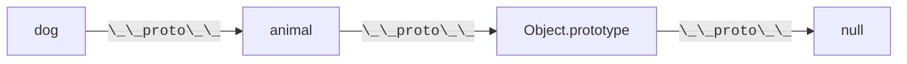
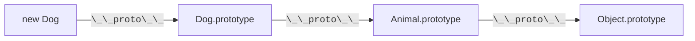
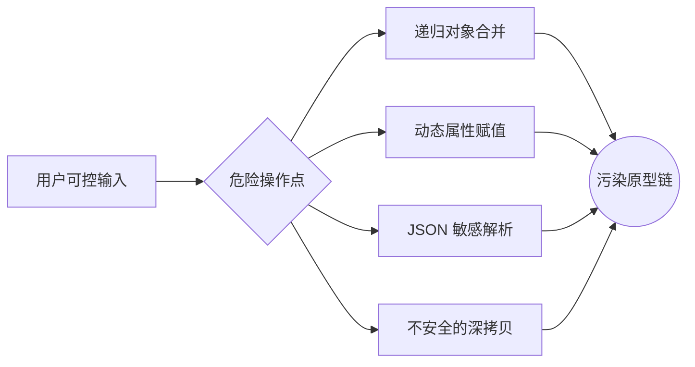
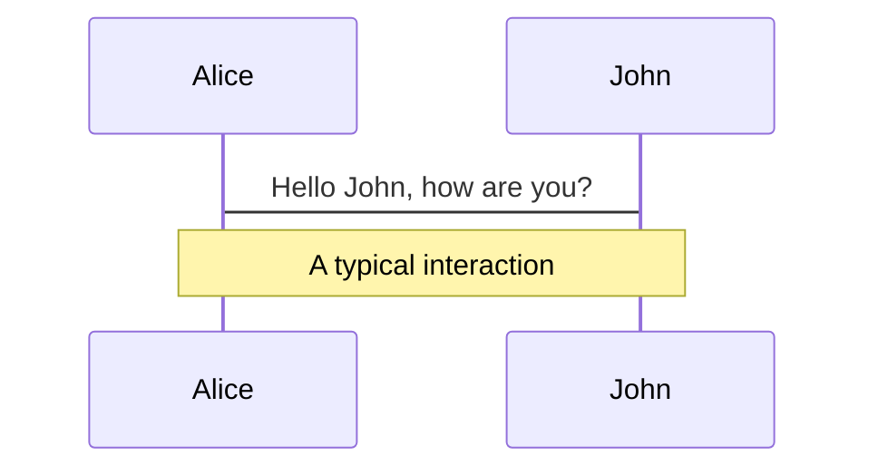
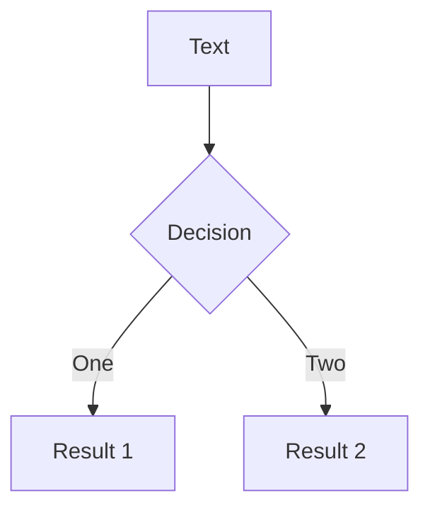
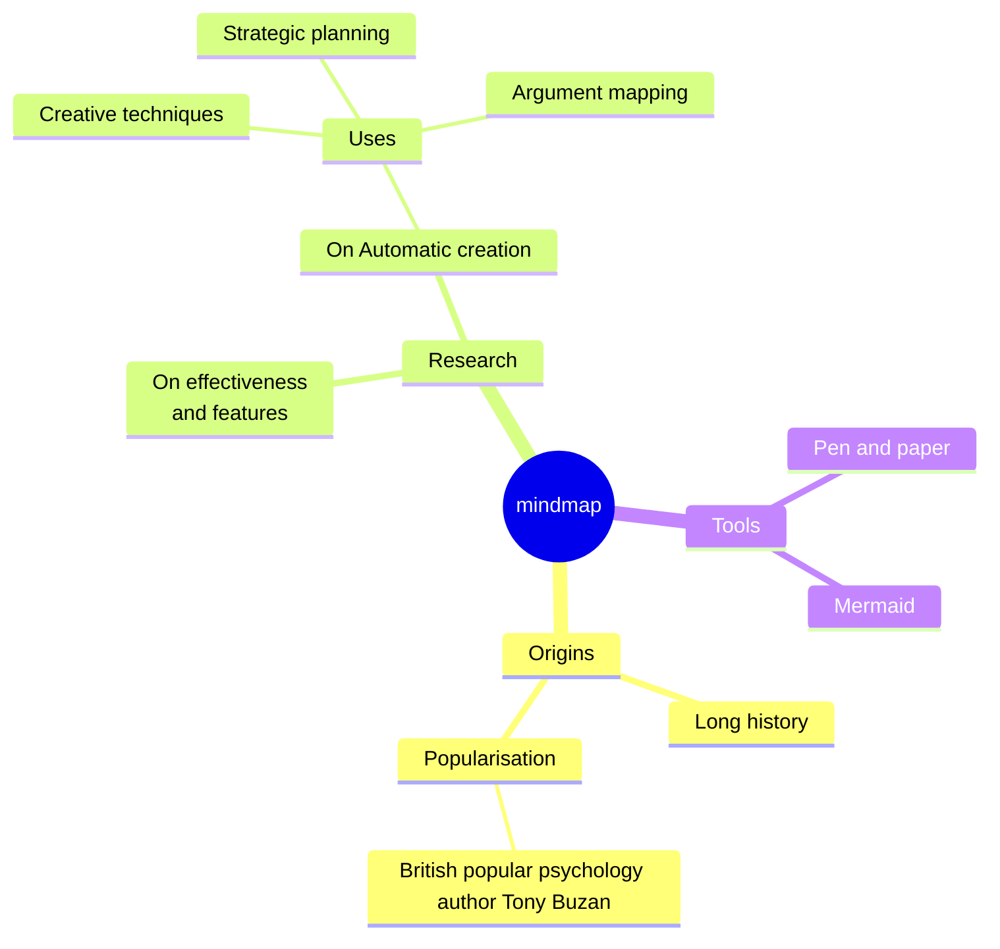
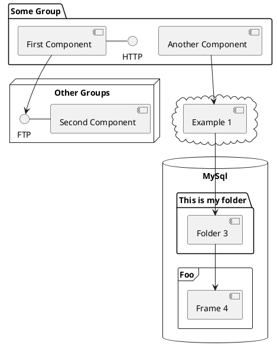

---
# You can also start simply with 'default'
theme: default
# random image from a curated Unsplash collection by Anthony
# like them? see https://unsplash.com/collections/94734566/slidev
background: https://cover.sli.dev
# some information about your slides (markdown enabled)
title: Web Security Slides
# apply unocss classes to the current slide
class: text-center
# https://sli.dev/features/drawing
drawings:
  persist: false
# slide transition: https://sli.dev/guide/animations.html#slide-transitions
transition: slide-left
# enable MDC Syntax: https://sli.dev/features/mdc
mdc: true
---

<!-- markdownlint-disable single-title no-inline-html heading-style blanks-around-headings -->

# Web 安全常见漏洞

Mix

<div class="abs-br m-6 text-xl">
  <a href="https://github.com/mnixry" target="_blank" class="slidev-icon-btn">
    <carbon:logo-github />
  </a>
</div>

<!--
The last comment block of each slide will be treated as slide notes. It will be visible and editable in Presenter Mode along with the slide. [Read more in the docs](https://sli.dev/guide/syntax.html#notes)
-->

---
layout: center
transition: fade-out
---

# 常见漏洞：原型链污染

原型链污染 (Prototype Pollution) 是一种通过修改对象原型来实现的漏洞，导致了一些意外的行为。该漏洞主要发生在 JavaScript 中，在其他语言例如 Python 中也有类似的问题。

```js
// 原型链污染
Object.prototype.isAdmin = true;
```

```js
// 检查用户是否为管理员
if (user.isAdmin) {
  console.log("Admin access granted");
}
```

<style>
h1 {
  background-color: #2B90B6;
  background-image: linear-gradient(45deg, #4EC5D4 10%, #146b8c 20%);
  background-size: 100%;
  -webkit-background-clip: text;
  -moz-background-clip: text;
  -webkit-text-fill-color: transparent;
  -moz-text-fill-color: transparent;
}
</style>

---
layout: image-right
image: ./images/jetbrains-pl-rank.png
---

## 为什么我们会对原型链污染感兴趣？

- JavaScript 生态工具链纷杂繁复，依赖众多

  - 38% 的流行包处于不活跃状态，很可能存在安全风险 （2022）

- 这种漏洞很容易写出来且难以通过常规手段发现 (Linters, SAST)
- 一次污染，全局遭殃

- 可能存在这些漏洞的语言正在变得越来越流行
  - TIOBE：JavaScript rk 6, Python rk 1
  - JetBrains：JavaScript rk 1, Python rk 2

---

## 什么是原型，什么是原型链？

原型 (Prototype) 是主要的 JavaScript 继承特性。在 JavaScript 中，对象是通过使用 `{}` 语法创建的。例如：

```js
const my_object = { a: 1, b: 2 };
```

JSON 是 「JavaScript Object Notation (JavaScript 对象表示法)」 的缩写，所以即使你没有见过 JavaScript，但是也应该对这个语法非常熟悉。

这个对象有两个属性：`a` 和 `b`。如果我们想要访问 `a` 的值，我们可以使用点表示法或括号表示法：

```js {0|1-3|4-5|all}
console.log(my_object.a);
// 输出：1
// 在功能上等同于
console.log(my_object["a"]);
// 也输出：1
```

如果我们想要向对象添加一个新属性，我们可以使用与上面相同的语法，无论是点表示法还是括号表示法：

```js {0|1|2|3-4|all}
my_object.c = 3;
my_object["d"] = 4;
console.log(my_object);
// 输出：{a: 1, b: 2, c: 3, d: 4}
```

---

### 原型基础：对象的 DNA 结构

```javascript
const animal = { eats: true };
const dog = { barks: true };

// 建立原型链连接
Object.setPrototypeOf(dog, animal);

console.log(dog.barks); // true (自有属性)
console.log(dog.eats); // true (继承属性)
```

<div v-click>



</div>

---
layout: two-cols-header
---

### 当 Class 遇上原型：ES6 的语法糖衣

::left::

- ES6

```js {all|2-4|6-8|1-9|11|12-15|16-19|22-23|all}{lines:true}
class Animal {
  constructor(name) {
    this.name = name;
  }

  speak() {
    console.log(`${this.name} makes a noise`);
  }
}

class Dog extends Animal {
  constructor(name) {
    super(name); // 调用父类构造函数
  }

  speak() {
    super.speak();
    console.log("Woof!");
  }
}

const dog = new Dog("Rex");
dog.speak(); // 输出：Rex makes a noise\nWoof!
```

::right::

<div v-click="8" class="ml-xs">

- ES5：

```js {all|1-3|5-7|9-12|13-18|20-22|all}{lines:true}
function Animal(name) {
  this.name = name;
}

Animal.prototype.speak = function () {
  console.log(`${this.name} makes a noise`);
};

function Dog() {
  Animal.call(this); // 调用父类构造函数
}

Dog.prototype = Object.create(Animal.prototype); // 继承原型
Dog.prototype.constructor = Dog; // 设置构造函数
Dog.prototype.speak = function () {
  super.speak();
  console.log("Woof!");
};

var dog = new Dog("Rex"); // BTW，const 和 let 也是 ES6 的特性
dog.speak(); // 输出：Rex makes a noise\nWoof!
```

</div>

<div v-click class="absolute bg-white px-10 left-0px top-100px w-100vw">



</div>

---
layout: two-cols-header
---

### 原型操作：穿越继承链的三种方式

::left::

```js {all|1-4|6-9|11-15|all}{lines:true}
// 1. 通过构造函数
function Animal() {}
const obj = new Animal();
console.log(obj.__proto__ === Animal.prototype); // true

// 2. Object.create 直接指定原型
const protoObj = { x: 1 };
const child = Object.create(protoObj);
console.log(child.x); // 1

// 3. 现代 API 操作
const parent = { y: 2 };
const child = {};
Object.setPrototypeOf(child, parent);
console.log(child.y); // 2
```

<v-clicks>

- 如果是写代码的话，直接修改 `__proto__` 会导致性能问题 （JIT 优化）
- 推荐使用 `Object.create` / `Object.getPrototypeOf` 来操作原型。

</v-clicks>

::right::

<div v-click class="mb-10 pl-xs">

#### `__proto__` 和 `prototype` 的区别

- `__proto__` 是对象上的一个属性，指向对象的原型：

  ```js
  const obj = {};
  obj.__proto__ = { a: 1 };
  console.log(obj.a); // 1
  ```

- `prototype` 是构造函数上的一个属性，指向构造函数内 `this` 的原型：

  ```js
  const Animal = function () {};
  Animal.prototype = { eats: true };

  const dog = new Animal();
  console.log(dog.eats); // true
  ```

</div>

---

### 原型链的尽头：`Object.prototype`

```js {all|1-3|6-8|9-11|all}{lines:true}
const arr = [1, 2, 3];
console.log(arr.__proto__ === Array.prototype); // true
console.log(arr.toString()); // "1,2,3" 来自 Object.prototype

// 追溯完整继承链：
console.log(
  arr.__proto__.__proto__ === Object.prototype, // true
);
console.log(
  arr.__proto__.__proto__.__proto__, // null
);
```

<v-clicks>

- 🚩 所有内置类型（`Array`/`Date` 等）最终都继承自 `Object.prototype`
- 💣 修改 `Object.prototype` 会影响**所有对象**

</v-clicks>

---

## 原型链污染的成因



<v-clicks>

- 🎯 四类高危操作承载 90% 的原型链污染漏洞
- 🔥 用户输入 → 危险 API → 原型篡改 的三段式攻击链

</v-clicks>

---

### 漏洞代码沙盘：递归合并陷阱

```js {monaco-run}
// 危险的对象合并实现
function merge(target, source) {
  for (const key in source) {
    if (typeof source[key] === "object" && source[key] !== null) {
      if (!target[key]) {
        target[key] = {};
      }
      merge(target[key], source[key]); // 递归陷阱
    } else {
      target[key] = source[key]; // 污染触发点
    }
  }
}

// 攻击者输入
const maliciousPayload = JSON.parse('{"__proto__":{"isAdmin":true}}');
merge({}, maliciousPayload); // 发起污染攻击

console.log({}.isAdmin); // 输出 true
```

---

### 动态属性赋值的黑暗面

```js {monaco-run}
function setValue(obj, key, value) {
  const segments = key.split(".");
  const lastSegment = segments.pop();
  for (const segment of segments) {
    const accessor = Array.isArray(obj) ? +segment : segment;
    if (!(accessor in obj)) obj[accessor] = {};
    obj = obj[accessor];
  }
  obj[lastSegment] = value;
}

// 攻击向量
setValue({}, "__proto__.polluted", "HACKED");

// 灾难性后果
console.log({}.polluted); // 输出 "HACKED"
```

<v-clicks>

💣 高危特征：

- 使用 `obj[key] = value` 形式
- 支持通过 `.` 分割的嵌套路径（如 `a.b.c`）

</v-clicks>

---

### 深拷贝引发的血案

```js {monaco-run}
function deepClone(obj) {
  if (typeof obj !== "object" || obj === null) return obj; // 基本类型或 null 直接返回
  if (Array.isArray(obj)) return obj.map(deepClone); // 数组类型
  const clone = {};
  for (const key in obj) clone[key] = deepClone(obj[key]); // 遍历对象属性
  return clone;
}

function register(user, role = "user") {
  delete user.role;
  const session = deepClone(user);
  if (role === "admin") {
    session.isAdmin = true;
  }
  return session;
}

const user = register(JSON.parse('{"__proto__":{"isAdmin":true}}'));
console.log(user.isAdmin); // 输出 true
```

---

## 原型链污染：利用方法

有以下几种思路：

- 影响鉴权参数，结合业务逻辑达成在系统内提升用户权限
- 利用模板引擎解析功能，达成 RCE
- 使用系统内已有的 Gadget 达成 RCE （Node.js `child_process` 等）

---

### 题目：funny login （DiceCTF Quals 2024）

使用提供的容器镜像，启动服务：

```shell
docker load -i funnylogin.tar
docker run --rm -p 3000:3000 funnylogin
```

看看如何使用漏洞组合，得到 Flag？

---

#### 解题思路

<v-clicks>

- 首先注意到没有对用户输入进行控制或 sanitization 就直接进行了 SQL 查询。
- 这意味着我们可以注入 SQL 查询，但问题是我们不知道用户是否有 `isAdmin` 为 `true`，因为它是随机的。
- 因此，我们需要找到一种方法来控制 `isAdmin` 的值。
- 注意到 `__proto__` 是 JavaScript 中的一个特殊属性，它指向对象的原型。
- 因此，我们可以将 `__proto__` 作为用户名注入，这样我们就可以做到 `isAdmin[user]==true`。

  ```js
  if (users[id] && isAdmin[user]) {
    return res.redirect("/?flag=" + encodeURIComponent(FLAG));
  }
  ```

- 用户名 `__proto__`，密码 `1' or id=1; --` 即可绕过密码验证。

</v-clicks>

---

### 题目：login please （ImaginaryCTF 2022）

使用提供的容器镜像，启动服务：

```shell
docker load -i loginplease.tar
docker run --rm -p 5001:5001 loginplease
```

请阅读源码，找到问题所在并得到 Flag。

---

#### 解题思路

<v-clicks>

- `Object.assign` 将一个或者多个源对象中所有可枚举的自有属性复制到目标对象，并返回修改后的目标对象。

```js {monaco-run}
const obj = JSON.parse('{"__proto__":{"username":"admin"}}');
console.log(obj, obj.username === undefined);
Object.assign({}, obj).username;
```

- 同时给出的程序支持传入 `urlencoded` 和 `json` 格式的请求体

  ```js
  app.use(urlencoded({ extended: false }));
  app.use(json());
  ```

  - 因此我们可以通过 `Content-Type: application/json` 来传入 `json` 格式的请求体。

```json
{
  "__proto__": { "username": "admin" },
  "password": "admin"
}
```

</v-clicks>

---
transition: slide-up
level: 2
---

# Navigation

Hover on the bottom-left corner to see the navigation's controls panel, [learn more](https://sli.dev/guide/ui#navigation-bar)

## Keyboard Shortcuts

|                                                    |                             |
| -------------------------------------------------- | --------------------------- |
| <kbd>right</kbd> / <kbd>space</kbd>                | next animation or slide     |
| <kbd>left</kbd> / <kbd>shift</kbd><kbd>space</kbd> | previous animation or slide |
| <kbd>up</kbd>                                      | previous slide              |
| <kbd>down</kbd>                                    | next slide                  |

<!-- https://sli.dev/guide/animations.html#click-animation -->


<p v-after class="absolute bottom-23 left-45 opacity-30 transform -rotate-10">Here!</p>

---
layout: two-cols
layoutClass: gap-16
---

# Table of contents

You can use the `Toc` component to generate a table of contents for your slides:

```html
<Toc minDepth="1" maxDepth="1" />
```

The title will be inferred from your slide content, or you can override it with `title` and `level` in your frontmatter.

::right::

<Toc text-sm minDepth="1" maxDepth="2" />

---
layout: image-right
image: <https://cover.sli.dev>
---

# Code

Use code snippets and get the highlighting directly, and even types hover!

```ts {all|5|7|7-8|10|all} twoslash
// TwoSlash enables TypeScript hover information
// and errors in markdown code blocks
// More at https://shiki.style/packages/twoslash

import { computed, ref } from "vue";

const count = ref(0);
const doubled = computed(() => count.value * 2);

doubled.value = 2;
```

<arrow v-click="[4, 5]" x1="350" y1="310" x2="195" y2="334" color="#953" width="2" arrowSize="1" />

<!-- This allow you to embed external code blocks -->

<<< @/snippets/external.ts#snippet

<!-- Footer -->

[Learn more](https://sli.dev/features/line-highlighting)

<!-- Inline style -->
<style>
.footnotes-sep {
  @apply mt-5 opacity-10;
}
.footnotes {
  @apply text-sm opacity-75;
}
.footnote-backref {
  display: none;
}
</style>

<!--
Notes can also sync with clicks

[click] This will be highlighted after the first click

[click] Highlighted with `count = ref(0)`

[click:3] Last click (skip two clicks)
-->

---
level: 2
---

# Shiki Magic Move

Powered by [shiki-magic-move](https://shiki-magic-move.netlify.app/), Slidev supports animations across multiple code snippets.

Add multiple code blocks and wrap them with <code>````md magic-move</code> (four backticks) to enable the magic move. For example:

````md magic-move {lines: true}
```ts {*|2|*}
// step 1
const author = reactive({
  name: "John Doe",
  books: [
    "Vue 2 - Advanced Guide",
    "Vue 3 - Basic Guide",
    "Vue 4 - The Mystery",
  ],
});
```

```ts {*|1-2|3-4|3-4,8}
// step 2
export default {
  data() {
    return {
      author: {
        name: "John Doe",
        books: [
          "Vue 2 - Advanced Guide",
          "Vue 3 - Basic Guide",
          "Vue 4 - The Mystery",
        ],
      },
    };
  },
};
```

```ts
// step 3
export default {
  data: () => ({
    author: {
      name: "John Doe",
      books: [
        "Vue 2 - Advanced Guide",
        "Vue 3 - Basic Guide",
        "Vue 4 - The Mystery",
      ],
    },
  }),
};
```

Non-code blocks are ignored.

```vue
<!-- step 4 -->
<script setup>
const author = {
  name: "John Doe",
  books: [
    "Vue 2 - Advanced Guide",
    "Vue 3 - Basic Guide",
    "Vue 4 - The Mystery",
  ],
};
</script>
```
````

---

# Components

<div grid="~ cols-2 gap-4">
<div>

You can use Vue components directly inside your slides.

We have provided a few built-in components like `<Tweet/>` and `<Youtube/>` that you can use directly. And adding your custom components is also super easy.

```html
<Counter :count="10" />
```

<!-- ./components/Counter.vue -->
<Counter :count="10" m="t-4" />

Check out [the guides](https://sli.dev/builtin/components.html) for more.

</div>
<div>

```html
<Tweet id="1390115482657726468" />
```

<Tweet id="1390115482657726468" scale="0.65" />

</div>
</div>

<!--
Presenter note with **bold**, *italic*, and ~~striked~~ text.

Also, HTML elements are valid:
<div class="flex w-full">
  <span style="flex-grow: 1;">Left content</span>
  <span>Right content</span>
</div>
-->

---
class: px-20
---

# Themes

Slidev comes with powerful theming support. Themes can provide styles, layouts, components, or even configurations for tools. Switching between themes by just **one edit** in your frontmatter:

<div grid="~ cols-2 gap-2" m="t-2">

```yaml
---
theme: default
---
```

```yaml
---
theme: seriph
---
```


</div>

Read more about [How to use a theme](https://sli.dev/guide/theme-addon#use-theme) and
check out the [Awesome Themes Gallery](https://sli.dev/resources/theme-gallery).

---

# Clicks Animations

You can add `v-click` to elements to add a click animation.

<div v-click>

This shows up when you click the slide:

```html
<div v-click>This shows up when you click the slide.</div>
```

</div>

<br>

<v-click>

The <span v-mark.red="3"><code>v-mark</code> directive</span>
also allows you to add
<span v-mark.circle.orange="4">inline marks</span>
, powered by [Rough Notation](https://roughnotation.com/):

```html
<span v-mark.underline.orange>inline markers</span>
```

</v-click>

<div mt-20 v-click>

[Learn more](https://sli.dev/guide/animations#click-animation)

</div>

---

# Motions

Motion animations are powered by [@vueuse/motion](https://motion.vueuse.org/), triggered by `v-motion` directive.

```html
<div
  v-motion
  :initial="{ x: -80 }"
  :enter="{ x: 0 }"
  :click-3="{ x: 80 }"
  :leave="{ x: 1000 }"
>
  Slidev
</div>
```

<div class="w-60 relative">
  <div class="relative w-40 h-40">
    
    
    
  </div>

  <div
    class="text-5xl absolute top-14 left-40 text-[#2B90B6] -z-1"
    v-motion
    :initial="{ x: -80, opacity: 0}"
    :enter="{ x: 0, opacity: 1, transition: { delay: 2000, duration: 1000 } }">
    Slidev
  </div>
</div>

<!-- vue script setup scripts can be directly used in markdown, and will only affects current page -->
<script setup lang="ts">
const final = {
  x: 0,
  y: 0,
  rotate: 0,
  scale: 1,
  transition: {
    type: 'spring',
    damping: 10,
    stiffness: 20,
    mass: 2
  }
}
</script>

<div
  v-motion
  :initial="{ x:35, y: 30, opacity: 0}"
  :enter="{ y: 0, opacity: 1, transition: { delay: 3500 } }">

[Learn more](https://sli.dev/guide/animations.html#motion)

</div>

---

# LaTeX

LaTeX is supported out-of-box. Powered by [KaTeX](https://katex.org/).

<div h-3 />

Inline $\sqrt{3x-1}+(1+x)^2$

Block

$$
{1|3|all}
\begin{aligned}
\nabla \cdot \vec{E} &= \frac{\rho}{\varepsilon_0} \\
\nabla \cdot \vec{B} &= 0 \\
\nabla \times \vec{E} &= -\frac{\partial\vec{B}}{\partial t} \\
\nabla \times \vec{B} &= \mu_0\vec{J} + \mu_0\varepsilon_0\frac{\partial\vec{E}}{\partial t}
\end{aligned}
$$

[Learn more](https://sli.dev/features/latex)

---

# Diagrams

You can create diagrams / graphs from textual descriptions, directly in your Markdown.

<div class="grid grid-cols-4 gap-5 pt-4 -mb-6">









</div>

Learn more: [Mermaid Diagrams](https://sli.dev/features/mermaid) and [PlantUML Diagrams](https://sli.dev/features/plantuml)

---
foo: bar
dragPos:
  square: 691,32,167,_,-16
---

# Draggable Elements

Double-click on the draggable elements to edit their positions.

<br>

###### Directive Usage

```md

```

<br>

###### Component Usage

```md
<v-drag text-3xl>
  <div class="i-carbon:arrow-up" />
  Use the `v-drag` component to have a draggable container!
</v-drag>
```

<v-drag pos="663,206,261,_,-15">
  <div text-center text-3xl border border-main rounded>
    Double-click me!
  </div>
</v-drag>


###### Draggable Arrow

```md
<v-drag-arrow two-way />
```

<v-drag-arrow pos="67,452,253,46" two-way op70 />

---
src: ./pages/imported-slides.md
hide: false
---

---

# Monaco Editor

Slidev provides built-in Monaco Editor support.

Add `{monaco}` to the code block to turn it into an editor:

```ts {monaco}
import { ref } from "vue";
import { emptyArray } from "./external";

const arr = ref(emptyArray(10));
```

Use `{monaco-run}` to create an editor that can execute the code directly in the slide:

```ts {monaco-run}
import { version } from "vue";
import { emptyArray, sayHello } from "./external";

sayHello();
console.log(`vue ${version}`);
console.log(
  emptyArray<number>(10).reduce(
    (fib) => [...fib, fib.at(-1)! + fib.at(-2)!],
    [1, 1],
  ),
);
```

---
layout: center
class: text-center
dragPos:
  square: 0,-5,0,0
---

# Learn More

[Documentation](https://sli.dev) · [GitHub](https://github.com/slidevjs/slidev) · [Showcases](https://sli.dev/resources/showcases)

<PoweredBySlidev mt-10 />
